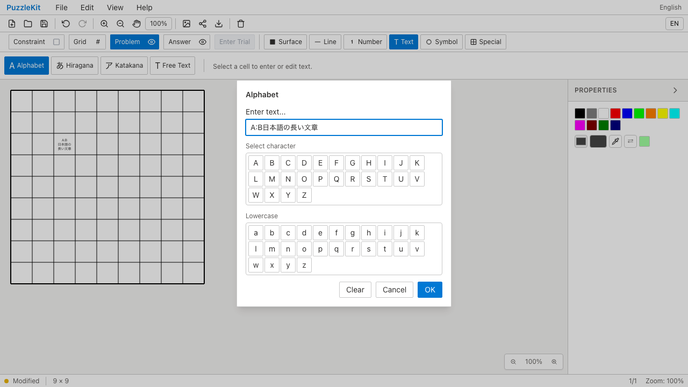
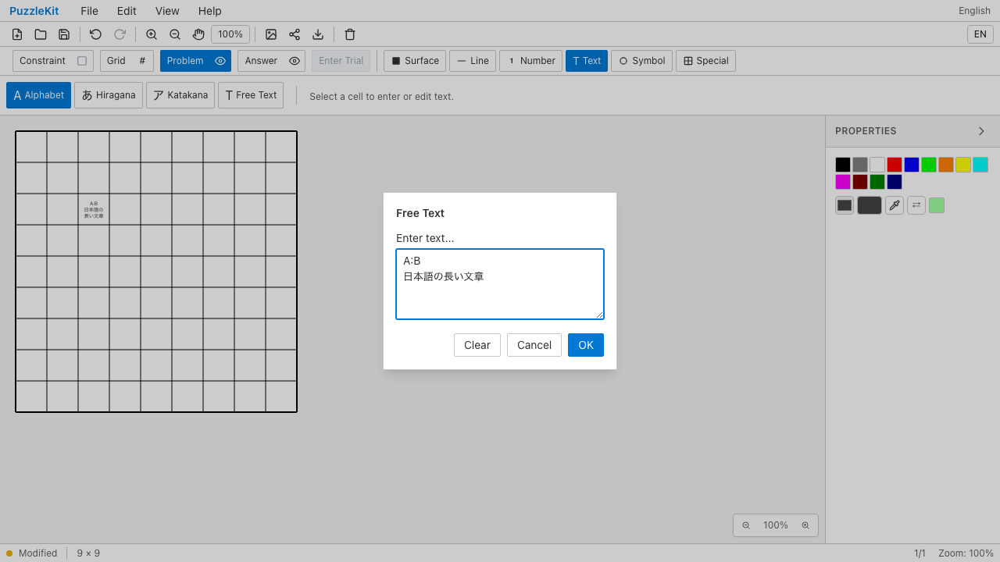
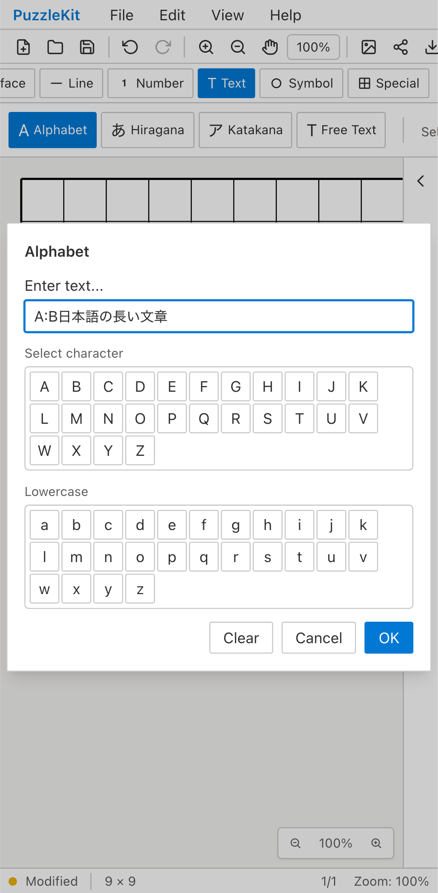
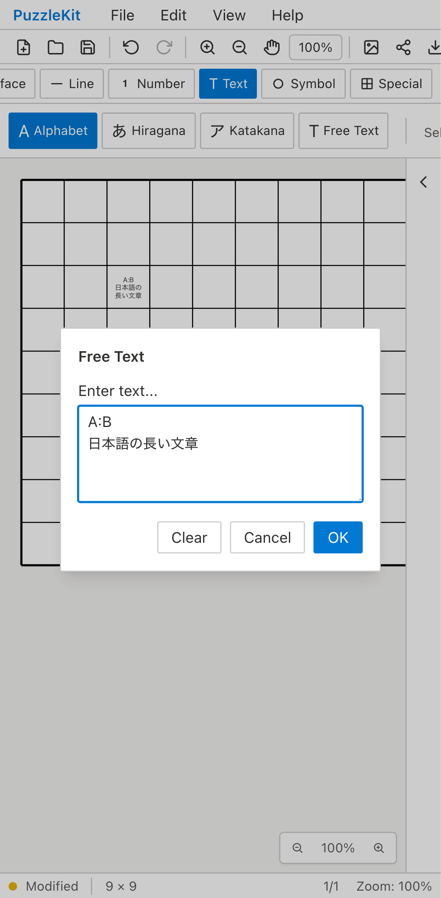
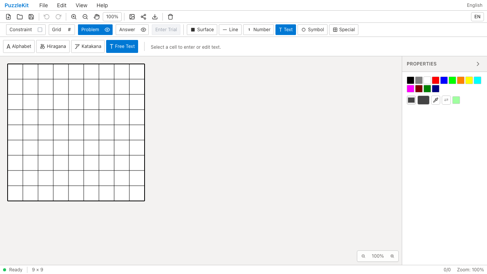
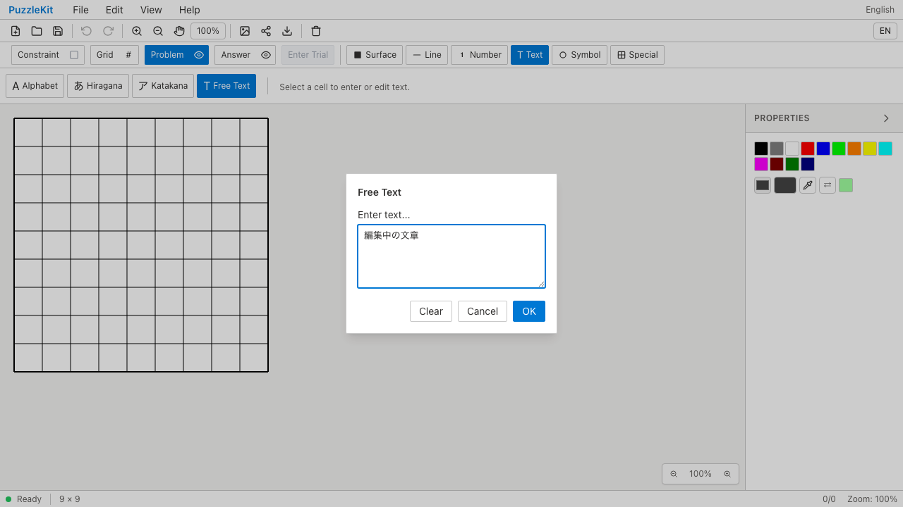
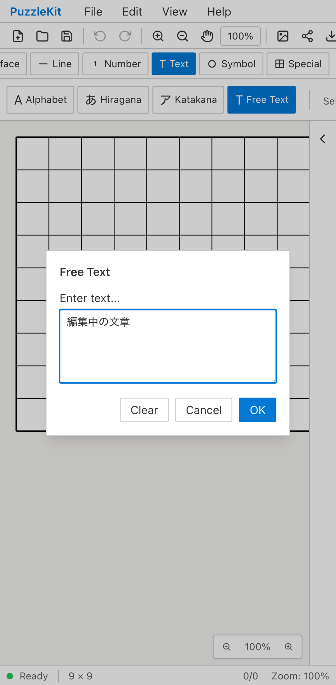
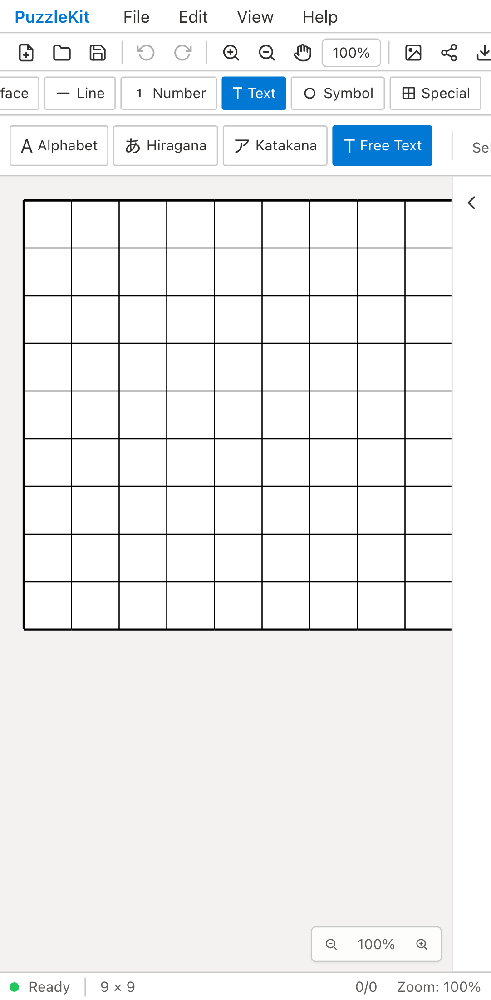
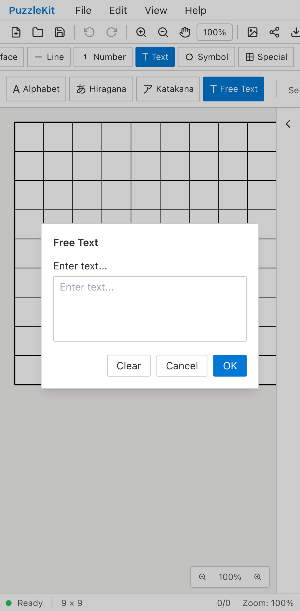

# 文字入力のQA — 2026-09-11

Issue #10に関連する、文字の再編集・IME入力・タップ操作の回帰確認です。

## 対象とリビジョン

- Before: `2b3407a1b97cba6aa59f2f94a8a349854975658d`（PR #60に#62を統合した状態）。
- Afterアプリ: `f0ba9e9a26d7e2f40cc97955b4d025064041d7a8`。後続変更はテストの初回起動制限とQA証跡です。
- PC: Chromium、1280×720。モバイル: Chromium Pixel 7エミュレーション。WebKit PC/iPhone 13でも回帰確認。
- 盤面の準備、文字の入力・再編集、Undo/Redo、保存・再読込、SVGダウンロードはすべて画面から操作しています。開発ストアの直接操作は使っていません。
- 長文再編集・IMEケースは両画面幅でマウスクリックを使用。独立したタップケースは`page.touchscreen.tap`を使用。
- IMEはCompositionEvent/KeyboardEventの契約試験です。OSネイティブIMEや実端末のソフトキーボードを操作した結果ではありません。

## 再現した問題と修正

| 問題 | Before | After |
| --- | --- | --- |
| 長文を別の文字ツールで開く | Free TextをAlphabetから開くと、改行が表示されない2文字制限の単行欄になる | 既存の文字種で開き、複数行・長文をそのまま追記できる |
| IME変換中のEsc | ダイアログが閉じ、未保存の草稿を失う | 変換中は草稿を保持。変換終了後の通常Esc/Cancelは閉じる |
| 指でセルをタップ | 文字ツールの処理結果が通知されず、ダイアログが開かない | 完了した単指タップで入力・再編集できる |
| 追加メタデータの保持 | 再編集でfillColor/objectKeyなどを引き継がない | ID・既存プロパティを保持し、未変更保存は履歴を増やさない |

メタデータの項目はコード比較とUnitテストで確認し、他の3項目はブラウザで再現しました。

## 検証結果

- Unit: **1,120件成功、75ファイル**。文字種・メタデータ・1回のUndo/Redo・未変更保存、IMEのEnter/Esc・isComposing・legacy keyCode 229、タップの通知とキャンセル/ドラッグ/パン/PlayerのProblem保護を含みます。
- 文字入力E2E: **10件成功、2件対象外**。対象外はタップ非対応のPCプロファイル。リトライなし、ブラウザの未処理例外なし。
- 本番Chromium QA: **53件成功、1件対象外**。既存48件に文字入力5件を追加。対象外はPCのタップケース。
- アプリ/E2E型チェック、ソルバーのソースマップ検査、production build成功。
- BeforeはPC/モバイル計5件が対象不具合の期待されたアサーション失敗、PCのタップ1件は対象外。初回探索でタップ問題により後続操作まで進めなかった記録は比較用から除外しています。
- 初回Afterの長文試験はMacのEndキーの扱いによって先頭に追記したため失敗。全選択→右矢印で末尾へ移動する操作に修正し、同じ期待値で再確認しました。
- 全Unit/単独Unitの初回Nurikabe試験が5秒で時間切れ。単独実行でもバンドルの変換に約6.5秒かかることを確認し、初回起動を含む1件だけ15秒に調整。解のアサーションは維持し、全Unitを再実行して成功しました。

## Before / After画像・動画

比較用10本と本番5本の計15本を保存しています。全動画の正の再生時間、ffmpegによる全フレームのデコード、SHA-256、Chromiumでの再生・シークを検査しました。

[動画比較ページ（ローカルでHTMLを開く）](evidence-text-input-20260911/index.html) · [実行情報とチェックサム](evidence-text-input-20260911/evidence.json)

### 長文の再編集 — chromium

| Before | After |
| --- | --- |
|  [動画](evidence-text-input-20260911/cross-tool-chromium-before.webm) |  [動画](evidence-text-input-20260911/cross-tool-chromium-after.webm) |

### 長文の再編集 — mobile-chrome

| Before | After |
| --- | --- |
|  [動画](evidence-text-input-20260911/cross-tool-mobile-chrome-before.webm) |  [動画](evidence-text-input-20260911/cross-tool-mobile-chrome-after.webm) |

### 変換中の草稿保持 — chromium

| Before | After |
| --- | --- |
|  [動画](evidence-text-input-20260911/composition-chromium-before.webm) |  [動画](evidence-text-input-20260911/composition-chromium-after.webm) |

### 変換中の草稿保持 — mobile-chrome

| Before | After |
| --- | --- |
|  [動画](evidence-text-input-20260911/composition-mobile-chrome-before.webm) |  [動画](evidence-text-input-20260911/composition-mobile-chrome-after.webm) |

### 指タップで入力を開く — mobile-chrome

| Before | After |
| --- | --- |
|  [動画](evidence-text-input-20260911/touch-mobile-chrome-before.webm) |  [動画](evidence-text-input-20260911/touch-mobile-chrome-after.webm) |

## 本番ビルドの証跡

- cross-tool / chromium: [動画](evidence-text-input-20260911/cross-tool-chromium-production.webm) · [画像](evidence-text-input-20260911/cross-tool-chromium-production.png) · [SVG](evidence-text-input-20260911/cross-tool-chromium-production-export.svg)
- composition / chromium: [動画](evidence-text-input-20260911/composition-chromium-production.webm) · [画像](evidence-text-input-20260911/composition-chromium-production.png)
- cross-tool / mobile-chrome: [動画](evidence-text-input-20260911/cross-tool-mobile-chrome-production.webm) · [画像](evidence-text-input-20260911/cross-tool-mobile-chrome-production.png) · [SVG](evidence-text-input-20260911/cross-tool-mobile-chrome-production-export.svg)
- composition / mobile-chrome: [動画](evidence-text-input-20260911/composition-mobile-chrome-production.webm) · [画像](evidence-text-input-20260911/composition-mobile-chrome-production.png)
- touch / mobile-chrome: [動画](evidence-text-input-20260911/touch-mobile-chrome-production.webm) · [画像](evidence-text-input-20260911/touch-mobile-chrome-production.png)

## Issue #10の残件

数値と一般文字の入力UI統合、長文を盤面注釈として配置する仕様は、この修正の対象外です。Issue全体はクローズしません。設計・UI Reviewメモは非追跡の`.work/`に保存しています。
