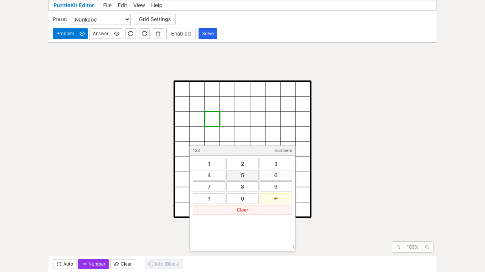
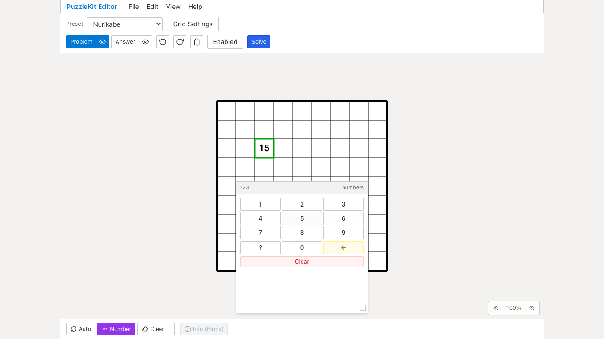
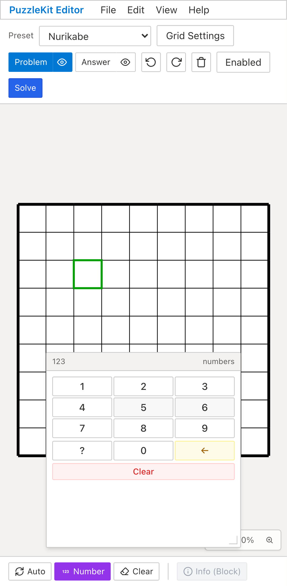
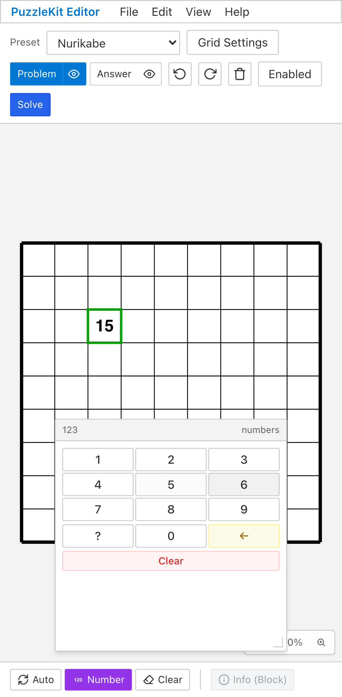
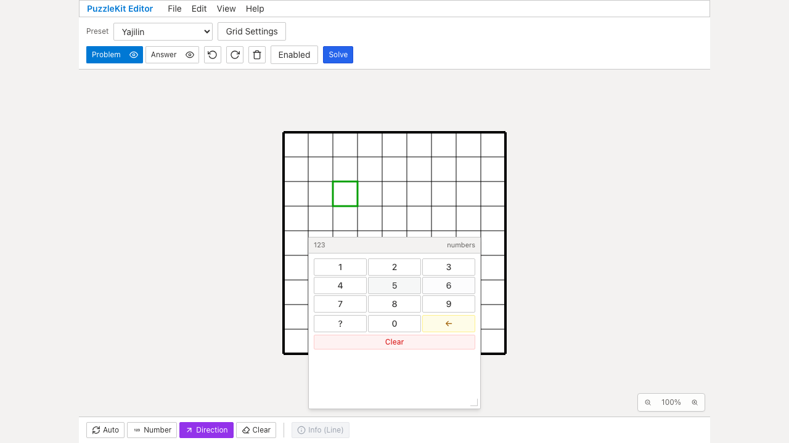
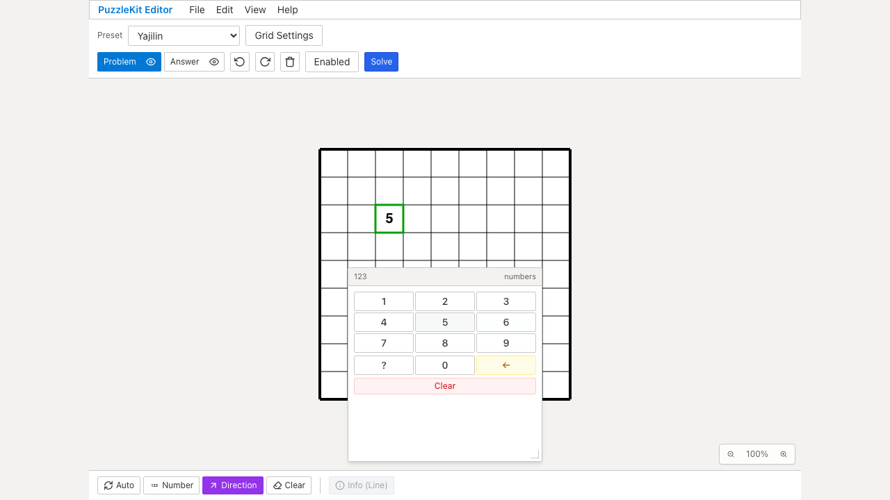
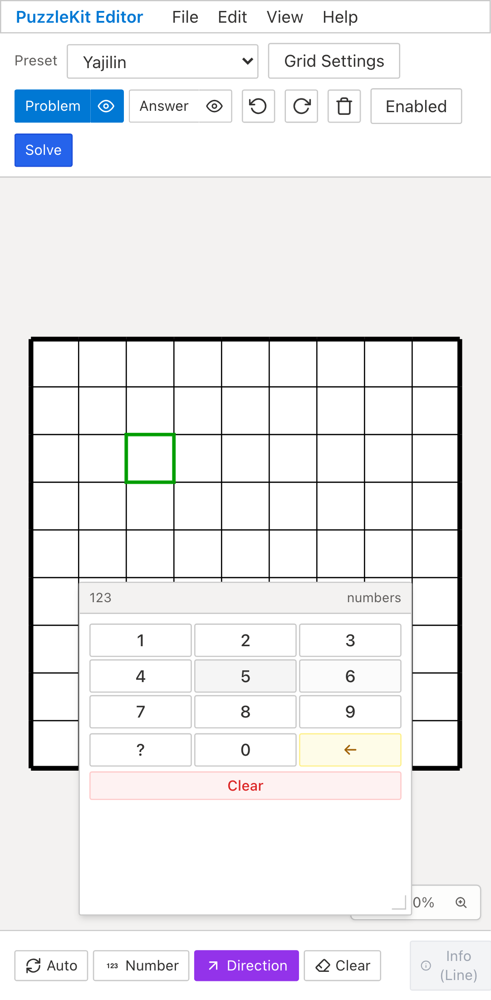
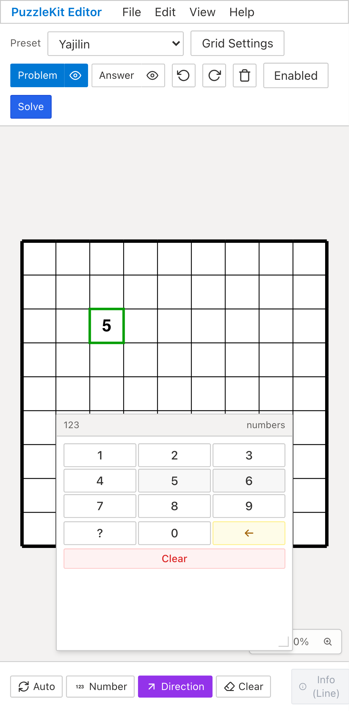

# 数字パッドUndoのQA — 2026-09-12

数字パッドで既存の数字を変更した後、Undoを1回押すと直前の値ではなく空欄になる問題を修正しました。

## 対象とリビジョン

- Beforeアプリ: `caf28a680394a8872ebe652046aea77195d0d8dc`（PR #63）。
- After / productionアプリ: `5e01cf574364e80abd9d7efb54cdca19dcda11a8`。テストしたソースをコミットしたリビジョンです。後続はQA証跡のみ。
- PC: Chromium、1280×720。モバイル: Chromium Pixel 7エミュレーション。WebKit PC/iPhone 13でも回帰確認。
- `/edit`でNurikabeのNumber、YajilinのDirectionを選び、Problemレイヤーのセルと数字パッドを操作します。PCはクリック、モバイルはPlaywrightのtouchscreen/locator.tapでタップしています。
- ブラウザQAの準備・入力・Undo/Redoはすべて画面操作です。実端末やOSのソフトキーボードを操作した結果ではありません。

## 再現した問題と修正

| 操作 | Before | After |
| --- | --- | --- |
| Nurikabe: 15 → 6 → Undo 1回 | 空欄になる | 15に戻る |
| Yajilin: 5 → 6 → Undo 1回 | 空欄になる | 5に戻る |
| 既存数字の更新 | 削除・新規追加でIDと付帯情報を失い、履歴が分かれる | 既存ID・位置・付帯情報を保持して1操作で更新 |
| Paintの色・サイズ変更を伴う入力 | 値と外観の置換を1回で戻せない | 従来のブラシ色・サイズを反映し、値と外観をまとめて戻せる |

通常数字の色・サイズは保持します。Paintは従来の入力仕様に従い、選択中のブラシ設定を反映します。同じ値・外観への更新では履歴を追加せず、Redoを保持します。既存の履歴グループも閉じません。

## 検証結果

- 全Unit: **1,132件成功、76ファイル**。今回の12件は中心・頂点・辺、レイヤーを切り替えたUndo/Redo、ID/色/サイズ/objectKey、方向・角度、JSON書出し/読込み後の再編集、未変更時のRedo、Backspace/Clear、Paintの外観、外側の履歴グループ、編集禁止レイヤーを検証。
- 対象E2E: **8件成功**（Chromium/WebKit × PC/モバイル × 2パズル）。リトライなし。置換・Undo/Redo・Backspaceの復元を確認。
- 本番Chromium QA: **57件成功、既存のPCタップ非対応1件は対象外**。
- アプリ/E2E型チェック、production build、ソルバーのソースマップ検査、QA runner 3件、QA doctorは成功。ビルド警告なし。
- Before: Chromium PC/モバイルの計4件が、Undo後の値を比較する期待されたアサーション失敗。各ケースでUndo直後の画像を取得済み。ブラウザの未処理例外なし。
- 初回の試験準備では`/edit`の盤面自動保存とYajilinのNumberモードの桁数に誤った前提がありました。自動保存の前提を除き、Directionモードで再実行した最終Beforeのみ証跡に採用しています。
- ID・追加メタデータ・任意角度・JSON往復・Paint外観の保証はUnitテストによるものです。画面QAでは数字の復元を検証しています。`/edit`の盤面自動保存は検証項目に含めません。

## Before / After画像・動画

全画像は「置換後にUndoを1回押した直後」を比較しています。Beforeは空欄、Afterは15または5です。初期値の画像は比較ページから確認できます。

比較8本と本番4本、計12本の動画を保存しました。全動画の再生時間・SHA-256・ffmpegによる全フレームのデコード・Chromiumでの再生とシークを検査済みです。

[動画比較ページ（ローカルでHTMLを開く）](evidence-number-pad-history-20260912/index.html) · [実行情報とチェックサム](evidence-number-pad-history-20260912/evidence.json)

### Nurikabe — chromium

| Before | After |
| --- | --- |
|  [動画](evidence-number-pad-history-20260912/nurikabe-chromium-before.webm) |  [動画](evidence-number-pad-history-20260912/nurikabe-chromium-after.webm) |

### Nurikabe — mobile-chrome

| Before | After |
| --- | --- |
|  [動画](evidence-number-pad-history-20260912/nurikabe-mobile-chrome-before.webm) |  [動画](evidence-number-pad-history-20260912/nurikabe-mobile-chrome-after.webm) |

### Yajilin — chromium

| Before | After |
| --- | --- |
|  [動画](evidence-number-pad-history-20260912/yajilin-chromium-before.webm) |  [動画](evidence-number-pad-history-20260912/yajilin-chromium-after.webm) |

### Yajilin — mobile-chrome

| Before | After |
| --- | --- |
|  [動画](evidence-number-pad-history-20260912/yajilin-mobile-chrome-before.webm) |  [動画](evidence-number-pad-history-20260912/yajilin-mobile-chrome-after.webm) |

## 本番ビルドの証跡

- Nurikabe / chromium: [動画](evidence-number-pad-history-20260912/nurikabe-chromium-production.webm) · [画像](evidence-number-pad-history-20260912/nurikabe-chromium-production.png)
- Nurikabe / mobile-chrome: [動画](evidence-number-pad-history-20260912/nurikabe-mobile-chrome-production.webm) · [画像](evidence-number-pad-history-20260912/nurikabe-mobile-chrome-production.png)
- Yajilin / chromium: [動画](evidence-number-pad-history-20260912/yajilin-chromium-production.webm) · [画像](evidence-number-pad-history-20260912/yajilin-chromium-production.png)
- Yajilin / mobile-chrome: [動画](evidence-number-pad-history-20260912/yajilin-mobile-chrome-production.webm) · [画像](evidence-number-pad-history-20260912/yajilin-mobile-chrome-production.png)

## 関連Issueと依存PR

PR #60 → #63 → この変更の順に依存しています。Issue #10の入力に関連する修正ですが、数値・文字の入力UI統合と盤面注釈の仕様は残るため、Issue全体を閉じる変更ではありません。設計・UI Reviewメモは非追跡の`.work/`に保存しています。
