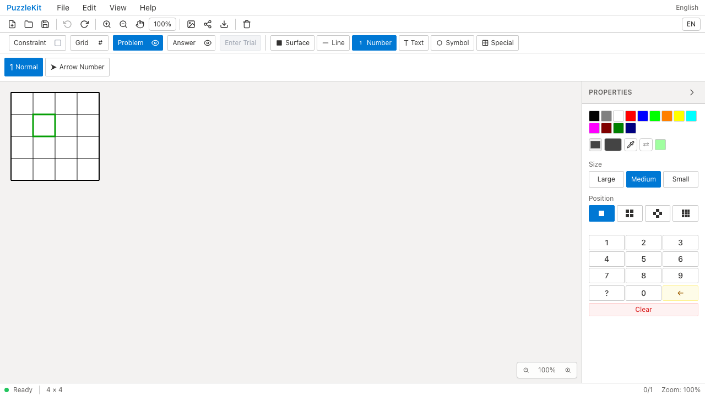
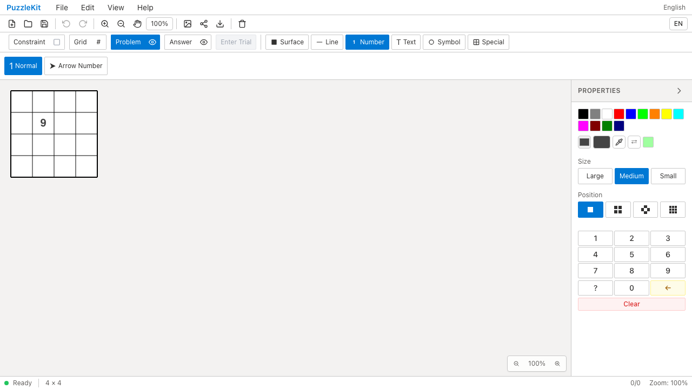
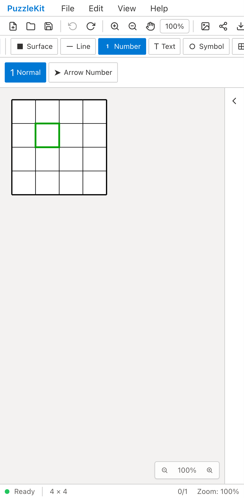
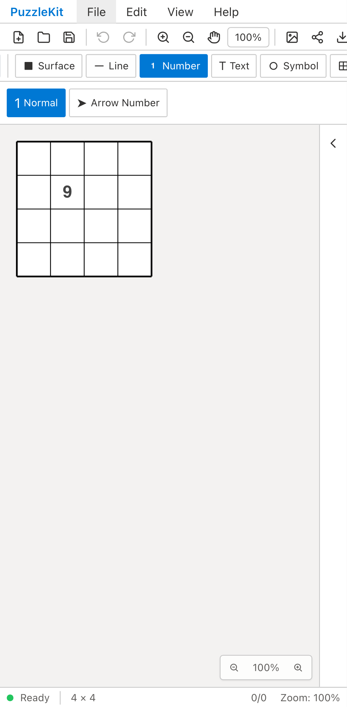
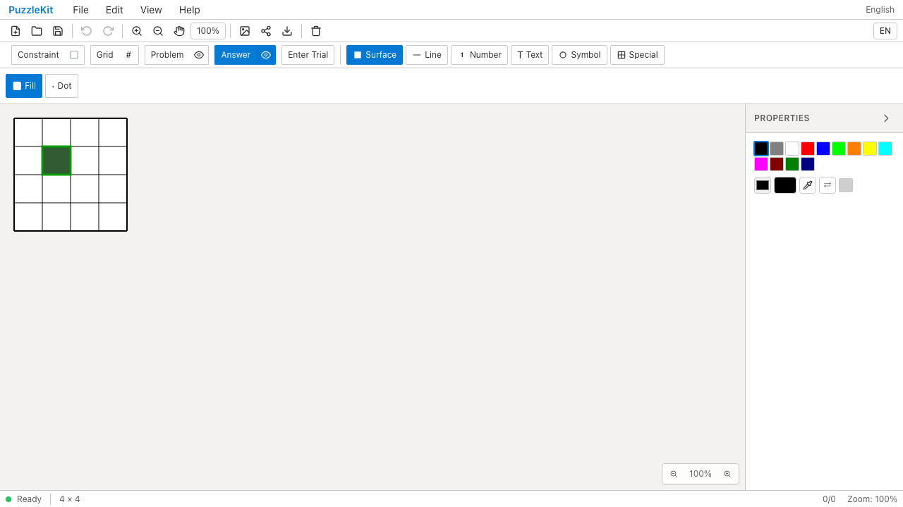
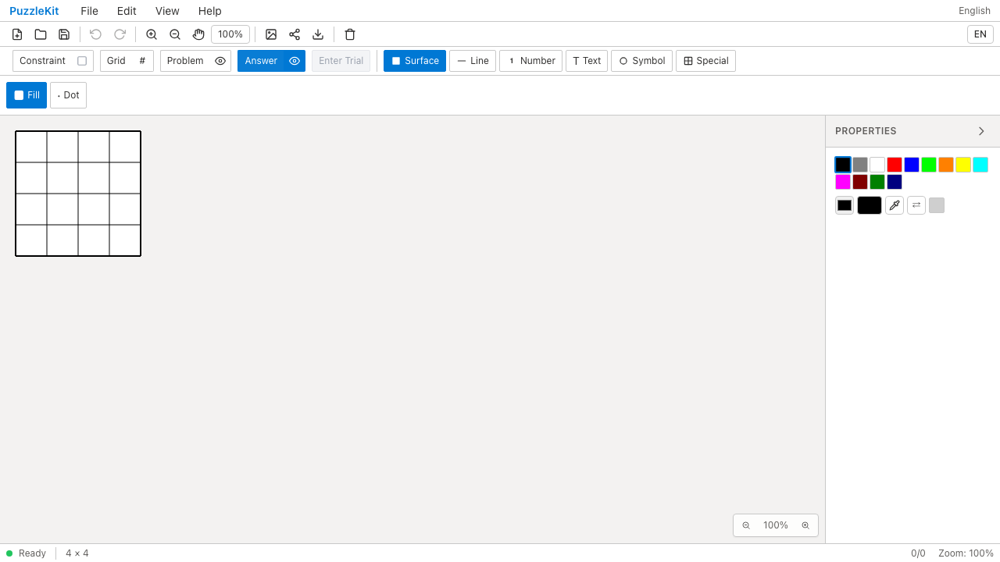
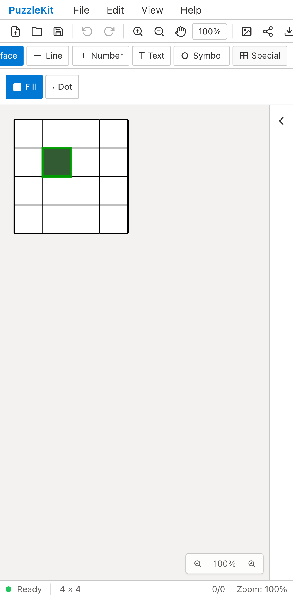
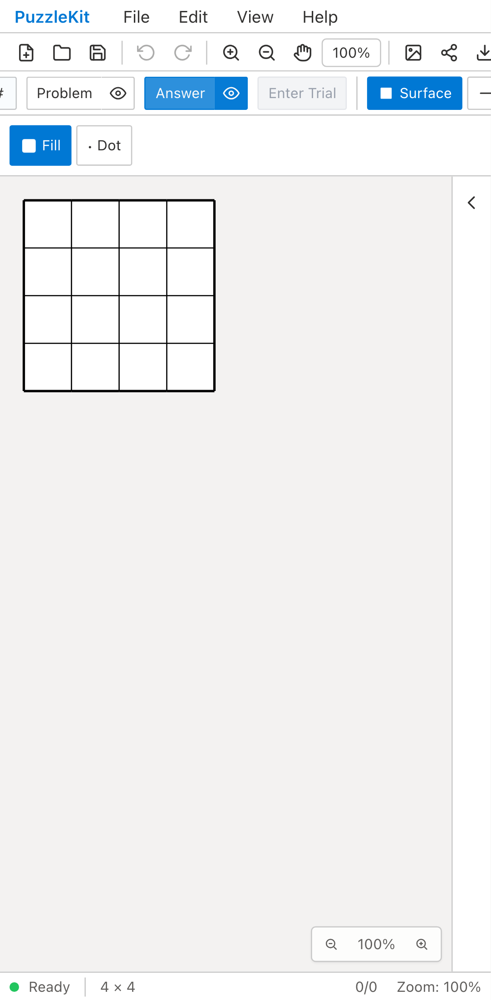

# 問題切替の編集セッション — QA 2026-09-12

File/Openで別の問題を読み込んでも前のUndo/Redoが残り、同一IDの数字を消せる問題と、Trial中New→Rejectで旧解答が新盤面へ戻る問題を修正した。

成功したNew、File/Open、URL／autosaveの読込、store importで、Trial snapshot・選択／カーソル・描画中の状態とUndo/Redoを破棄する。importsではviewportとツール設定の既存動作を維持し、Newは従来通りviewportを初期化する。読込前の変換・ID処理が失敗した場合は現在の盤面と編集履歴を保持する。

## 対象と結果

| 対象 | revision | 結果 |
|---|---|---|
| Before production | `888827354c2bd72a509d537717383bc6edce731f` | File/OpenとTrial→Newの2ケース×Chromium desktop/mobileが期待通り失敗 |
| After production | `b8086e83c1825bd47bc6efb8a2a0c96167d89ed4` | 同4ケース成功。読込後／New後の新しい編集のUndo/Redoも確認 |

- Unit: **1,194成功 / 78ファイル**。新規11件でNew/UI/store、nested Trial、選択、旧Undo/Redo、外側のhistory group、ID同期、無効データ、autosave、URL成功／失敗を確認。
- production QA: **70成功 / 1既存skip**。追加6件には不正JSONと必須データのないJSONでの盤面・Trial・Undo/Redoの保持を含む。
- アプリ／E2E型検査、production build、solver source maps成功。build警告なし。
- 全E2Eと最終commitのCI結果はPRの検証欄を参照。
- 追加Unit初回は3経路のセッション残留で3失敗／3成功。実装後、追加の保護ケースも含め新規11件が成功。
- 初回productionの不正ファイルテストでは、パネルとダイアログのCloseの指定が重複してstrict locatorエラーになった。テストを修正し、最終production全体は70件成功。元ログは作業記録に保持。

ブラウザQAはPlaywright＋Chromium、production build、Pixel 7相当のモバイルエミュレーション。物理端末ではない。問題ファイルは実UIで保存したJSONを基に別問題のfixtureを作り、実際のFile/Openから読み込む。ブラウザ内storeの直接書換えは行っていない。

## Before / After

File/Openは別サイズの問題（同一IDの数字9）を開いた直後に比較する。Beforeでは有効なUndoを押すと9が消える。Afterでは旧Undoが無効になり9が残る。

Newは9×9でTrialに入り4×4を新規作成した直後に比較する。Beforeでは残っているRejectを押すと古い解答が復活する。AfterではTrialが終了し、空の新規盤面が保持される。

| ケース | Before | After |
|---|---|---|
| File/Open desktop |  |  |
| File/Open mobile |  |  |
| New desktop |  |  |
| New mobile |  |  |

## 動画

| ケース | Before | After |
|---|---|---|
| File/Open desktop | [動画](evidence-puzzle-session-20260912/file-open-chromium-before.webm) | [動画](evidence-puzzle-session-20260912/file-open-chromium-after.webm) |
| File/Open mobile | [動画](evidence-puzzle-session-20260912/file-open-mobile-chrome-before.webm) | [動画](evidence-puzzle-session-20260912/file-open-mobile-chrome-after.webm) |
| New desktop | [動画](evidence-puzzle-session-20260912/new-trial-chromium-before.webm) | [動画](evidence-puzzle-session-20260912/new-trial-chromium-after.webm) |
| New mobile | [動画](evidence-puzzle-session-20260912/new-trial-mobile-chrome-before.webm) | [動画](evidence-puzzle-session-20260912/new-trial-mobile-chrome-after.webm) |

全8動画のdecode・Chromium再生／シークを確認。[ローカル再生用gallery](evidence-puzzle-session-20260912/index.html) · [revision・実行結果・SHA256](evidence-puzzle-session-20260912/evidence.json)。GitHubでは画像表と個別動画リンクから確認できる。

Trial内のReject/Acceptと履歴checkpoint、ファイルの制約設定保存、library buildは別対応。クラウド実アカウントでの通信は未検証。UI・設計レビューは非追跡 `.work` に保持する。
