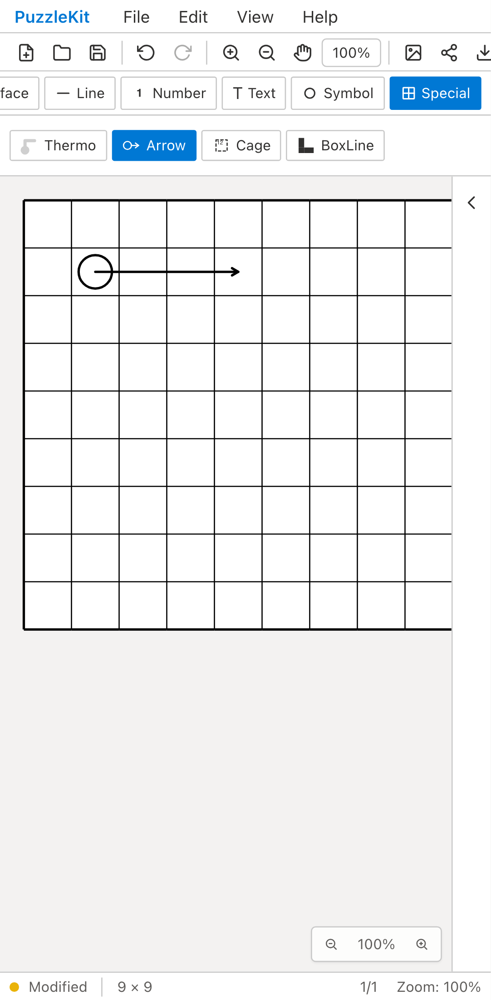
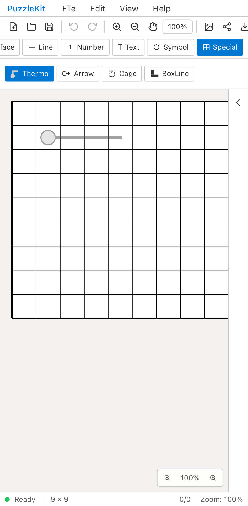
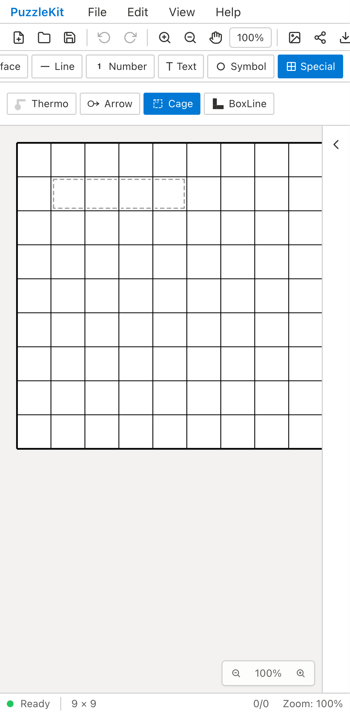
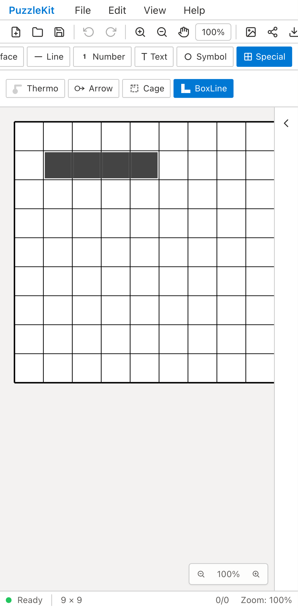
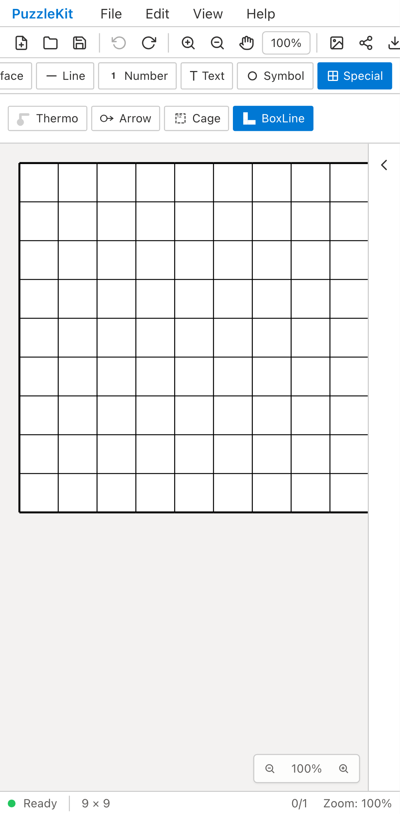

# Specialの指描画・BoxLine履歴QA — 2026-09-12

指で描いたArrow/Thermo/Cageがプレビューのまま確定しない問題と、BoxLineをUndoできない問題を修正しました。

## 対象とリビジョン

- Beforeアプリ: `c41e2e31a9c8400cc1f534eb025179a2052fa508`（PR #64）。Arrow/Thermo/Cageはdev server、BoxLineは同リビジョンのproduction buildで撮影。
- After / productionアプリ: `8c99cb6bce393889aa1ba13045f3ba6c7165dba3`。実行したソースをコミットしたリビジョンです。後続変更はQA証跡のみ。
- `/master`、Problem → Special。Chromium Pixel 7エミュレーションでCDPのtouchStart/move/endを使用し、盤面座標(80,80)から(200,80)へ指描画します。
- ツール・履歴・編集ボタンはtap、対象選択は画面のselectにselectOptionを使用。開発用ストアから図形を直接作成していません。
- ユーザー指定のPlaywright + ChromiumによるQAです。実端末や物理ペンの確認ではありません。

## Before / Afterの挙動

| 対象 | Before | After |
| --- | --- | --- |
| Arrow / Thermo / Cage | 指を離しても未確定プレビューが残り、図形や履歴が作成されない | 指を離すと図形が確定し、1回のUndo/Redoで戻せる |
| キャンセル・複数指への移行 | Specialの未確定経路を明示的に破棄しない | 未確定経路を破棄し、次の指描画に持ち越さない |
| BoxLine | 追加・削除・更新が履歴に記録されない | ID・色・セル列を保持してUndo/Redo。同じセル列への更新は履歴を増やさない |

長押し削除の後は確定処理を呼ばず、削除した図形を誤って作り直さないようにしました。Specialの確定には実際のpointerup座標を使い、最後のmoveから離れた位置で指を離した場合も終点を扱います。盤外で確定できない場合は未確定経路を破棄します。

## ローカル検証

- 全Unit: **1,183件成功、77ファイル**。
- 新規Unit: **51件成功**。4ツールの作成・1回のUndo/Redo・重複release・cancel・複数指/部分release・Pan Mode・Player Problem保護・長押し/2指/3指削除・最小セル数・マウス・ペン・盤外終了。BoxLineは更新、レイヤー切替後のUndo、セル配列のコピー、未変更時のRedo保持、外側の履歴グループ、Player保護を含みます。
- Special指操作E2E: **7件成功**。Arrow/Thermoは作成→Undo/Redo→先端短縮→Undo/Redo→SVG書出し→autosave完了待機→再読込。Cage/BoxLineは作成とUndo/Redo。Arrowでcancel・複数指・Pan Mode後の再描画を確認。
- 既存ジェスチャーE2E: **19件成功**。線描画、Grid、ピンチ、複数指、タップ入力。
- 本番Chromium QA: **64件成功、既存のPCタップ非対応1件は対象外**。今回の7件を常時実行する対象に追加しました。
- アプリ/E2E型チェック、production build、ソルバーのソースマップ検査、QA runner 3件、QA doctor成功。ビルド警告なし。
- Beforeの4件は対象不具合による期待された失敗。Arrow/Thermo/Cageは確定要素が0、BoxLineはUndoが無効で図形が残るアサーション失敗です。比較画像は失敗前に取得しています。
- 初回AfterでBoxLineのUndo無効を発見。履歴修正前の実行は比較用Afterから除外し、最終7件成功の記録を採用しました。
- 最終Afterとproductionはリトライなし、ブラウザ未処理例外なし。ペン、長押し/複数指削除、BoxLineの更新APIはUnitで検証し、録画した操作範囲と区別しています。

## 比較画像・動画

Arrow/Thermo/Cageは**指を離した直後**の比較です。Beforeはプレビューのままで履歴0、Afterは確定した図形と履歴が表示されます。BoxLineは**Undo操作後**を比較し、BeforeではUndoが無効のため図形が残り、Afterでは消えます。

比較8本と本番4本、計12動画を保存しました。全動画の再生時間・SHA-256・ffmpeg全フレームデコード・Chromiumでの再生とシークを検査しました。

[動画比較ページ（ローカルでHTMLを開く）](evidence-special-touch-20260912/index.html) · [リビジョンとチェックサム](evidence-special-touch-20260912/evidence.json)

### Arrow

| Before | After |
| --- | --- |
|  [動画](evidence-special-touch-20260912/arrow-mobile-chrome-before.webm) |  [動画](evidence-special-touch-20260912/arrow-mobile-chrome-after.webm) |

### Thermo

| Before | After |
| --- | --- |
|  [動画](evidence-special-touch-20260912/thermo-mobile-chrome-before.webm) |  [動画](evidence-special-touch-20260912/thermo-mobile-chrome-after.webm) |

### Cage

| Before | After |
| --- | --- |
|  [動画](evidence-special-touch-20260912/cage-mobile-chrome-before.webm) |  [動画](evidence-special-touch-20260912/cage-mobile-chrome-after.webm) |

### Boxline

| Before | After |
| --- | --- |
|  [動画](evidence-special-touch-20260912/boxline-mobile-chrome-before.webm) |  [動画](evidence-special-touch-20260912/boxline-mobile-chrome-after.webm) |

## 本番ビルドの証跡

- Arrow: [動画](evidence-special-touch-20260912/arrow-mobile-chrome-production.webm) · [画像](evidence-special-touch-20260912/arrow-mobile-chrome-production.png) · [書出したSVG](evidence-special-touch-20260912/arrow-mobile-chrome-production.svg)
- Thermo: [動画](evidence-special-touch-20260912/thermo-mobile-chrome-production.webm) · [画像](evidence-special-touch-20260912/thermo-mobile-chrome-production.png) · [書出したSVG](evidence-special-touch-20260912/thermo-mobile-chrome-production.svg)
- Cage: [動画](evidence-special-touch-20260912/cage-mobile-chrome-production.webm) · [画像](evidence-special-touch-20260912/cage-mobile-chrome-production.png)
- Boxline: [動画](evidence-special-touch-20260912/boxline-mobile-chrome-production.webm) · [画像](evidence-special-touch-20260912/boxline-mobile-chrome-production.png)

## 依存関係と関連Issue

依存PRは #60 → #63 → #64 → この変更です。Issue #30の具体例である先端短縮はPR #60が実装し、この変更は指による新規描画と履歴を補完します。Issueの完了判定は依存PRの統合後に行います。設計・UI Reviewは非追跡の`.work/`に保存しています。
