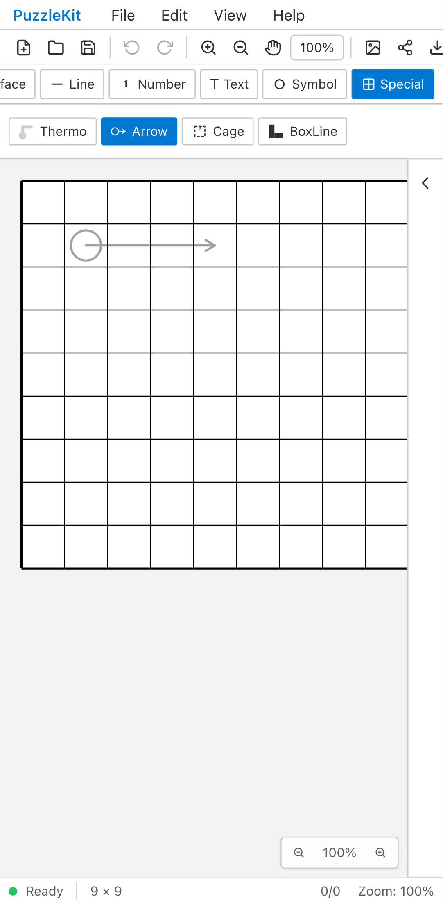
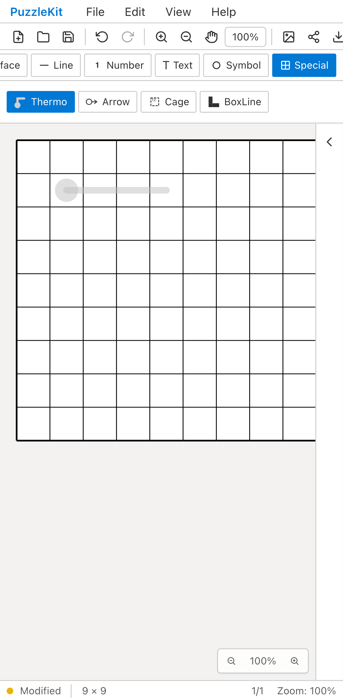

# develop統合のproduction QA — 2026-09-12

#63〜#65の修正をdevelopへ取り込む統合候補を再検証した。3件はfeatureブランチへのマージで止まっていたため、PRがmergedでもdevelopではタッチ作成の不具合を再現できた。

| 対象 | commit | 結果 |
|---|---|---|
| Before: develop | `623a530d2ca2cafda15bc2c23836abb082598669` | Arrow / Thermoのタッチ終了後、確定pathが0件（期待1件） |
| After: 統合候補 | `74cbf6faaf6ac6f71b0e2a4cd22aef1c61c1090a` | 両方とも作成・先端短縮・Undo/Redo・SVG出力・autosave reloadが成功 |

統合commitの4 parentsはdevelopと#63/#64/#65の各merge commit。ファイルツリーは#65 head `3e0cbb2` と完全一致する。新しいアプリ実装変更は含まない。

## 検証

- Unit: **1,183成功 / 77ファイル**。
- アプリ・E2E型検査、solver source map検査: 成功。
- production build: 成功、build警告なし。
- production Chromium QA: **64成功 / 1既存skip**（desktopで非対応のタッチケース）。テキスト編集・IME、数字パッド履歴、Specialタッチなどを含む。
- 今回の比較QA: ChromiumのPixel 7エミュレーション、production build、同じUI操作script。ブラウザ内storeの直接変更なし。物理端末／OSのIME入力試験ではない。
- Beforeは前の統合レビューで記録した同日・同じdevelopのproduction再現証跡。Afterは本統合候補をbuildして新規録画した。Beforeの2件の失敗は期待された不具合再現。
- 4動画を全フレームdecodeし、再生可能性を確認。最終CI・全E2E結果は本PRの検証欄を参照。

## 画面比較

指を離した直後の比較。Beforeは未確定previewが残り、Undoできるオブジェクトがない。Afterは確定済みオブジェクトでUndoが有効になる。

| 操作 | Before | After |
|---|---|---|
| Arrow |  |  |
| Thermo |  |  |

## 動画

| 操作 | Before | After |
|---|---|---|
| Arrow | [動画](evidence-stack-integration-20260912/arrow-before.webm) | [動画](evidence-stack-integration-20260912/arrow-after.webm) |
| Thermo | [動画](evidence-stack-integration-20260912/thermo-before.webm) | [動画](evidence-stack-integration-20260912/thermo-after.webm) |

[ローカル再生用ギャラリー](evidence-stack-integration-20260912/index.html) · [commit・観測値・動画情報・SHA256](evidence-stack-integration-20260912/evidence.json)。GitHub上のHTMLはソース表示になるため、PR内の画像比較と個別動画リンクからも確認できる。

## 統合対象の詳細な証跡

- [テキスト入力](2026-09-11-text-input.md)
- [数字パッドの履歴](2026-09-12-number-pad-history.md)
- [SpecialタッチとBoxLine履歴](2026-09-12-special-touch.md)

全体レビューで見つかったFile/Openの旧履歴、Trial、新規作成、ファイルの制約設定保存、library buildの問題は別対応。本PRの成功は、それらの修正完了を意味しない。UI・設計レビュー文書は非追跡 `.work` に保持する。
