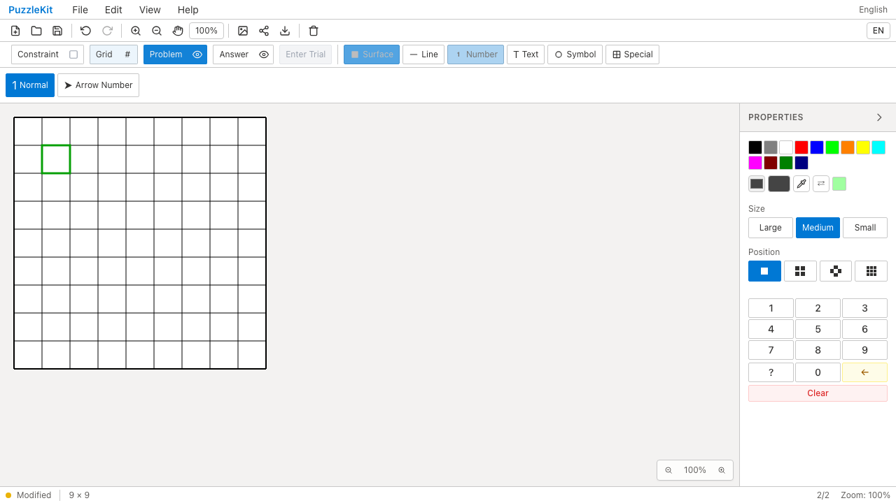

# テスト整理とQA証跡

本番処理を呼ばない実装コピー・型付きfixtureの自己確認を削除し、重複するPenpa/JSON変換を統合した。製品版Chromiumのケースは `@production` で選び、開発版で同じケースを二重実行しない。アプリ本体の変更はない。

## 残した保証

- 半線・タッチは本番のtopology処理、入力hook、ブラウザー操作で確認する。
- PenpaはUnicode、特殊配列、回答レイヤー、圧縮あり／なし、履歴の除外／保持、外部URL解析を残した。汎用serializerに各grid名を渡すだけの反復を廃止した。
- JSONはgrid/state全体を比較し、要素・属性の欠落を確認する。Providerの提供storeは既存のcomponent/hookテストで確認する。
- 矢印はテスト内の疑似描画計算を削り、本番の方向計算結果を検査する。未指定の方向に既定値が入らないようfixtureの引数を明示した。
- Workerの実行・再試行・キャンセル、履歴と編集保護、IME、描画の回帰は維持した。WebKitの回帰も引き続き実行する。

削除判断は「削ると見逃す現実的な不具合」と保守・実行費用による。件数・カバレッジを維持すること自体は目的にしていない。全監査候補のうち、今回の範囲はP1全16項目と変換などの統合13項目。個別tool・幾何・描画のケース縮約は続く整理対象である。詳細監査・進捗台帳は非追跡 `.work` に保持する。

## 検証

| 検査 | 結果 |
|---|---|
| source map / app型検査 / E2E型検査 / doctor / build | PASS |
| Unit | 73ファイル・1,002件PASS（整理前78ファイル・1,194件） |
| QA runnerの子process・失敗集約 | 3件PASS |
| 開発版E2E | 255 PASS / 1既存skip、約225秒 |
| 製品版E2E | 70 PASS / 1既存skip、約39秒 |
| 同じChromium操作のBefore / After | 各5件PASS |
| 分離した撮影用config | 13 PASS / 1既存skip |

開発版／製品版のskipはdesktopでのfinger操作、撮影用configのskipはdesktop専用6×6撮影のmobile実行。新規の失敗回避skipは追加していない。

収集結果を変更前と突合し、製品版の71枠は完全一致、開発版との重複はゼロ。開発版は359→256枠で、除外103枠の内訳は製品版との重複71、UI撮影20、NPGenerator撮影8、XML失敗→回復フローに包含される成功例4。[ケース別の照合結果](evidence-test-consolidation-20260914/selection-validation.json)に全除外枠を記録した。

過去の同じアプリコードのローカル記録は開発版約316秒・製品版約59秒。実行条件は同一ではなく、今回の差を削除だけの速度改善とは断定しない。Unitも過去約15.18秒、今回15.84秒であり、時間短縮を主張しない。Unitの主効果は約2,400行の保守対象削減である。

## PRから確認できるBefore / After

Beforeは `7a2d387`、Afterは `3589880`。同じ `e2e/editor-issues.spec.ts` とChromium設定で録画し、双方5件が成功した。テスト整理のため画面上の挙動は同じである。

| 操作 | Before | After |
|---|---|---|
| Free Segment → Undo/Redo |  |  |
| 数字入力 → Backspace |  |  |

| 動画 | Before | After |
|---|---|---|
| Free Segment | [再生](evidence-test-consolidation-20260914/free-segment-before.webm) | [再生](evidence-test-consolidation-20260914/free-segment-after.webm) |
| 数字削除 | [再生](evidence-test-consolidation-20260914/number-delete-before.webm) | [再生](evidence-test-consolidation-20260914/number-delete-after.webm) |

[ローカル再生用gallery](evidence-test-consolidation-20260914/index.html) / [revision・結果・SHA256](evidence-test-consolidation-20260914/evidence.json)。4動画の全decodeとChromiumでの再生・シークを確認した。全ケースの動画・trace・ログは各QA runに保持し、CIも従来どおりartifactを30日保存する。

## 再現

```bash
npm run qa:check
npm run build
npm run qa:production
# Beforeは7a2d387をcheckoutしたworkspaceで実行
npm run qa:capture -- before e2e/editor-issues.spec.ts --project=chromium
# 整理後のrevisionで同じ操作を実行
npm run qa:capture -- after e2e/editor-issues.spec.ts --project=chromium
npm run qa:capture -- after --config=playwright.capture.config.ts
```

製品版に割り当てたケースを開発サーバーで調査するときは `QA_INCLUDE_PRODUCTION_TESTS=1 npm run test:e2e`。`qa:capture` はこの指定を自動で行う。撮影用NPGenerator画像はrunごとの `screenshots/` に保存し、公開済み画像を上書きしない。
