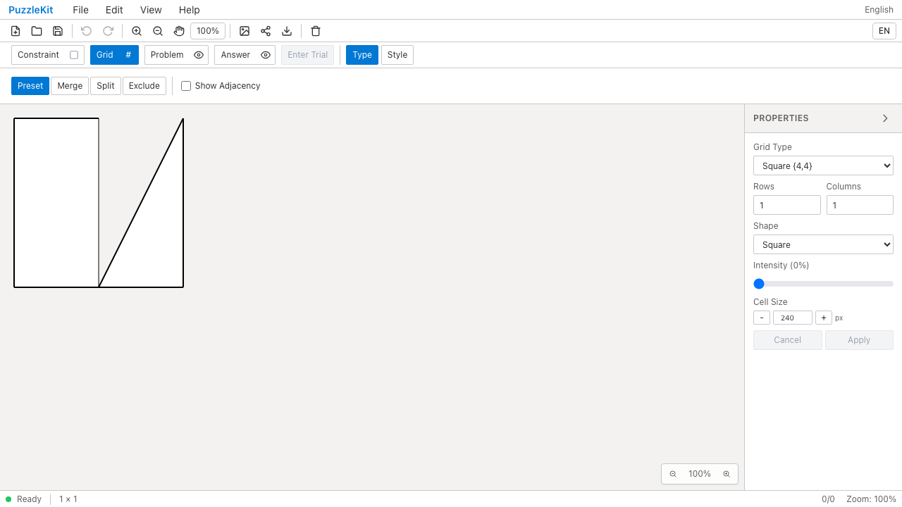
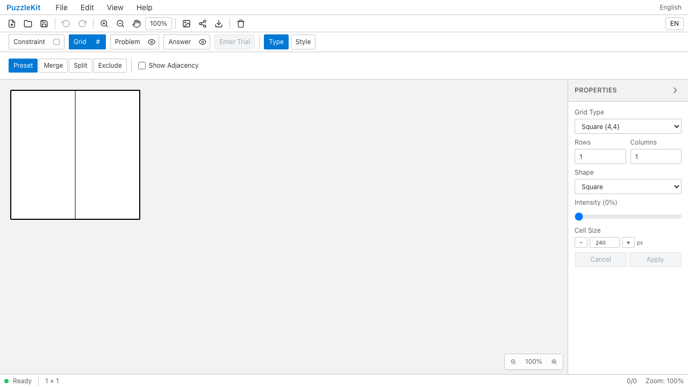
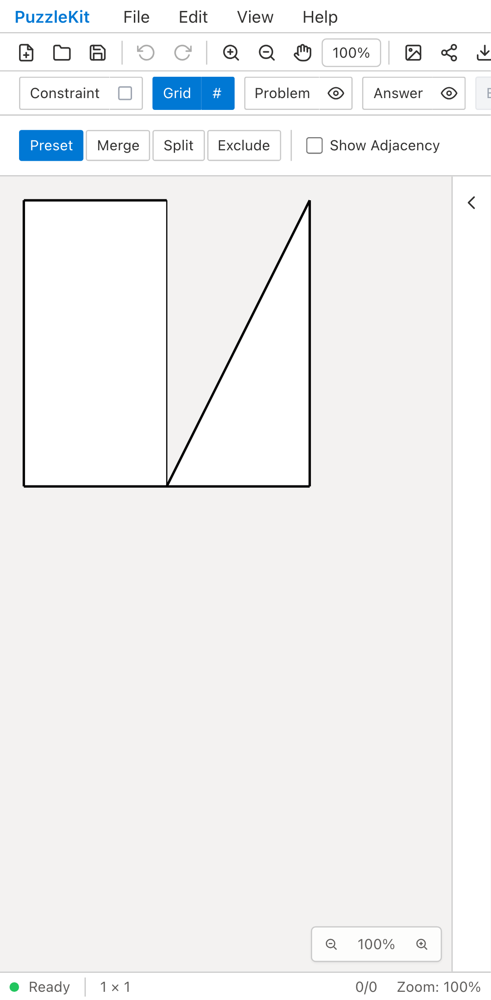
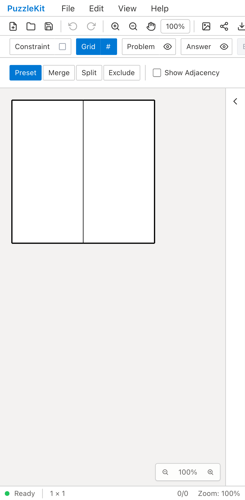

# 辺上の分割点によるセル分割 QA — 2026-09-15

1セルの正方形で、上辺と下辺の中点を指定した保存JSONをFile Openすると、修正前は2頂点の退化セルと不正な6頂点セルが生成されました。修正後は120×240の長方形2枚（面積各28,800）になります。撮影は同一JSON・同一ハーネス、PC/mobile Chromiumで実施しました。

分割点を実際に属する辺へ順序どおり挿入し、辺の向きと既存頂点への一致を扱います。別セル・存在しない辺への参照を推測で補完する旧動作は廃止し、無効な分割は元のセルを保持します。通常のUI分割ジェスチャーは頂点指定です。本件は保存JSON/APIのedge指定経路を対象とし、任意の凹多角形の全分割を保証するものではありません。

## 検証

- 旧geometryテスト10件は不具合があっても成功。期待座標・面積と無効参照の保持へ置換すると、旧実装で5失敗・9成功。修正後geometryとmultitouchの対象31件が成功。
- Unit 958件/72ファイル、アプリ/E2E型検査、solver source map検査が成功。
- 開発E2E: 255成功・既存skip 1。
- アプリビルド成功後、本番E2E: 70成功・既存skip 1。
- 先行PRを含むローカル統合 `113f36c` でライブラリビルド、全Unit591件/68ファイル、アプリ/E2E型検査が成功。統合全E2Eはこの時点では未再実行。
- Before: `c6e07799cfec71aa7d345216acca780f048c0bb2`、After: `cd38396639c1f2515e73b9e17e60b67fb7daf9c5`。両撮影時clean。552ソースの差は分割処理とgeometryテストの2ファイルのみ。
- Beforeの2件成功は既知の不正な頂点数2/6を記録できた意味です。Afterは2件とも頂点数4/4・面積を検証しています。4動画の全デコード、Chromium再生・シーク、4画像の内容を確認済み。

## 証跡と再現

[動画ギャラリー](evidence-edge-split-20260915/index.html) / [撮影revision・メディアSHA256](evidence-edge-split-20260915/evidence.json)。HTMLは証跡フォルダごと取得して開くと比較再生できます。各profileの `*-polygons.json` は画面SVGから取得した頂点です。

| PC Before | PC After |
|---|---|
|  |  |
| [動画](evidence-edge-split-20260915/chromium-before.webm) | [動画](evidence-edge-split-20260915/chromium-after.webm) |

| Mobile Before | Mobile After |
|---|---|
|  |  |
| [動画](evidence-edge-split-20260915/mobile-chrome-before.webm) | [動画](evidence-edge-split-20260915/mobile-chrome-after.webm) |

公開した `fixture.json` を `/master` のFile → Openで読み込めば手動再現できます。撮影入力は以下の名前で各revisionのチェックアウトへコピーします。撮影用 `.work` ファイルはソースmanifest対象外なので、実行したファイルそのものを証跡に含めています。

| 証跡ファイル | コピー先 |
|---|---|
| fixture.json | .work/edge-split-qa/fixture.json |
| edge-split.spec.ts.txt | .work/edge-split-qa/edge-split.spec.ts |
| edge-split-qa.config.ts.txt | .work/edge-split-qa.config.ts |
| vite-special-fixture.config.ts.txt | .work/vite-special-fixture.config.ts |

リポジトリルートでサーバーを起動し、別シェルから該当revisionに合わせてbefore/afterを指定します。

```sh
npm ci
npx playwright install chromium
npm run dev -- --config .work/vite-special-fixture.config.ts --host 127.0.0.1 --port 4186 --strictPort
QA_EXTERNAL_BASE_URL=http://127.0.0.1:4186 npm run qa:capture -- after --config .work/edge-split-qa.config.ts
```

最初のAfter撮影はサンドボックスがChromiumのMachPort作成を拒否して起動前に終了し、権限を切り替えた撮影が成功しました。全QAの最初のE2EもサーバーbindのEPERMで未実行となり、Unit等の成功後にE2E以降を再実行しました。アプリの失敗とは分けて扱っています。
