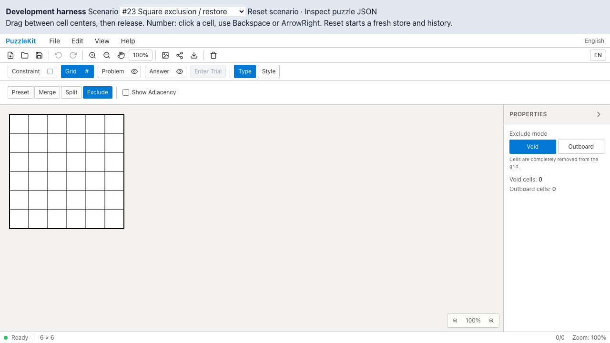

# セル除外テストの画像保存整理 QA — 2026-09-15

マウスによるsquare/hexセル除外テストで、各ケースが無条件保存する `excluded.png` / `restored.png` を削除しました。別ファイルへ移した後も残っていた保存処理です。復元後は共通の最終画面と重複し、除外中の状態も比較動画で確認できるため、個別画像2枚を保守しない判断です。

起動・実マウスclick・セル数減少・同じ場所のclick・元のセル数への復元は不変です。検査を画像比較に置き換えるものではありません。途中状態を静止画1枚で確認する便宜は減り、動画で確認します。アプリ変更・新規skipなし、実行時間/flake改善は未計測です。

- base: PR #97 `11ad8b75e2669c4245b6a484764f711417febe53`。After code: `21add01d60b6fe6ce66a9270a25c994ede4bc987`。両撮影時clean。
- desktop Chromium/WebKitでBefore4件・After4件・通常実行4件成功。E2E型検査成功。
- 個別PNGはBefore8枚（excluded/restored各4）からAfter0枚。通常実行でもPNG0枚。
- 先行PRを含むローカル統合で対象4件と型検査成功。QA保存先を明示した通常成功時もPNG/WebM/trace ZIPは0件。全体Unit/E2E/buildは直前の統合で成功済みで、この画像保存だけの変更では繰り返していません。
- 撮影ソース555ファイルの差は対象specだけ。4動画を全デコードし、Chromium再生/シーク・4画像の内容を確認済み。

以下はdesktop Chromiumの代表証跡です。最終画像は両方とも復元後です。除外中は動画内で確認できます。

| Square Before | Square After |
|---|---|
|  |  |
| [動画](evidence-exclusion-artifacts-20260915/square-before.webm) | [動画](evidence-exclusion-artifacts-20260915/square-after.webm) |

| Hex Before | Hex After |
|---|---|
|  |  |
| [動画](evidence-exclusion-artifacts-20260915/hex-before.webm) | [動画](evidence-exclusion-artifacts-20260915/hex-after.webm) |

[撮影revision・SHA256](evidence-exclusion-artifacts-20260915/evidence.json) / [動画ギャラリー](evidence-exclusion-artifacts-20260915/index.html)。各revisionで以下を実行します。

```sh
npm run qa:capture -- before e2e/cell-exclusion.mouse.spec.ts
npm run qa:capture -- after e2e/cell-exclusion.mouse.spec.ts
npm run typecheck:e2e
npx playwright test e2e/cell-exclusion.mouse.spec.ts
```

今回の撮影はmetadata記載の `QA_EXTERNAL_BASE_URL=http://127.0.0.1:4186` を指定しました。実touchによる除外・復元は別テストのままです。
