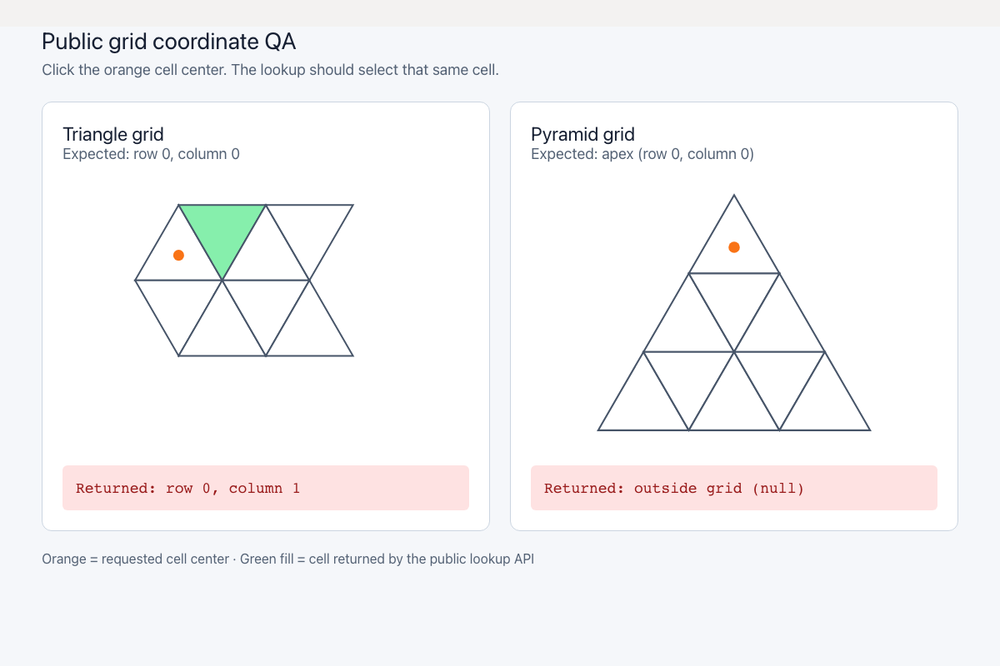
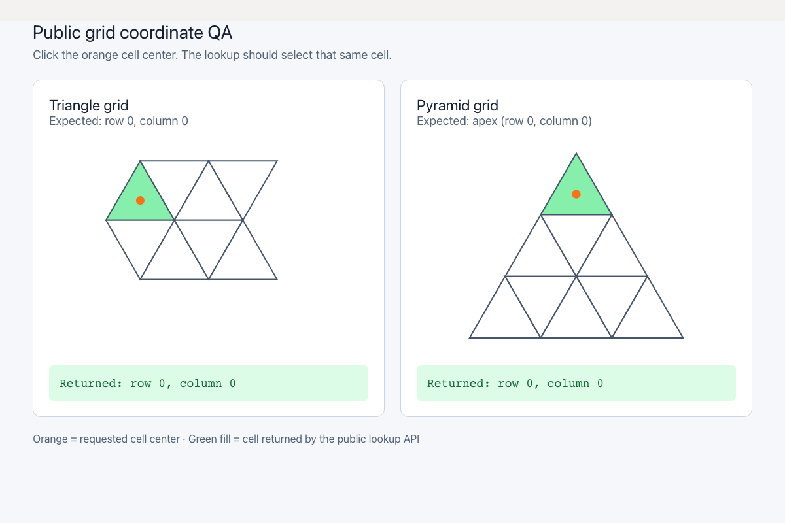

# 三角形・ピラミッドの座標逆変換 QA

`pixelToTri` は三角形の中心を隣のセルとして返し、`pixelToPyramid` は頂点側のセル中心を盤外として返していました。半セル幅だけで列を決めていた処理に斜辺の判定を加え、行ごとの向きとピラミッドの左右境界を扱います。共有する斜辺上は右側のセルに割り当てます。

この修正は公開座標APIのものです。通常の編集キャンバスからの直接利用は確認できなかったため、以下は実際のAPIと頂点座標を使った診断画面で同じ位置をクリックした記録です。

| | Before | After |
|---|---|---|
| revision（変更なしの作業ツリー） | `c6e07799cfec71aa7d345216acca780f048c0bb2` | `f8502522e5c405be6c8b243e9c9591a818c7102b` |
| 三角形の `(0, 0)` 内部をクリック | `(1, 0)` を選択 | `(0, 0)` を選択 |
| ピラミッドの `(0, 0)` 内部をクリック | `null` | `(0, 0)` を選択 |
| 画面 |  |  |
| 録画 | [Before](evidence-grid-lookup-20260915/before.webm) | [After](evidence-grid-lookup-20260915/after.webm) |

オレンジの印がクリック対象、緑の塗りがAPIの返したセルです。Playwright + Chromiumで実クリックし、返り値も検証しました。[入力値・返り値・SHA256](evidence-grid-lookup-20260915/evidence.json)を保存しています。両録画の全フレームのデコード、Chromiumでの再生・シークを確認済みです。runtime errorは両方0件。[ローカル比較用HTML](evidence-grid-lookup-20260915/index.html)もあります。

検証結果:

- 追加した回帰テスト6件は修正前に5件失敗・1件成功、修正後は全件成功。中心、斜辺の両側、行の偶奇、盤外、別サイズを確認。
- Unit全体960件／73ファイル成功。関連3ファイル88件成功、追加テストのTypeScript検査成功。
- source map確認、アプリ／E2E型検査、アプリのproduction build成功。
- 開発版E2E: 255成功・1既存スキップ。本番版Chromium: 70成功・1既存スキップ。
- PR #70のテスト整理との一時統合でも、関連テスト29件成功・マージ競合なし。

最初の開発版E2E実行中に、`.work` 内の別worktreeの `tsconfig.json` 更新に伴うViteの全再読み込みが記録され、失敗が発生しました。QA用HTMLの更新にも再読み込み通知が出ていましたが、別パスのHTML通知だけでは編集ページは再読み込みされないことを追加調査で確認しています。その実行は中断し、監視とキャッシュを分離したサーバーで代表9件、その後全E2Eを再実行して上記の成功を確認しました。初回実行を成功としては扱っていません。

`build:lib` は修正前後で同じ19件の型エラーがあり、このPRのアプリビルド成功とは別です。ライブラリ側の型設定・宣言生成は別PRで修正します。
