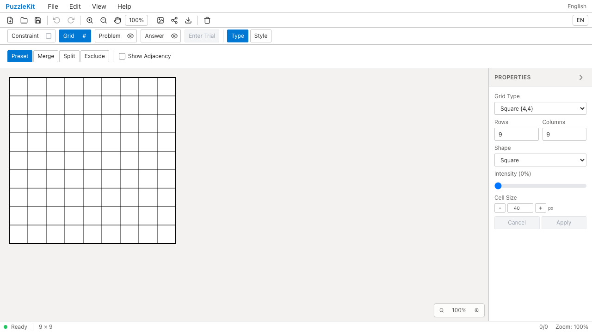
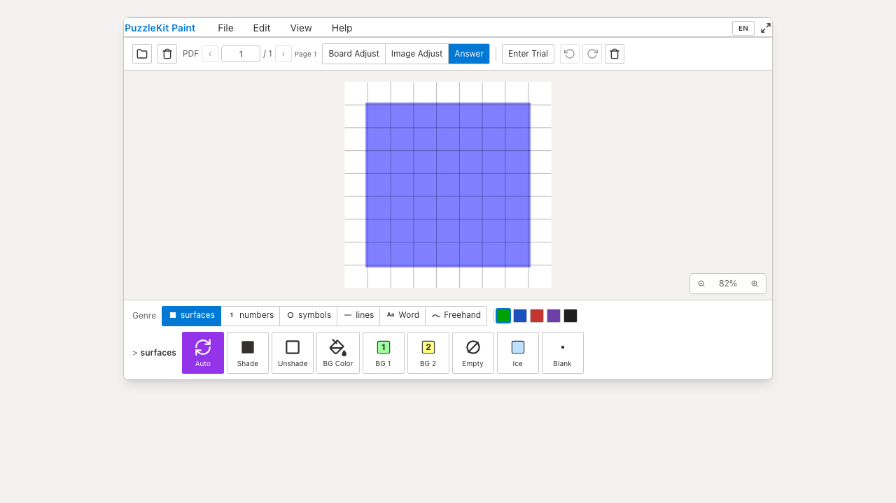

# ライブラリ型ビルドの復旧 QA

基準コミット `c6e07799cfec71aa7d345216acca780f048c0bb2` の `npm run build:lib` は19件の型エラーで失敗していました。アプリ用とライブラリ用のTypeScript設定がずれており、Viteの `import.meta.env` / Worker import型、既に使用しているES2022のAPI型が不足していました。また、公開フックの戻り値に含まれる `SculptHover` が非公開で、型宣言を生成できませんでした。

`lib` / `types` をアプリと揃え、`SculptHover` をexportしました。出力targetは従来のES2020のままです。CIに `build:lib` を追加し、アプリビルドだけが成功している状態ではこのエラーを見逃さないようにしました。ビルド確認後にアプリをbuildし直して本番E2Eを実行します。

修正コミット: `2898508b9b8417763c50f8889d373dd50d73fb4f`。Before/Afterとも変更のない作業ツリーで録画しました。

| 確認 | Before | After |
|---|---|---|
| `npm run build:lib` | 型エラー19件 | 成功 |
| 公開エントリ | ビルド失敗 | core / compat / runtime / react のJS・型宣言を生成 |
| Chromium: 全アプリ入口・PDF Worker取り込み | 7成功 | 7成功 |
| Master |  |  |
| Master動画 | [Before](evidence-library-build-20260915/master-before.webm) | [After](evidence-library-build-20260915/master-after.webm) |
| PDF取り込み |  |  |
| PDF取り込み動画 | [Before](evidence-library-build-20260915/paint-pdf-before.webm) | [After](evidence-library-build-20260915/paint-pdf-after.webm) |

画面はアプリの回帰確認で、見た目の変更はありません。録画した4動画は全フレームのデコードとChromiumでの再生・シークを確認済み。runtime errorは0件。[revision・SHA256・media情報](evidence-library-build-20260915/evidence.json) / [ローカル比較用HTML](evidence-library-build-20260915/index.html)。

修正後の全体確認はUnit954件／72ファイル、開発版E2E255成功・1既存スキップ、本番版Chromium70成功・1既存スキップ。source map確認、アプリ／E2E型検査、アプリbuildも成功しました。`qa:check` の全ステップが成功しています。

別PRの格子テスト整理・座標API修正には依存しません。詳細なエラー比較と作業記録は非追跡 `.work` に保存しています。
