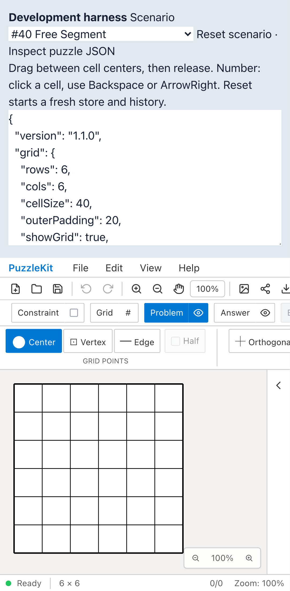

# QA成功時の証跡保存を整理

通常の回帰テストでは、成功時の動画・trace・途中/最終画面を保存しない。`QA_ARTIFACT_DIR` は保存先だけを指定する。失敗時の動画・trace・自動画面、ログ、結果JSON、SVG/PNG出力等の検査対象データは残す。

Before/Afterの `qa:capture` と撮影専用configは成功時も全証跡を保存する。通常の全検証でも全件保存したい場合は `QA_RECORD_SUCCESS=1` を指定する。成功後に過去のその実行の動画を取り出すことはできなくなるため、調査目的の実行では事前にこの設定を使う。

変更はPlaywright設定3file、共通fixture、11specの撮影条件、説明文。撮影条件とimportを除く11spec本文は基点と完全一致することを確認した。テスト操作・assertion・実行集合は不変（開発252枠、本番71枠、追加skipなし）。`retain-on-failure` は実行中の記録自体を停止しないので、保存・アップロード量の削減を実行速度の改善と混同しない。

実Chromiumで正常1件・assertion失敗1件・ブラウザー例外をfixtureが検出する失敗1件を用意し、次の6設定を確認した。検査用ページは保存動作を確認するためのHTMLであり、製品の機能テストとは別である。18件中の12失敗は意図した結果で、設定検証はすべて成功した。

| 設定 | 正常時 | assertion/fixture失敗時 |
|---|---|---|
| 通常development / 通常production | 動画・trace・最終画面なし | 動画・trace・自動画面あり |
| development / productionで `QA_VARIANT=after` | 動画・trace・最終画面あり | 同左＋自動画面 |
| 撮影専用config / `QA_RECORD_SUCCESS=1` | 動画・trace・最終画面あり | 同左＋自動画面 |

保存された16動画を全decode、16traceをZIP検査した。さらに実アプリのFree Segmentと文字再編集を明示的な全件保存で実行し、2件成功、途中画像の直接ファイル保存と添付、最終画像、動画、traceを確認した。[保存検証・hash](evidence-qa-artifact-retention-20260915/retention-verification.json)。

全Unit954件/72file、app/E2E型検査・source map、app build成功。通常の開発E2E251件成功・1既存skip、本番Chromium E2E70件成功・1既存skip。両レポートと出力フォルダを調べ、成功テストの動画・trace・撮影画像が0件であることを確認した。検査対象のexport画像やJSONは残る。今回のローカル出力は開発約1.59MB、本番約1.27MB。環境の異なるCIのサイズや速度を保証する数値ではない。

依存はPR #99、baseは `feature/test-special-fixture`。先行PR全体とのローカル統合ではPDF分割等に伴う4fileの競合を解消し、移動先 `pdf-import.spec.ts` へ撮影条件を引き継いだ。統合の型検査と実行集合（開発202・本番65枠不変）を確認。統合の全Unit/E2Eは今回は再実行していない。リモートのPRは未マージ。

Before `44d1f0037cece199f3963c7fd4b77ef962bc39f8` / After `0440d1ba55549f3c777c3cc6431ab0b2e148a7a9`、撮影時clean。Before source554fileは基点と一致、変更sourceは上記設定と撮影処理のみ。既存ハーネスのシナリオ切替・JSON確認をdesktop/mobile Chromiumで両phase各2件実行した。

| 証跡 | Before | After |
|---|---|---|
| ハーネス操作（mobile） |  |  |
| 操作動画 | [Before](evidence-qa-artifact-retention-20260915/qa-harness-before.webm) | [After](evidence-qa-artifact-retention-20260915/qa-harness-after.webm) |

2画像を確認し、2動画を全decode・Chromium再生/シークで確認済み。[gallery](evidence-qa-artifact-retention-20260915/index.html) / [撮影revision・SHA256](evidence-qa-artifact-retention-20260915/evidence.json)。詳細監査・UI Reviewは非追跡 `.work` に保存。

保存設定の検証を再実行する場合、[検査用spec](evidence-qa-artifact-retention-20260915/retention-cases.spec.ts.txt) と [development](evidence-qa-artifact-retention-20260915/development.config.ts.txt) / [production](evidence-qa-artifact-retention-20260915/production.config.ts.txt) / [capture](evidence-qa-artifact-retention-20260915/capture.config.ts.txt) を `.work/retention-probe/` に末尾 `.txt` を除いて配置し、[検証スクリプト](evidence-qa-artifact-retention-20260915/check-retention-matrix.py.txt)を `.work/check-retention-matrix.py` に保存する。

```bash
python3 .work/check-retention-matrix.py
npm run qa:check
npm run build
npm run qa:production
# すべての成功証跡が必要な場合
QA_RECORD_SUCCESS=1 npm run qa:check
# 各revisionでbefore/afterを指定
npm run qa:capture -- before e2e/ui-audit.spec.ts --project=chromium --project=mobile-chrome
```

ローカル開発/撮影は専用Vite4186へ `QA_EXTERNAL_BASE_URL` で接続し、`.work`/`docs/qa` watch除外と専用cacheを設定。本番は標準preview4176。
