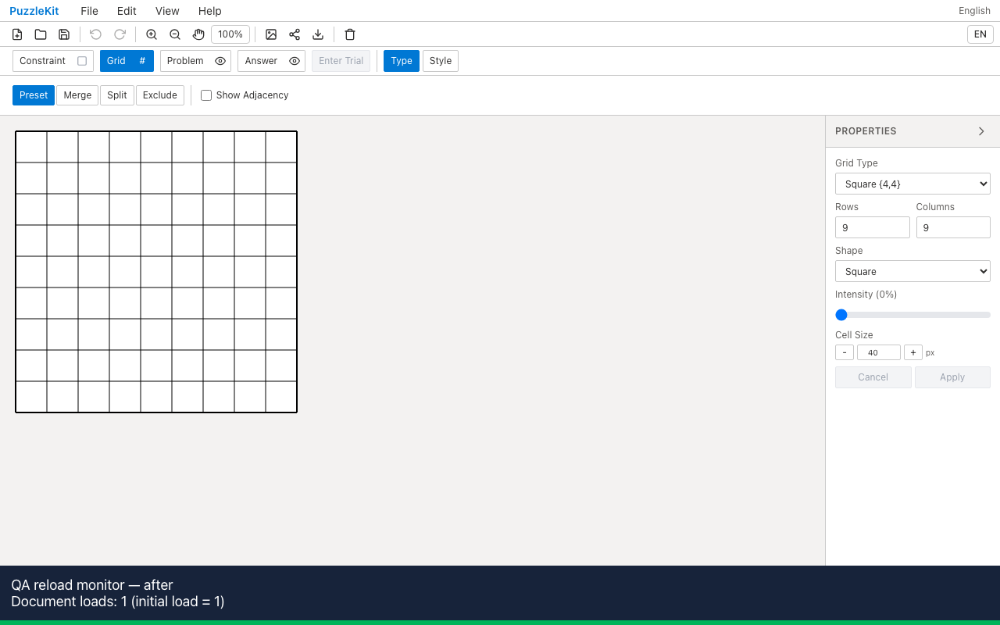

# QAサーバーの作業領域分離

`.work` 内に作成した別worktreeの `tsconfig.json` 更新によって、Viteが全モジュールを無効化し、実行中のQAページを再読み込みしていました。QA設定で作業領域と証跡を監視から除外し、最適化済み依存もworktreeごとに分離しました。

除外パターンは対象worktreeのルートに固定しています。親の `.work` 配下に置いたworktreeでも、自身の `src` は監視されます。キャッシュは `.work/node_modules/.vite-qa` に配置し、トップレベルの `node_modules` が共有シンボリックリンクでも相互に書き換えません。

Playwright + Chromiumで実際のMaster画面を開いたままファイルを更新しました。画面下の診断表示はページ読み込み回数です。1が初回表示、2が意図しない再読み込み後です。緑の下線は `src` のCSS変更が反映されたことを示します。

| 計測 | Before | After |
|---|---|---|
| revision（変更なしの作業ツリー） | `c6e07799cfec71aa7d345216acca780f048c0bb2` | `e83dc18ce521451e4e8b44c0e0f117d4390cc497` |
| 子worktreeのtsconfig更新による再読み込み | 1回 | 0回 |
| 別パスのQA用HTML更新 | 再読み込み通知1件、編集ページの再読み込み0回 | 通知0件、再読み込み0回 |
| `src` のCSS変更 | 反映成功 | 反映成功 |
| 画面 |  |  |
| 動画 | [Before](evidence-qa-isolation-20260915/before.webm) | [After](evidence-qa-isolation-20260915/after.webm) |

更新後2秒の観測区間で回数とWebSocket通知を記録し、期待値を検証しました。両動画の全デコード、Chromiumの再生・シークを確認済み。runtime errorは0件。[計測結果・SHA256](evidence-qa-isolation-20260915/evidence.json) / [比較用HTML](evidence-qa-isolation-20260915/index.html)。

追加検証:

- 同じ `node_modules` を共有する2つのworktreeで、別々のキャッシュに18依存ずつ生成されたことを実ファイルで確認。主worktreeの全E2E実行中に別worktreeも起動し、編集操作5件が成功。
- Unit954件／72ファイル、開発版E2E255成功・1既存スキップ。本番版Chromium70成功・1既存スキップ。
- source map確認、アプリ／E2E型検査、変更したQA設定の追加型検査、アプリbuild成功。

通常dev・本番アプリの動作は変更していません。外部QAサーバーではこの設定を使用し、ブランチ切替後は再起動してから検査します。設定変更中の失敗記録と詳細調査は非追跡 `.work` に保存しています。
