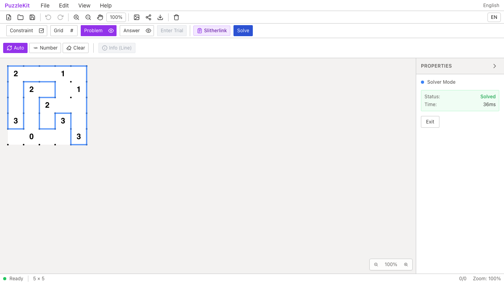
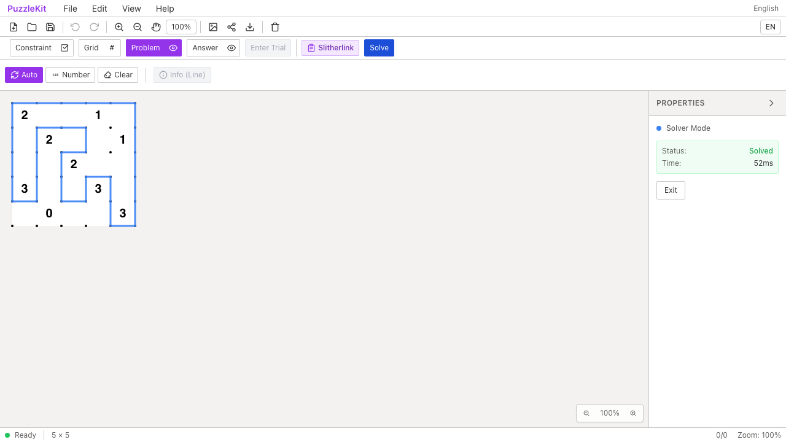
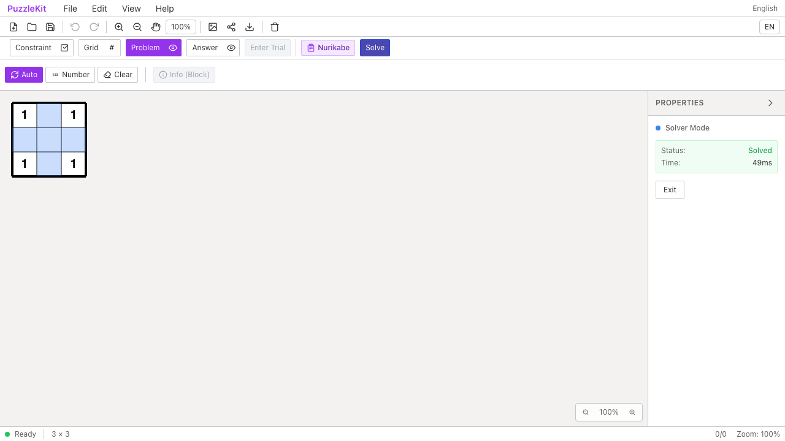

# 旧ソルバー診断整理のQA

旧 `test-solver*` / `test-yajilin*` / `test-slither-solver.ts` の手動診断10本・623行を削除した。期待解を判定せずconsole出力を手動で見る処理と、パーサーのコピーを整理し、現在のQAコマンドと歴史的な再現URLを[testingガイド](../testing.md#ソルバーの診断)へ集約した。

ソルバー本体・現行Unit/E2Eは変更していない。過去のQA manifestに残るファイル名とhashも保持する。削除対象はCIで実行されていなかったため、CI時間やUnit件数の削減とは扱わない。詳細なC128〜C137の監査は非追跡 `.work` に保存する。

| 検査 | 結果 |
|---|---|
| source map / app型 / E2E型 / app build | PASS |
| Unit | 954件 / 72ファイル PASS（変更前と同数） |
| 開発版E2E | 255 PASS / 1既存skip |
| 本番版Chromium E2E | 70 PASS / 1既存skip |
| Before / After Chromium | 各ソルバー8件 PASS |
| 配布物比較 | 全87ファイルのSHA256が一致 |
| #70〜#83＋本変更のローカル統合 | 662件 / 68ファイル PASS |

library buildは#78統合時に成功し、以降はテスト・診断・docs変更のみ。全PR統合ブランチでE2Eは再実行していない。

Before `c6e0779` / After `d8835f2`。URL取込、Nurikabeの解あり/解なし・確定セル、Wasm取得失敗からの再試行、Heyawakeの部屋制約、キャンセル、Worker起動失敗からの復帰、Slitherlinkの完成ループをChromiumの8ケースで確認した。

| 操作 | Before | After |
|---|---|---|
| Slitherlinkの完成ループ |  |  |
| Wasm取得失敗後の再試行 |  |  |
| Slitherlink動画 | [Before](evidence-retire-solver-diagnostics-20260915/slither-loop-before.webm) | [After](evidence-retire-solver-diagnostics-20260915/slither-loop-after.webm) |
| 失敗・再試行動画 | [Before](evidence-retire-solver-diagnostics-20260915/wasm-retry-before.webm) | [After](evidence-retire-solver-diagnostics-20260915/wasm-retry-after.webm) |

[動画gallery](evidence-retire-solver-diagnostics-20260915/index.html) / [revision・SHA256](evidence-retire-solver-diagnostics-20260915/evidence.json)。全4動画のdecode、Chromium再生・シーク、全4画像を確認した。計測時間など実行ごとの表示値は異なる。動画は別実行でフレーム同期していない。

Before source manifest552ファイルが基点と一致し、After542ファイルとの差分は削除した10scriptsのみ。ガイドの説明追加はgit差分で確認した。

```bash
npm run qa:check
npm run build
npm run qa:production
npm run qa:capture -- before e2e/solver.spec.ts --project=chromium
# After revisionでは before を after にする
```

ローカル開発版は `QA_EXTERNAL_BASE_URL=http://127.0.0.1:4188` と、入れ子worktree・証跡をwatch対象外にした専用Vite設定を使用した。本番版は標準previewを使う。
