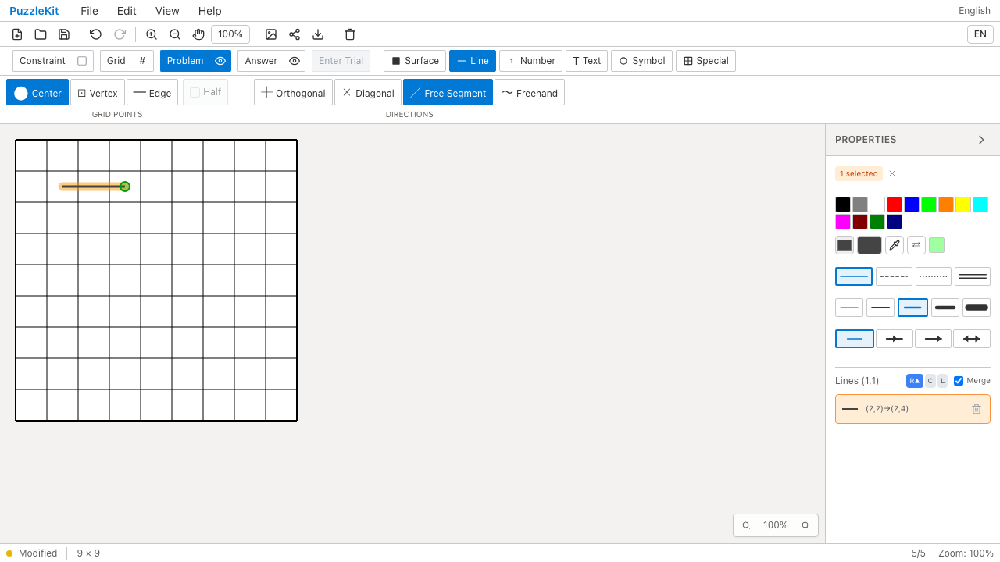
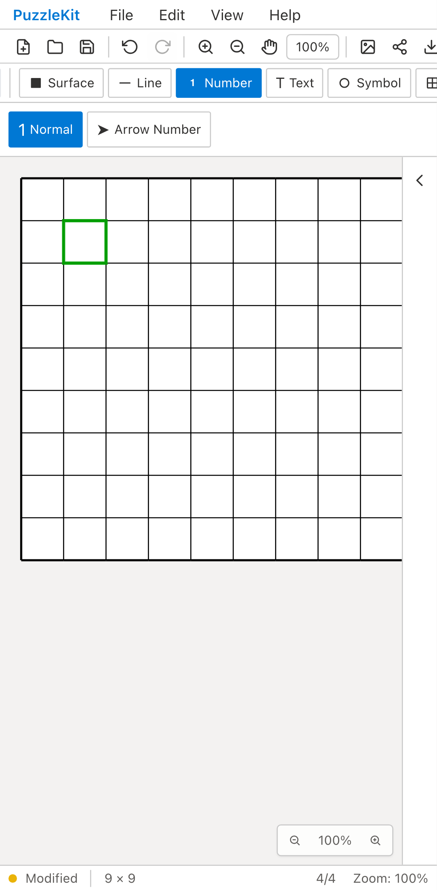

# 数字・線の重複E2Eフロー整理

PR #97を基点に、独立起動していた3ケースを統合・削除した。アプリ・Unitは変更していない。

- 通常線の再drag消去を、既存のFree Segment/UndoRedoフローの冒頭へ統合。orthogonalとFree Segmentのmode差を残す。
- clickで作った数字のBackspace削除を、通常markerキーの履歴フローへ統合。削除Undoで元の数字に戻してから既存の置換検査を続ける。
- harness方向数字のBackspaceは、本番UIから同じ入力・置換・削除・UndoRedoを確認する `number-history` で代替。harnessの設定配線だけを独立に確認する保証は外す。

対象3fileは11→8ケース。全project/title集合の差分は3件×4profileの削除のみ、追加なし。開発230→218枠、本番65枠のまま、新しいskipなし。17行追加・35行削除。速度改善の実測値は主張しない。

全Unit954件/72ファイル、app/E2E型検査、source map、app build成功。開発E2E217件成功・1既存skip、本番Chromium E2E64件成功・1既存skip。先行PRとのローカル統合は同じ実行集合を確認し、今回は統合Unit/全E2Eは再実行していない。

Before `11ad8b75e2669c4245b6a484764f711417febe53` / After `ff6183b870defb4374b6fc1b58680f4a93746490`。両方clean。対象3specをdesktop/mobile Chromiumで全実行し、Before22件/After16件成功。Before source555ファイルは基点SHAと一致し、変更sourceは対象E2E3ファイルのみ。

下記のAfter動画には統合した先行操作が増えているため、Beforeと完全に同じ操作列ではない。線の履歴数表示が増えるのもこのためで、最終の描画結果を比較している。

| 証跡 | Before | After |
|---|---|---|
| 線描画・UndoRedo（desktop） |  |  |
| 数字・削除（mobile） |  |  |
| 線動画 | [Before](evidence-test-editor-flows-20260915/line-flow-before.webm) | [After](evidence-test-editor-flows-20260915/line-flow-after.webm) |
| 数字動画 | [Before](evidence-test-editor-flows-20260915/number-flow-before.webm) | [After](evidence-test-editor-flows-20260915/number-flow-after.webm) |

4画像を目視し、4動画を全decode・Chromium再生/シークで確認した。[gallery](evidence-test-editor-flows-20260915/index.html) / [revision・SHA256](evidence-test-editor-flows-20260915/evidence.json)。詳細監査・UI Reviewは非追跡 `.work` に保存。

```bash
npm run qa:check
npm run build
npm run qa:production
npx playwright test --list
npx playwright test --config playwright.production.config.ts --list
# 各revisionでphaseをbefore/afterに変更
npm run qa:capture -- before e2e/editor-issues.spec.ts e2e/number-history.spec.ts e2e/topology-issues.spec.ts --project=chromium --project=mobile-chrome
```

ローカル開発/撮影は専用Vite4186に `QA_EXTERNAL_BASE_URL` で接続し、`.work`/`docs/qa` watch除外と専用cacheを設定。本番は標準preview4176。
