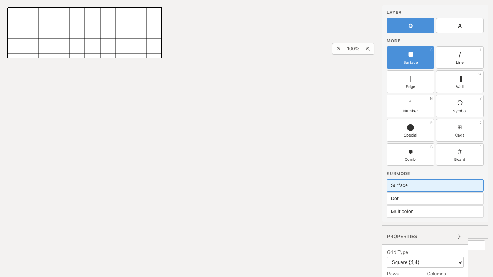
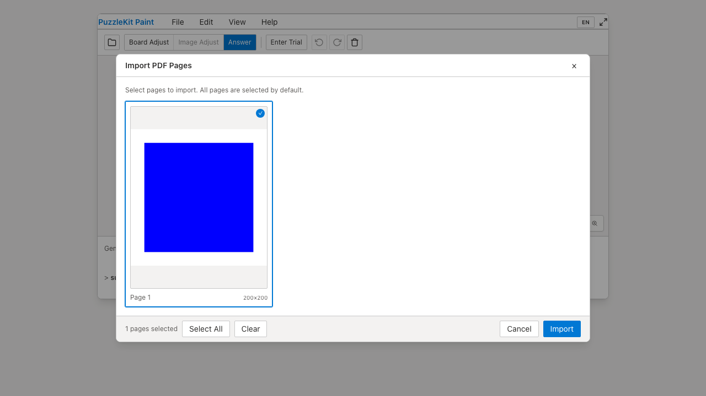

# 起動確認E2Eの実行環境整理

6入口の起動smokeを本番desktop Chromiumへ集約し、28→10実行枠へ整理した。PDF workerは別specへ移し、4環境の検証を維持した。アプリコード・Unit・PDF検証本文は変更していない。

| シナリオ | Before | After |
|---|---|---|
| `/` `/master` `/edit` `/paint` `/play` `/embedded.html` | 各4環境、計24枠 | 製品desktop Chromium、計6枠 |
| PDF worker起動・青pixel・盤面への読込 | 4環境 | 同じ4環境 |

4環境は、製品版Chromium/mobile-chromeと開発版WebKit/mobile-webkit。別HTMLや別Appの故障を拾うため6pathは全て残した。PDFのworker・描画エンジン差も残す。画面固有のWebKit/モバイル初期化エラーを検出する範囲は狭まる。特にHome/Player/Embeddedには別の操作E2Eによる直接代替がない。この保証と重複18枠の実行・録画・traceの負担を比較して削減した。速度改善の実測値は主張しない。

`--list --reporter=json` の全project/title集合を比較し、削除が上記18枠だけ、追加がなく、PDF4枠が残ることを確認した。通常開発256→244枠、本番71→65枠。新しいskipはない。先行PRのローカル統合でも同じ実行集合。今回は統合Unit/全E2Eは再実行していない。

全Unit954件/72ファイル、app/E2E型検査、source map、app build成功。開発E2E243件成功・1既存skip、本番Chromium E2E64件成功・1既存skip。

Before `c6e07799cfec71aa7d345216acca780f048c0bb2` / After `8f23b05225287d265b3e3cd932171d0b1dfd5eef`。両方clean、製品版desktop Chromiumで全6入口+PDFを各7件成功。Before source552ファイルは基点SHAと一致し、Afterで変わったsourceは2specとPlaywright設定のみ。

| 証跡 | Before | After |
|---|---|---|
| 埋め込み入口 |  |  |
| PDF描画 |  |  |
| 埋め込み動画 | [Before](evidence-test-entrypoint-matrix-20260915/embedded-before.webm) | [After](evidence-test-entrypoint-matrix-20260915/embedded-after.webm) |
| PDF読込動画 | [Before](evidence-test-entrypoint-matrix-20260915/pdf-before.webm) | [After](evidence-test-entrypoint-matrix-20260915/pdf-after.webm) |

4画像の目視、4動画の全decodeとChromium再生/シークを確認した。[gallery](evidence-test-entrypoint-matrix-20260915/index.html) / [revision・SHA256](evidence-test-entrypoint-matrix-20260915/evidence.json)。詳細なテスト監査・UI Reviewは非追跡 `.work` に保存。

```bash
npm run qa:check
npm run build
npm run qa:production
# 実行対象を確認（テストは実行しない）
npx playwright test --list
npx playwright test --config playwright.production.config.ts --list
# Before revisionでビルド後
npm run qa:capture -- before --config playwright.production.config.ts e2e/build-entrypoints.spec.ts --project=chromium
# After revisionでビルド後
npm run qa:capture -- after --config playwright.production.config.ts e2e/build-entrypoints.spec.ts e2e/pdf-import.spec.ts --project=chromium
```

ローカル開発E2Eは専用Viteサーバー4186に `QA_EXTERNAL_BASE_URL` で接続し、`.work`/`docs/qa` watch除外と専用cacheを設定した。撮影と本番E2Eは標準preview4176を使用した。
