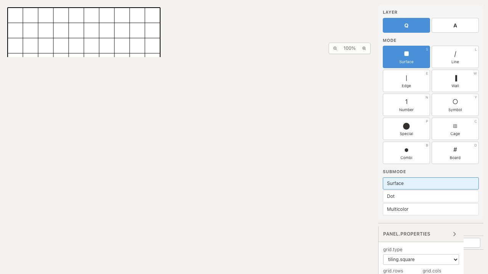

# ジャンル検索テスト整理のQA

`puzzleGenres.test.ts` を18件から3件へ整理し、155行削減しました。定数・表示文言・個別タグ定義の転記、型が保証する定義の存在確認、似た検索例を削除しています。

残した3シナリオは、単一タグの一致と不一致、複数タグのAND条件と該当なし、既知IDの参照と未登録IDのフォールバックです。AND検索では「ループのみ」のMasyuと「数字のみ」のSudokuを除外し、片方の条件だけで返す不具合を検出します。

IDの重複チェックも削除しました。元モジュールのコピーでMasyuのIDをSudokuと重複させると、TypeScriptが定義の重複キーを `TS1117` として検出することを確認しています。全ジャンルの定義は `Record<PuzzleGenre, GenreInfo>` で型検査されます。

## 検証

| 項目 | 結果 |
|---|---|
| 対象Unit | Before 18件 / After 3件成功 |
| 全Unit | 939件・72ファイル成功 |
| 変更ファイルの明示TypeScript検査 | 成功 |
| app/E2E型検査・source map検査・app build | 成功 |
| 開発E2E | 255成功・1既存skip |
| 本番Chromium E2E | 70成功・1既存skip |
| 先行PR #70〜#92とのローカル統合Unit | 607件・67ファイル成功 |
| Before/After Chromium起動QA | 各2件成功、再試行なし |

統合ブランチの全E2Eは再実行していません。アプリ実装・E2Eの変更はありません。実行時間の短縮量は評価していません。

タグを無視する、ANDをORに変える、既知IDも常にUnknownへ返す、の3種類の不具合を一時的に入れ、それぞれ1件が失敗することを確認しました。実装を復元後、対象3件も成功しています。

## Before / After

Before: `c6e07799cfec71aa7d345216acca780f048c0bb2`、After: `83c82015a1b2cf3c90f8870f4bc7b881b3e54b7e`。撮影時cleanで、552ファイルのソースハッシュ比較では対象テストだけが変更されています。

対象関数は `src/types/index.ts` と `src/lib/core.ts` から公開されていますが、現在のアプリUIからは呼び出されていません。**APIの挙動はUnitで検証しています。以下の動画は埋め込みエディターの起動確認であり、ジャンル検索操作の動画ではありません。**

Playwright + ChromiumのデスクトップとPixel 7で各phase計2件を実行しました。公開する画像・動画はデスクトップのBefore/After各1件です。2画像を目視して同じ初期表示を確認し、2動画の全フレームdecodeとChromium再生・シークを確認しました。

| 証跡 | Before | After |
|---|---|---|
| 埋め込みエディター初期表示 |  |  |
| 起動動画 | [Before](evidence-test-genre-contracts-20260915/embedded-before.webm) | [After](evidence-test-genre-contracts-20260915/embedded-after.webm) |

[撮影revision・コマンド・SHA256](evidence-test-genre-contracts-20260915/evidence.json)。詳細監査・UI観察は非追跡 `.work` に保管します。

開発サーバーを起動し、各revisionで `before` / `after` を指定します。

```sh
QA_INCLUDE_PRODUCTION_TESTS=1 QA_EXTERNAL_BASE_URL=http://127.0.0.1:4186 \
  npm run qa:capture -- after e2e/build-entrypoints.spec.ts \
  --grep 'build: opens /embedded.html' --project=chromium --project=mobile-chrome
```
