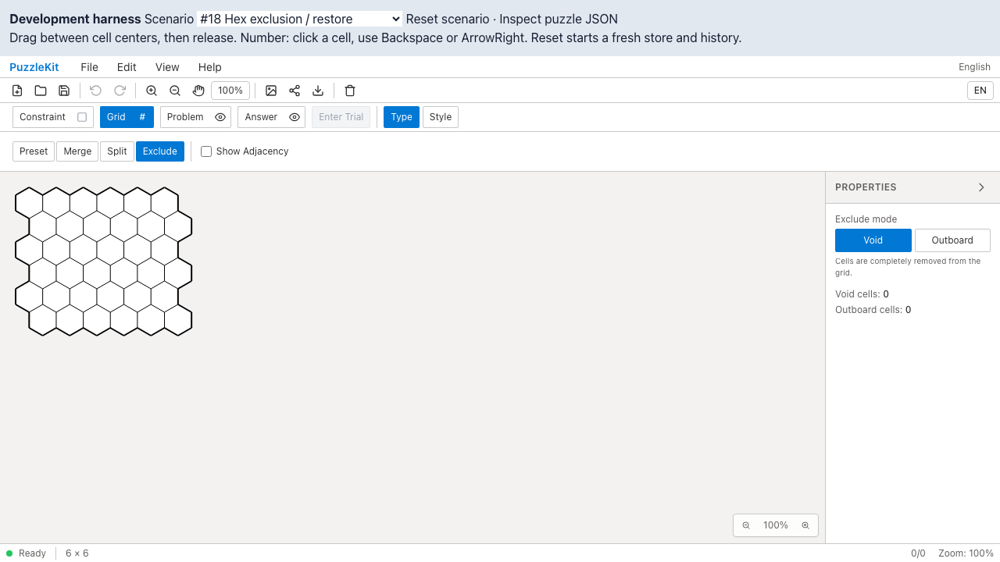
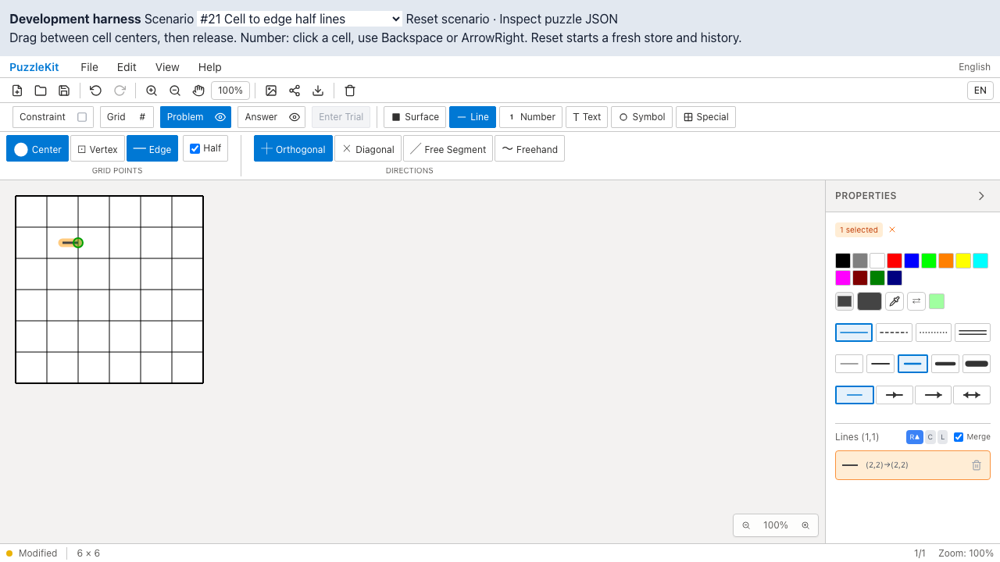

# 格子テスト整理のQA

同じ格子の反復生成、単なる非空・正値の確認、期待値を本番helperで作る検査を整理した。対象は格子生成・座標変換の7テストファイルで、本番コードとE2Eは変更していない。

- 正方形・六角形・三角形・ピラミッドの入口は、非正方形fixtureと固定ID／座標で確認する。三角形の列数倍化、ピラミッドの高さ優先を残した。
- 隣接セルは件数だけでなく接続先の集合を確認する。頂点・辺・端点の参照、盤外除外、最寄り点の種別選択と距離制限を維持した。
- 六角形の2つのAPIは半径／直径の基準が異なるため、独立した固定座標で確認する。
- 三角形の向きと奇偶行、ピラミッドの行境界・盤外indexを残し、`%2`・`2n+1`・`n²` の式の転記を削除した。
- 頂点関数はまだ別実装なので、三角形のテストだけでピラミッドも保証した扱いにはしていない。

監査候補14項目に対応。詳細な削除判断・進捗台帳は非追跡 `.work` に保持する。

## 検証

| 検査 | 結果 |
|---|---|
| source map / app型検査 / E2E型検査 / build | PASS |
| 変更した7テストファイルのTypeScript検査 | PASS |
| Unit | 72ファイル・793件PASS（変更前954件） |
| 開発版E2E | 255 PASS / 1既存skip |
| 製品版Chromium E2E | 70 PASS / 1既存skip |
| Before / After Chromium | 各5件PASS |

格子テストは231件から70件へ統合・削除し、テストコード1,513行を削減した。Unit実測20.23秒で、前回17.03秒とは実行条件が異なる。速度改善やカバレッジ維持を成果として主張しない。

## Before / After

Before `c6e0779` / After `f98908a`。同一の `e2e/topology-issues.spec.ts` をChromiumで実行した。テスト整理のため画面の挙動は変わらない。

| 操作 | Before | After |
|---|---|---|
| 六角形セルの除外・復帰 |  |  |
| 半線の描画・Undo/Redo |  |  |

| 動画 | Before | After |
|---|---|---|
| 六角形セル | [再生](evidence-test-grid-geometry-20260915/hex-exclusion-before.webm) | [再生](evidence-test-grid-geometry-20260915/hex-exclusion-after.webm) |
| 半線 | [再生](evidence-test-grid-geometry-20260915/half-lines-before.webm) | [再生](evidence-test-grid-geometry-20260915/half-lines-after.webm) |

[再生用gallery](evidence-test-grid-geometry-20260915/index.html) / [revision・結果・SHA256](evidence-test-grid-geometry-20260915/evidence.json)。全decode、Chromiumでの再生・シーク、スクリーンショットを確認した。全5ケースの動画・trace・ログはローカルQA runに保存し、CIも全E2Eの証跡を30日保存する。

## 再現

```bash
npm run qa:check
npm run build
npm run qa:production
# それぞれのrevisionで実行
npm run qa:capture -- before e2e/topology-issues.spec.ts --project=chromium
npm run qa:capture -- after e2e/topology-issues.spec.ts --project=chromium
```

ローカルの開発版検証は専用Viteサーバー4184を起動し、`QA_EXTERNAL_BASE_URL=http://127.0.0.1:4184` を指定した。製品版は標準previewサーバーを使う。

調査中に見つかった旧公開API `pixelToTri` / `pixelToPyramid` の中心座標の逆変換不一致は、テスト整理と分けた修正対象としている。
