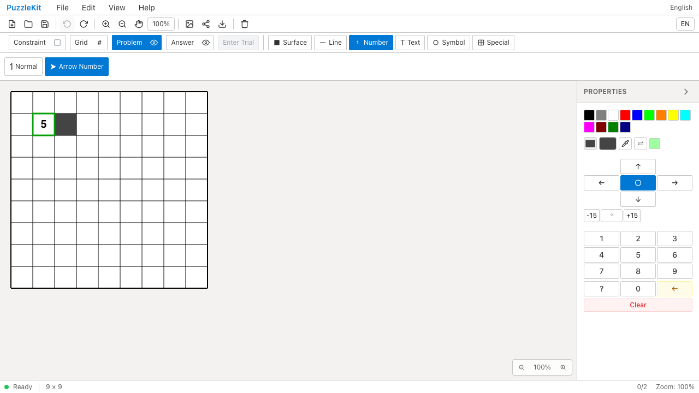
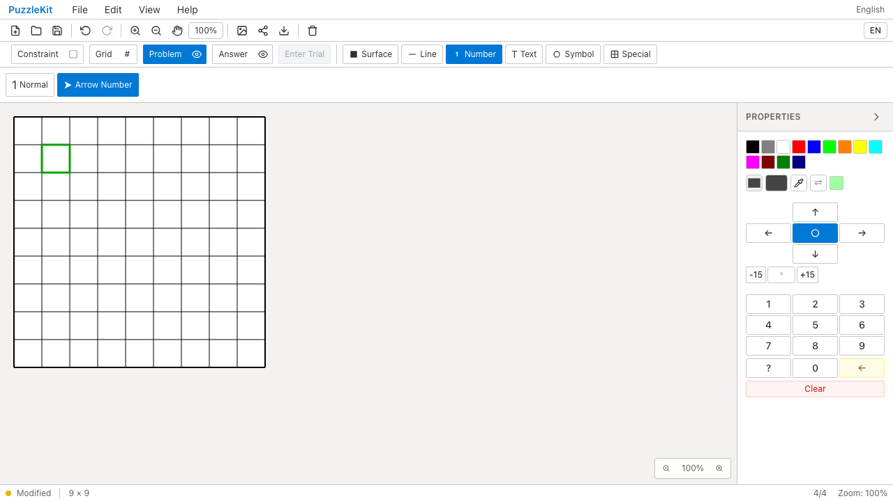

# 履歴・ストア分離のQA

履歴内部のindex・説明文・actionオブジェクトの転記テストを整理し、実ストアのUndo/Redo、グループ境界、履歴上限を確認する形にした。ストア間の分離は参照同一性から、盤面とpending autosaveの独立性へ変更した。公開history購読は通知内容と解除後の無通知を残した。

対象22件から6件、テストコード317行を削減した。通常数値更新のUndo/Redoは既存のnumberPadHistoryで実数値パネル操作から検査する。詳細なC065〜C068の削除・存続判断は非追跡 `.work` に保存する。

| 検査 | 結果 |
|---|---|
| source map / app型 / E2E型 / app build | PASS |
| 変更2テストの明示TypeScript検査 | PASS |
| Unit | 938件 / 72ファイル PASS |
| 開発版E2E | 255 PASS / 1既存skip |
| 本番版Chromium E2E | 70 PASS / 1既存skip |
| Before / After Chromium | 各6件 PASS |
| 未マージPRのローカル統合 | #70〜#79＋本変更＋保存設定整理で668件 / 69ファイル PASS |

本番コード・E2Eは変更していない。library buildは#78を含む統合で成功し、以降の統合はテスト変更のみ。全PR統合ブランチでE2Eは再実行していない。保存は共有キーのままで、今回のストア分離テストはpending timerの独立性を検査する。

Before `c6e0779` / After `6b906c2`。数値の挿入・置換・削除とUndo/Redo、自動保存後のreloadと再編集Undo、カーソル設定のreloadを同じChromium6操作で確認した。source manifest552ファイルを照合し、差分は対象2テストだけだった。

| 操作 | Before | After |
|---|---|---|
| 自動保存・reload後のUndo |  |  |
| 方向数字の削除Redo後 |  |  |
| 自動保存の動画 | [Before](evidence-test-history-contracts-20260915/autosave-before.webm) | [After](evidence-test-history-contracts-20260915/autosave-after.webm) |
| 数値履歴の動画 | [Before](evidence-test-history-contracts-20260915/directional-history-before.webm) | [After](evidence-test-history-contracts-20260915/directional-history-after.webm) |

[動画gallery](evidence-test-history-contracts-20260915/index.html) / [revision・SHA256](evidence-test-history-contracts-20260915/evidence.json)。全4動画のdecode、Chromium再生・シーク、全4画像を確認した。動画は別実行のためフレーム同期していない。方向数字の入力とUndo/Redo過程は動画に収録し、最終画像は削除Redo後を示す。

```bash
npm run qa:check
npm run build
npm run qa:production
npm run qa:capture -- before e2e/number-history.spec.ts e2e/persistence.spec.ts e2e/cursor-style.spec.ts --project=chromium
# After revisionでは before を after にする
```

ローカル開発版では `QA_EXTERNAL_BASE_URL=http://127.0.0.1:4186` と、入れ子worktree・証跡をwatch対象外にした専用Vite設定を使用した。本番版は標準previewを使う。
