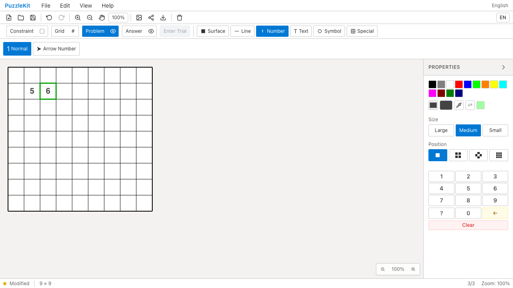
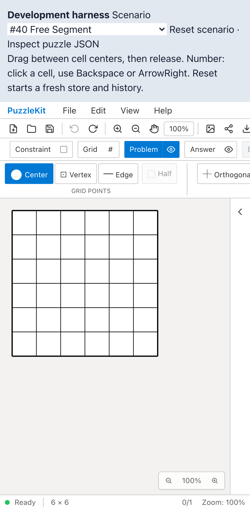

# 現役入力テスト整理のQA

PR #78の未使用関数撤去に続き、状態遷移・マウス入力・キーボード入力の3テストファイルを整理した。本番コードとE2Eは変更していない。

- pan条件・grid layerの下位helper検査を、既存の状態遷移へ集約。処理手順の配列コピーを削除し、入力座標・右クリック・Shiftの伝播、履歴確定、cancel時にTOOL_UPしないことを残した。
- 矢印キーの向きと移動を非正方形の盤面でまとめて確認。桁数の境界20/200は維持し、同レンジ内部の重複例を削除した。
- マウス入力は右クリック・Shift込みの代表例へ統合。Flick初期化は実directional入口へ集約し、単純なtext actionの転記は実テキスト操作E2Eに委ねた。
- テストで非公開経路からimportしていたAutoModeConfigを定義元へ修正し、fixtureも実際の型に合わせた。

対象99件から74件へ、テストコード228行を削減した。詳細なC060〜C064の判断は非追跡 `.work` に保持する。件数・カバレッジ維持や速度向上を成果として扱わない。

## 検証

| 検査 | 結果 |
|---|---|
| source map / app型検査 / E2E型検査 / app build | PASS |
| 変更3テストのTypeScript検査 | PASS |
| Unit | 72ファイル・916件PASS（基点941件） |
| 開発版E2E | 255 PASS / 1既存skip |
| 本番版Chromium E2E | 70 PASS / 1既存skip |
| Before / After Chromium | 各デスクトップ5件＋タッチ2件PASS |
| ローカル統合 | PR #70〜#78＋本変更でUnit694件／70ファイル成功 |

ライブラリbuildは#78を含む統合で確認済みで、今回の変更はテストのみ。既存の型エラー修正はPR #72にある。リモートではマージしていない。

## Before / After

Before `05c8217` / After `0bd9bef`。実際の数値入力・方向移動・Backspace削除・線の描画とUndo/Redoに加え、Chromiumのタッチ入力でパン・キャンセル後の再描画を確認した。

| 操作 | Before | After |
|---|---|---|
| 数値入力・ArrowRight |  |  |
| タッチパン |  |  |
| キャンセル後の再描画・Undo |  |  |

| 動画 | Before | After |
|---|---|---|
| 数値入力・ArrowRight | [再生](evidence-test-input-contracts-20260915/number-navigation-before.webm) | [再生](evidence-test-input-contracts-20260915/number-navigation-after.webm) |
| タッチパン | [再生](evidence-test-input-contracts-20260915/touch-pan-before.webm) | [再生](evidence-test-input-contracts-20260915/touch-pan-after.webm) |
| キャンセル後の再描画 | [再生](evidence-test-input-contracts-20260915/touch-cancel-before.webm) | [再生](evidence-test-input-contracts-20260915/touch-cancel-after.webm) |

[再生gallery](evidence-test-input-contracts-20260915/index.html) / [revision・SHA256](evidence-test-input-contracts-20260915/evidence.json)。全6動画のdecodeとChromiumでの再生・シーク、各スクリーンショットを確認した。CIの全E2E動画・trace・ログは30日保存する。

BeforeはPR #78のAfter録画を再利用した。基点05c8217のsource manifest 552ファイルが録画時と一致し、今回のAfterとの差分は対象3テストだけである。evidence.jsonのrecordedPhaseは元のafterを保持している。

## 再現

```bash
npm run qa:check
npm run build
npm run qa:production
# 各revisionでbefore / afterを指定
npm run qa:capture -- before e2e/editor-issues.spec.ts --project=chromium
npm run qa:capture -- before e2e/gestures.chromium-touch.spec.ts --project=mobile-chrome --grep 'touch pan mode|cancelled touch'
```

ローカル開発版では `QA_EXTERNAL_BASE_URL=http://127.0.0.1:4188` を指定し、証跡・入れ子worktreeをwatch対象外にする専用Vite設定を使った。本番版は標準previewサーバーを使う。
