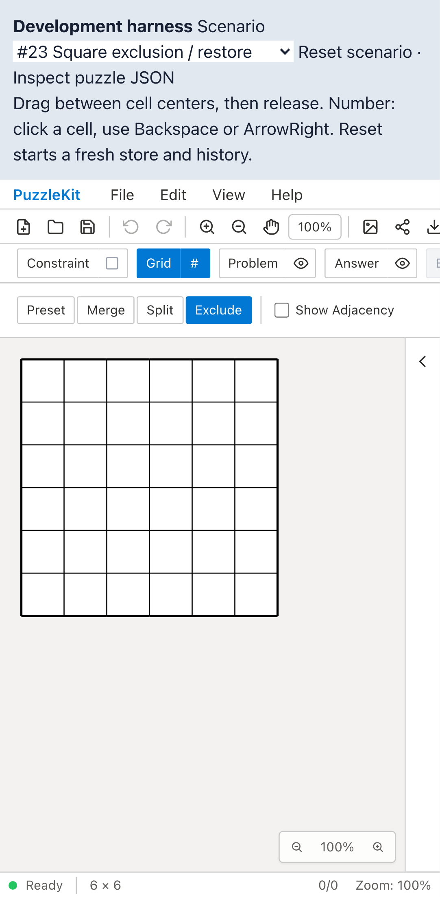
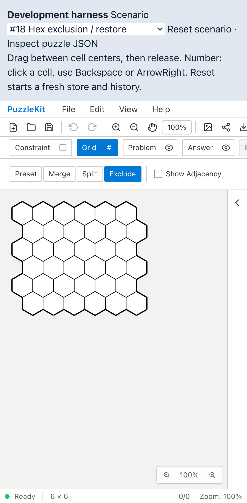
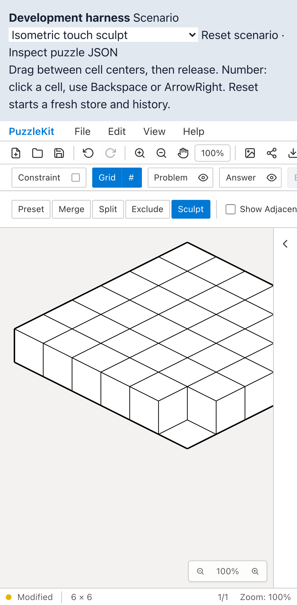

# マウス／touch E2Eの実行環境整理

PR #96を基点に、同じ入力を画面設定だけ変えて繰り返す14枠を除いた。アプリコード・Unit・シナリオ本文は変更していない。セル除外のmouse検証と共有座標変換を別ファイルへ移した。

| 検証 | Before | After |
|---|---|---|
| square/hex除外・復元（mouse） | 2形状×4環境=8 | desktop Chromium/WebKit、計4 |
| square/hex除外・復元＋数字作成Undo（tap） | 3件×4環境=12 | mobile Chromium/WebKit、計6 |
| Sculpt通常/Cut、Undo/Redo（tap） | 2形状×4環境=8 | mobile Chromium/WebKit、計4 |

数字の最初のtap作成→Undoは数値パッドの置換履歴とは違うため残す。SculptのCutと通常形状も両engineで残す。mobileでmouse、desktopでtouchという組合せ固有の不具合を拾う範囲は狭まる。この保証と14回の起動・録画・traceの負担を比較した。実行速度改善の数値は主張しない。

`--list` の全project/title集合で、削除14枠・追加なし・本番の変化なしを確認。開発244→230枠、本番65枠。新しいskipはない。全シナリオと移動したhelperの本文は基点との一致を検査した。先行PRのローカル統合でも同じ実行集合。今回は統合Unit/全E2Eは再実行していない。

全Unit954件/72ファイル、app/E2E型検査、source map、app build成功。開発E2E229件成功・1既存skip、本番Chromium E2E64件成功・1既存skip。

Before `09f3012bef4c1a13ac5859924b9bdc965ea74a7d` / After `0e13c6f3c875b944ceee3c4a73b374df087b4253`。撮影時clean、mobile Chromium（Pixel 7設定）で実touch入力5件を各phase成功。Before source553ファイルは基点SHAと一致し、変更sourceは2spec・共有helper・Playwright設定のみ。

| 証跡 | Before | After |
|---|---|---|
| 正方形除外・復元 |  |  |
| 正方形除外・復元動画 | [Before](evidence-test-input-matrix-20260915/square-exclusion-before.webm) | [After](evidence-test-input-matrix-20260915/square-exclusion-after.webm) |
| 六角形除外・復元 |  |  |
| 六角形除外・復元動画 | [Before](evidence-test-input-matrix-20260915/hex-exclusion-before.webm) | [After](evidence-test-input-matrix-20260915/hex-exclusion-after.webm) |
| Sculpt |  |  |
| Sculpt動画 | [Before](evidence-test-input-matrix-20260915/iso-sculpt-before.webm) | [After](evidence-test-input-matrix-20260915/iso-sculpt-after.webm) |
| Sculpt Cut |  |  |
| Sculpt Cut動画 | [Before](evidence-test-input-matrix-20260915/iso-sculpt-cut-before.webm) | [After](evidence-test-input-matrix-20260915/iso-sculpt-cut-after.webm) |

8画像を目視し、8動画を全decode・Chromium再生/シークで確認した。[gallery](evidence-test-input-matrix-20260915/index.html) / [revision・SHA256](evidence-test-input-matrix-20260915/evidence.json)。詳細監査・UI Reviewは非追跡 `.work` に保存。

```bash
npm run qa:check
npm run build
npm run qa:production
npx playwright test --list
npx playwright test --config playwright.production.config.ts --list
# 各revisionでphaseをbefore/afterに変更
npm run qa:capture -- before e2e/tap-input.spec.ts e2e/grid-sculpt.spec.ts --project=mobile-chrome
```

ローカル撮影/開発QAは専用Viteサーバー4186に `QA_EXTERNAL_BASE_URL` で接続し、`.work`/`docs/qa` watch除外と専用cacheを設定した。本番は標準preview4176を使用。
