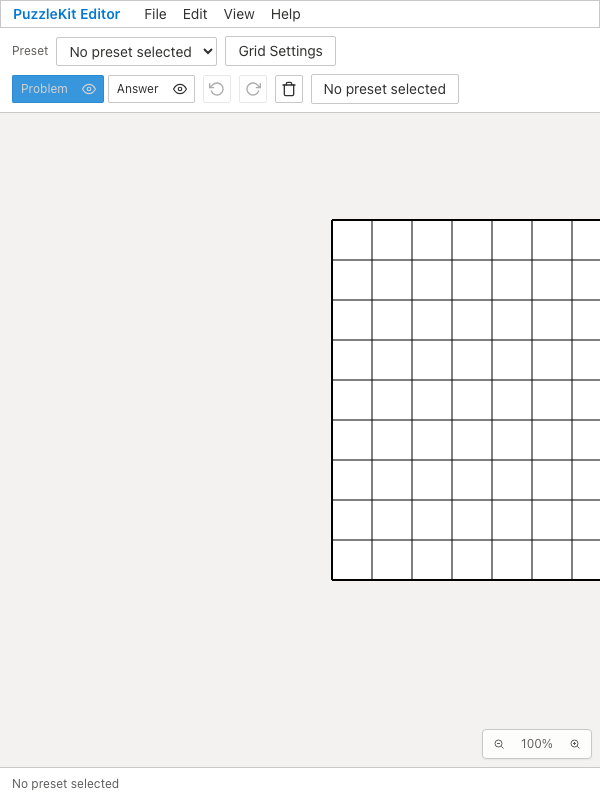
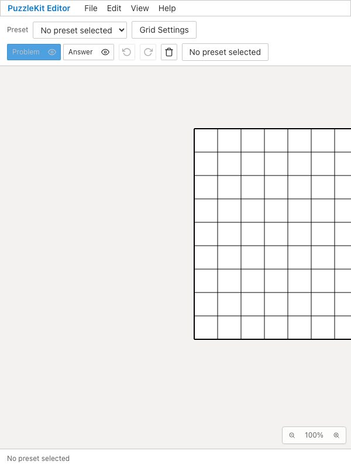

# レイアウト検査の重複整理 QA — 2026-09-15

Edit起動時の「DOM順で最初のボタンが可視」の1行を削除しました。ボタンの名前・操作結果を保証せず、同じ起動smokeは本番entrypointテストにもあります。初期device条件で最初のボタンだけ消える故障への検出は減りますが、保証の小ささとDOM順序への依存を踏まえて削除しました。

初期canvas可視はviewport変更前の同期として維持。600pxのEdit高さ、Paint高さと文書overflow、Master幅とoverflowは実際の盤面縮小・はみ出しを検出するため維持します。3ケース×4profileの件数は変わりません。アプリ変更なし、速度・不安定さの改善は未計測です。

- Before `aa89a6802d1be460e39640737a1a188a77fd7f06` / After `535f9a441509d7b8f8d74663159c677a02c321cc`、両撮影時clean。
- 同じEdit/Paint/Masterレイアウト検査が、PC/mobile ChromiumとWebKitでBefore12件・After12件成功。E2E型検査成功。
- 撮影ソース557ファイルの差は `e2e/editor-quality.spec.ts` の1行削除だけ。初期化待ち・viewport変更・固有寸法assertionは不変。
- 下記はPC ChromiumのEdit代表例。2画像の内容・2動画の全デコードとChromium再生/シークを確認済み。両方600×800の同じ盤面位置です。Problemボタンの色に撮影時の差があります。盤面全体の収まりはこの高さ検査の保証対象外です。
- テスト1行の削除なので、無関係なUnit全再実行は行わず対象12件を確認。先行PRを含む全体E2Eはローカル統合で別途実施します。

| Before | After |
|---|---|
|  |  |
| [動画](evidence-test-layout-20260915/edit-before.webm) | [動画](evidence-test-layout-20260915/edit-after.webm) |

[撮影revision・SHA256](evidence-test-layout-20260915/evidence.json) / [ローカル動画ギャラリー](evidence-test-layout-20260915/index.html)。baseはPR #102の `feature/qa-artifact-retention` です。

```sh
npm run qa:capture -- before e2e/editor-quality.spec.ts
npm run qa:capture -- after e2e/editor-quality.spec.ts
npm run typecheck:e2e
```

各コマンドは該当revisionで実行します。今回の撮影はmetadata記載の `QA_EXTERNAL_BASE_URL=http://127.0.0.1:4186` を使いました。
