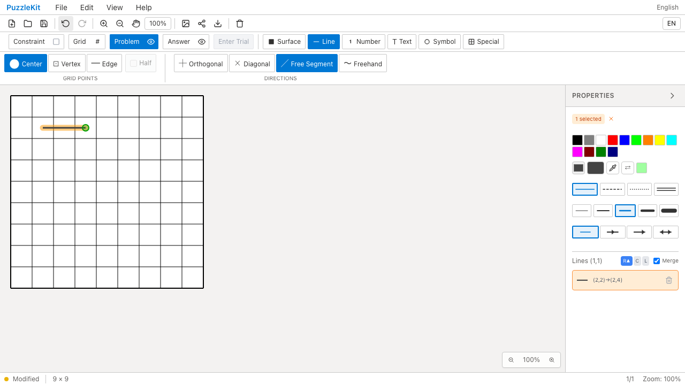
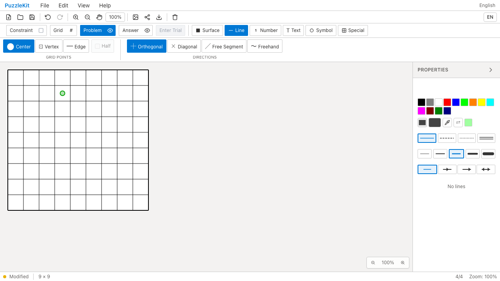

# 線描画テスト整理のQA

線描画・グループ正規化の4テストファイルを整理し、長い同形fixture、下位helperを使った期待経路の再構築、定数表の転記、E2Eと重複する追加・削除の検証を削除・統合した。本番コードとE2Eは変更していない。

endpoint/midpoint、既存backward、反転格納segment、方向未定義時の入力順、単一・孤立segmentは別の不具合を検出するため維持した。方向と接続順の保証は `normalizeLineGroup` の入口へ集約し、空Mapでも通るループや集合だけの比較を、完全なID順・方向Mapに置き換えた。

短縮pathは非対称な両端短縮・中間点保持と片側0へ統合。二重線の最小幅、置換時の旧線削除・返却ID、skip時の副作用抑止を残した。対象81件から56件、テストコード690行を削減した。件数・カバレッジ維持や速度向上を成果として扱わない。詳細な9候補の判断は非追跡 `.work` に保存している。

## 検証

| 検査 | 結果 |
|---|---|
| source map / app型検査 / E2E型検査 / app build | PASS |
| 変更4テストのTypeScript検査 | PASS |
| Unit | 72ファイル・929件PASS（変更前954件） |
| 開発版E2E | 255 PASS / 1既存skip |
| 本番版Chromium E2E | 70 PASS / 1既存skip |
| Before / After Chromium | 各2件PASS |

開発版E2Eは最初の整理commit `2960032` で開始し、その後Unit正常系2件を削除した。アプリ・E2Eに変更はなく、`a87f8d0` で全Unit・対象テストの型検査・After録画を改めて実行した。さらに `3d0f9fe` で混在方向の比較をMapから通常のオブジェクトへ変更し、全Unit・対象テストの型検査を再確認した。

PR #70〜#76と本変更のローカル統合も競合なく完了し、Unit732件（70ファイル）とライブラリbuildが成功した。ライブラリの既存型エラーはPR #72で解消される。リモートではマージしていない。

方向Mapを空にする一時的な故障注入では、当初4件中1件が見逃していた。比較方法の修正後は4件すべてが失敗し、不具合を検出することを確認した。一時変更した本番コードは復元済み。

## Before / After

Before `c6e0779` / After `a87f8d0`。source manifestの差分は対象4テストのみ。Chromiumで実際の描画・Undo/Redo・再ドラッグ消去を行った。

| 操作 | Before | After |
|---|---|---|
| Free Segment・Undo/Redo |  |  |
| Orthogonalの再ドラッグ消去 |  |  |

| 動画 | Before | After |
|---|---|---|
| Free Segment | [再生](evidence-test-line-contracts-20260915/free-segment-before.webm) | [再生](evidence-test-line-contracts-20260915/free-segment-after.webm) |
| Orthogonal | [再生](evidence-test-line-contracts-20260915/orthogonal-erase-before.webm) | [再生](evidence-test-line-contracts-20260915/orthogonal-erase-after.webm) |

[再生gallery](evidence-test-line-contracts-20260915/index.html) / [revision・結果・SHA256](evidence-test-line-contracts-20260915/evidence.json)。全4動画のdecodeとChromiumでの再生・シーク、各スクリーンショットを確認した。CIの全E2E動画・trace・ログは30日保存する。

## 再現

```bash
npm run qa:check
npm run build
npm run qa:production
# それぞれのrevisionで実行
npm run qa:capture -- before e2e/editor-issues.spec.ts --project=chromium --grep '#40|#20'
npm run qa:capture -- after e2e/editor-issues.spec.ts --project=chromium --grep '#40|#20'
```

ローカル開発版QAは `QA_EXTERNAL_BASE_URL=http://127.0.0.1:4188` を指定した。証跡・入れ子worktreeをwatchから除外する専用Vite設定を使い、本番版は標準previewサーバーを使った。
