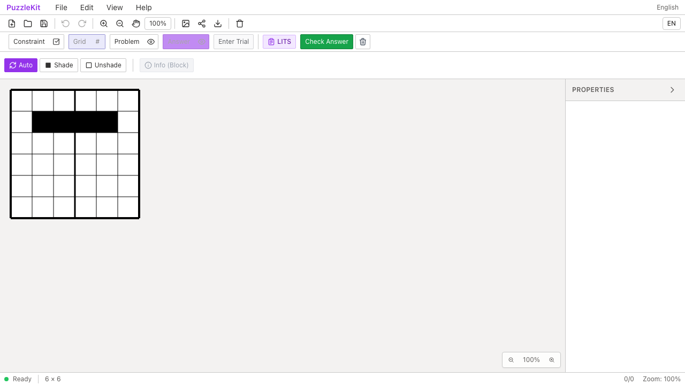
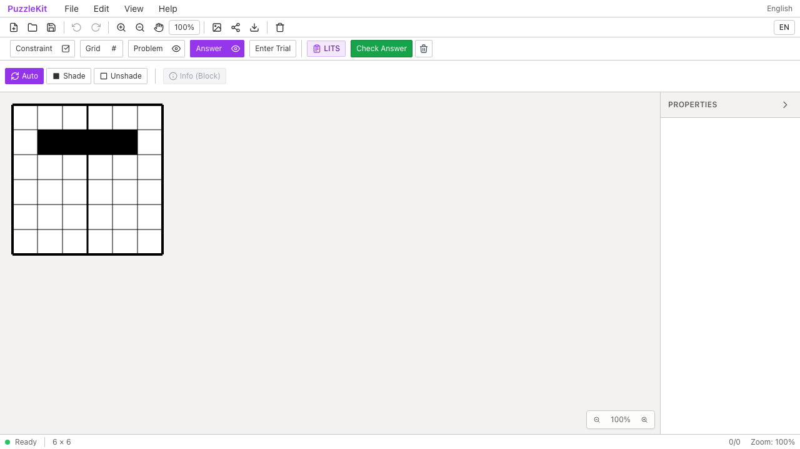

# LITSテスト整理のQA

`litsValidation.test.ts` の回転・反転生成ループを、独立した固定図形に置き換えました。対称性による重複14配置を削除し、L8・I2・T4・S4の計18配置を検証します。従来32回の検証と、平行移動を除いた形状集合が一致することも確認しました。

色塗りのUndo/Redoは既存のI字形成功シナリオへ統合し、store初期化を1回削減。対象テスト数は18→17件です。部屋マップの保持は参照一致から独立した値の比較へ変更しました。既存の未登録チェック用データには、型定義で必須の `pid` を補っています。差分は26行追加・22行削除で、速度短縮量は評価していません。

## 検証

| 項目 | 結果 |
|---|---|
| 対象Unit | Before 18件 / After 17件成功 |
| 最終変更で全Unit | 953件・72ファイル成功 |
| 変更ファイルの明示TypeScript検査 | 成功 |
| app/E2E型検査・source map検査・app build | 成功 |
| 開発E2E | 255成功・1既存skip |
| 本番Chromium E2E | 70成功・1既存skip |
| 先行PR #70〜#91とのローカル統合Unit | 622件・67ファイル成功 |
| Before/After Chromium QA | 各2件成功、再試行なし |

全体QAとbuildは `d46813b` で開始し、テストデータの `pid` のみ補った `0745f0a` の内容で全Unit・明示型検査・After撮影・統合Unitを確認しました。アプリ実装とE2Eは同一です。統合ブランチの全E2Eは再実行していません。

実装をコピーするテストの弱点も確認しました。実装と旧テストの**両方**から反転を除くと、旧分類テスト4件は成功してしまいます。同じ実装の不具合を新しい固定データで検証するとL/Sの2件が失敗しました。両方の90度回転を180度に変えた場合も旧4件は成功し、新4件はすべて失敗しました。これは変更していない旧テストとの比較ではなく、同じ誤りを共有するリスクの検証です。一時変更は復元し、新しい対象17件も成功しています。

## Before / After

Before: `c6e07799cfec71aa7d345216acca780f048c0bb2`、After: `0745f0a359a2b7468ed88592743bd225684b7459`。撮影時cleanで、552ファイルのソースハッシュ比較では対象テストだけが変更されています。

Playwright + ChromiumのデスクトップとPixel 7で、正しいI字形の判定→境界線を引いて不正解→Undoで正解→Redoと再読込後も不正解、を確認しました。各phaseで2件成功しています。公開する画像・動画はデスクトップのBefore/After各1件です。固定18配置の分類はUnitで検証し、動画は実際の部屋編集・判定操作を示します。

画像は再読込後の判定ダイアログを閉じた最終盤面です。目視で色塗りと部屋境界の保持を確認し、2動画の全フレームdecodeとChromium再生・シークも確認しました。

| 証跡 | Before | After |
|---|---|---|
| 部屋境界・再読込後 |  |  |
| 編集・判定・Undo/Redo・再読込 | [Before動画](evidence-test-lits-contracts-20260915/room-divider-before.webm) | [After動画](evidence-test-lits-contracts-20260915/room-divider-after.webm) |

[撮影revision・コマンド・SHA256](evidence-test-lits-contracts-20260915/evidence.json)。詳細監査は非追跡 `.work` に保管します。

開発サーバーを起動し、各revisionで `before` / `after` を指定します。

```sh
QA_EXTERNAL_BASE_URL=http://127.0.0.1:4186 npm run qa:capture -- after \
  e2e/room-text-access.spec.ts --grep 'LITS imported rooms' \
  --project=chromium --project=mobile-chrome
```
