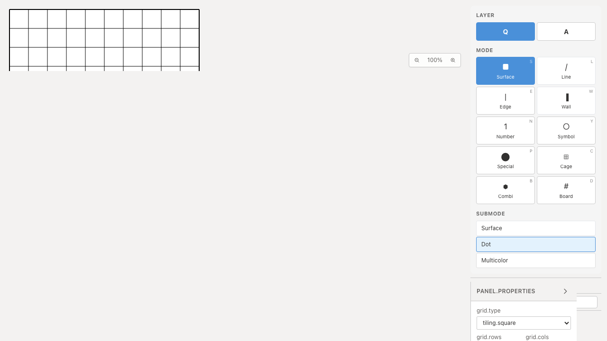

# 入力モードテスト整理のQA

`penpaModes.test.ts` を20件から4件へ統合し、76行削減しました。対角線対応、頂点・辺・セルの入力先、サブモード取得、ショートカット取得を各シナリオで確認します。

対角線のLine/Edge両方と、セル対象のSurface/Number/Symbol/Cageは登録漏れを検出するため残しました。重複した通常の不一致例3つを削除し、既知モードと未知モードの取得テストはそれぞれまとめています。関数の呼出しを大幅に減らした変更ではなく、過剰なケース分割とコードの反復を整理したものです。実行時間の短縮量は評価していません。

## 検証

| 項目 | 結果 |
|---|---|
| 対象Unit | Before 20件 / After 4件成功 |
| 全Unit | 938件・72ファイル成功 |
| 変更ファイルの明示TypeScript検査 | 成功 |
| app/E2E型検査・source map検査・app build | 成功 |
| 開発E2E | 255成功・1既存skip |
| 本番Chromium E2E | 70成功・1既存skip |
| 先行PR #70〜#93とのローカル統合Unit | 591件・67ファイル成功 |
| Before/After Chromium操作QA | 各2件成功、再試行なし |

統合ブランチの全E2Eは再実行していません。アプリ実装・恒久的なE2Eには変更がありません。

対角線対応からEdgeを外す、頂点対象をLineに取り違える、セル対象からSymbolを外す、の3種類の不具合を一時的に入れ、それぞれ1件の失敗を確認しました。実装を復元後、対象4件も成功しています。

## Before / After

Before: `c6e07799cfec71aa7d345216acca780f048c0bb2`、After: `dd6f5c078571745532e9f584d462ce3fc9aa1223`。撮影時cleanで、552ファイルのソースハッシュ比較では対象テストだけが変更されています。

Playwright + ChromiumのデスクトップとPixel 7で、埋め込み画面のLineへの変更→Freeline選択→Wallへ変更して初期サブモードへ戻る→Surfaceを2回押してDotに切り替える操作を確認しました。実際の `getSubmodes` と `getModeShortcut` を利用するパネル操作です。対角線や入力先の分類関数はUnitで検証しており、この動画で盤面への描画結果を検証してはいません。

公開する画像・動画はデスクトップのBefore/After各1件です。2画像を目視してDot選択状態を確認し、2動画の全フレームdecodeとChromium再生・シークを確認しました。

| 証跡 | Before | After |
|---|---|---|
| 操作後のDot選択 |  |  |
| モード変更・サブモード切り替え | [Before動画](evidence-test-mode-contracts-20260915/mode-selection-before.webm) | [After動画](evidence-test-mode-contracts-20260915/mode-selection-after.webm) |

[撮影revision・コマンド・SHA256](evidence-test-mode-contracts-20260915/evidence.json)。詳細監査・UIレビューは非追跡 `.work` に保管します。

撮影に使用した[Playwrightシナリオ](evidence-test-mode-contracts-20260915/capture.spec.txt)と[設定](evidence-test-mode-contracts-20260915/playwright.config.txt)のコピーを添付しています。再現する場合は添付コピーを先に `.work` へ保存してから対象revisionへ切り替え、開発サーバーを起動します（変更前は `before` を指定）。

```sh
mkdir -p .work
cp docs/qa/evidence-test-mode-contracts-20260915/capture.spec.txt .work/mode-capture.spec.ts
cp docs/qa/evidence-test-mode-contracts-20260915/playwright.config.txt .work/playwright.mode.config.ts
# 対象revisionへ切り替え、開発サーバーを起動してから実行
QA_EXTERNAL_BASE_URL=http://127.0.0.1:4186 npm run qa:capture -- after \
  --config .work/playwright.mode.config.ts
```
