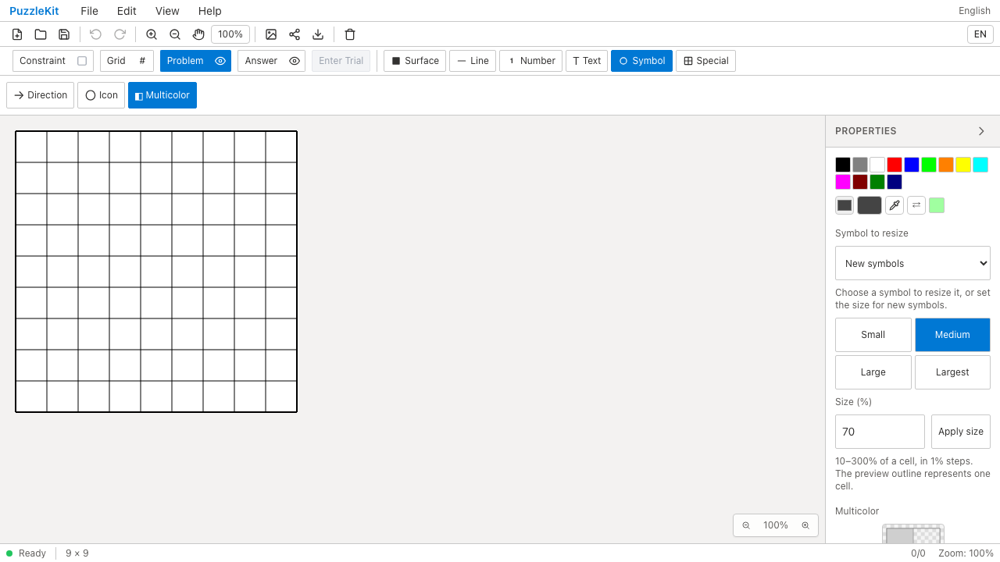

# Multicolorテスト整理のQA（2026-09-15）

内部保存領域の直接検査と重複確認を除き、レイヤー復帰時のツール・submodeと、Ribbonから選択した際の透明スロット初期化を残しました。2ファイル3件を1ファイル2件に統合し、81行削減しています。アプリ実装は変更していません。

## 検証

- 対象Unit: Before 3件、After 2件成功。変更テストを含む明示TypeScript検査成功。
- 全Unit: 953件／71ファイル成功。app/E2E型検査、source map、app build成功。
- 開発版E2E: 255成功・1既存skip。本番Chromium: 70成功・1既存skip。
- #70〜#84のコード変更とのローカル統合: Unit 661件／67ファイル成功。統合版での全E2E再実行は含みません。
- Chromium専用の証跡シナリオ: Before/After各1件成功、ブラウザー例外なし。ProblemのMulticolorとAnswerのIconがレイヤー切替後に復帰することを検証しました。

Before: `c6e07799cfec71aa7d345216acca780f048c0bb2`、After: `e844dbbc2e24bf5d6ac8c03cf1a1a333183dd741`。source manifestの差分は対象2テストのみです。撮影時の未追跡ファイルは準備中のQA証跡で、基準コミットに含まれるソースのハッシュは一致しています。

## Before / After

最後にProblemへ戻り、色の切替アニメーションの完了を待って撮影しています。UI変更のないテスト整理なので、表示の維持を確認する証跡です。

| 証跡 | Before | After |
|---|---|---|
| 最終表示 |  |  |
| 操作動画 | [Before動画](evidence-test-multicolor-contracts-20260915/layer-switch-before.webm) | [After動画](evidence-test-multicolor-contracts-20260915/layer-switch-after.webm) |

[revision・ハッシュ](evidence-test-multicolor-contracts-20260915/evidence.json) / [動画ギャラリー](evidence-test-multicolor-contracts-20260915/index.html)。両動画の全フレームdecode、Chromiumでの再生・シーク、両スクリーンショットの目視確認を実施しました。

## 再現

撮影専用シナリオは通常CIのテスト件数に含めていません。trace内のソースと一致する[シナリオ](evidence-test-multicolor-contracts-20260915/capture.spec.txt)と[設定](evidence-test-multicolor-contracts-20260915/playwright.config.txt)を添付しています。証跡を保持した状態で各対象revisionのソースを用意し、以下を実行します。

```sh
mkdir -p .work
cp docs/qa/evidence-test-multicolor-contracts-20260915/capture.spec.txt .work/multicolor-capture.spec.ts
cp docs/qa/evidence-test-multicolor-contracts-20260915/playwright.config.txt .work/playwright.multicolor.config.ts
npm run dev -- --config vite.qa.config.ts --host 127.0.0.1 --port 4186
# 別ターミナル。Afterの場合は before を after に変更
QA_EXTERNAL_BASE_URL=http://127.0.0.1:4186 npm run qa:capture -- before --config .work/playwright.multicolor.config.ts
```

今回のローカルサーバーには、並行worktree用にVite cacheを分離し、`.work` と `docs/qa` の更新を監視対象から外した設定を使用しています。詳細監査は非追跡 `.work` に保存しています。
