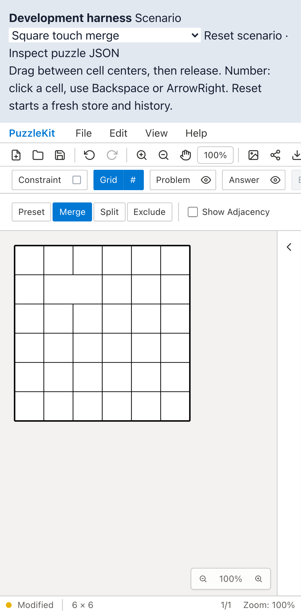
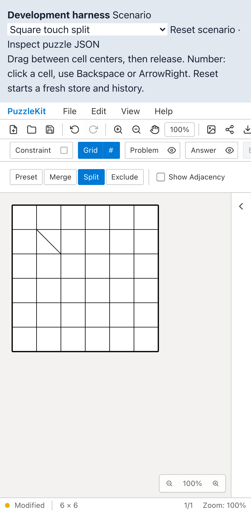

# マルチタッチ・盤面履歴テスト整理のQA

`multitouchGridRegression.test.tsx` を17件から15件に整理。最初の追跡対象の指と3本目の指のリリースは残し、もう一方の追跡対象の指の重複ケースを削除しました。移動後のタップ抑止は、変更していない `pinchAnchorRegression.test.tsx` の累積微小移動テストと既存E2Eで検証します。

盤面履歴の検証は参照一致から、grid設定・セルID・境界座標の値の一致へ変更。結合前の問題数字と解答色も復元後に保持されることを確認します。重複分割が履歴を増やさないことは、実際のUndoと `canUndo()` で確認します。storeだけを使う2件からhookのマウントを外し、総マウント数は17回から13回になりました。コードの追加・削除は各74行で、実行時間の短縮量は測定していません。

## 検証結果

| 検証 | 結果 |
|---|---|
| 対象＋変更していないpinchテスト | Before 27件 / After 25件成功 |
| 最終変更で全Unit | 952件、72ファイル成功 |
| 変更テストの明示TypeScript検査 | 成功 |
| app/E2E型検査、source map検査、app build | 成功 |
| 開発E2E | 255成功・1既存skip |
| 本番Chromium E2E | 70成功・1既存skip |
| 先行PR #70〜#88とのローカル統合Unit | 629件、67ファイル成功 |
| Before/After ChromiumタッチQA | 各11件成功、再試行なし |

全体QAとbuildは `8aa5180` の変更で実施。その後 `edab712` でテストの比較対象を境界座標へ絞り、最終変更の全Unit・明示型検査・After撮影・統合Unitを確認しました。この間のアプリ実装とE2Eは同一です。統合ブランチの全E2E再実行は含みません。

検出力も確認しました。履歴復元時に同じ値をdeep cloneする無害な変更では、旧2テストが失敗し、新2テストは成功。topologyを復元しない不具合では新2テストとも失敗しました。これらの一時変更は復元済みです。

## Before / After

Before: `c6e07799cfec71aa7d345216acca780f048c0bb2`、After: `edab712b8fce0aa98c3f554a9d9bf88a9ea31ad8`。両方とも撮影時の作業ツリーはcleanで、ソース一覧のハッシュ比較でも変更は対象テストだけです。

Playwright + ChromiumのPixel 7プロファイルを使用。11件には指のリリース、キャンセル、pinch、微小移動を含みます。下記はそのうち結合・分割の2件で、画像はUndo/Redo後の最終盤面です。UI変更のないテスト整理として、結合・分割形状の維持を確認しました。4画像を目視し、4動画の全フレームdecodeとChromiumでの再生・シークを確認しています。

| 操作 | Before | After |
|---|---|---|
| 結合 |  |  |
| 結合・Undo/Redo動画 | [Before](evidence-test-multitouch-contracts-20260915/merge-before.webm) | [After](evidence-test-multitouch-contracts-20260915/merge-after.webm) |
| 分割 |  |  |
| 分割・Undo/Redo動画 | [Before](evidence-test-multitouch-contracts-20260915/split-before.webm) | [After](evidence-test-multitouch-contracts-20260915/split-after.webm) |

[撮影revision・コマンド・SHA256](evidence-test-multitouch-contracts-20260915/evidence.json)。詳細監査は非追跡 `.work` に保管します。

既存の開発サーバーを利用する再現コマンド（各revisionで `before` / `after` を指定）:

```sh
QA_EXTERNAL_BASE_URL=http://127.0.0.1:4186 npm run qa:capture -- after \
  e2e/multitouch-grid.chromium-touch.spec.ts \
  e2e/pinch-anchor.chromium-touch.spec.ts --project=mobile-chrome
```
