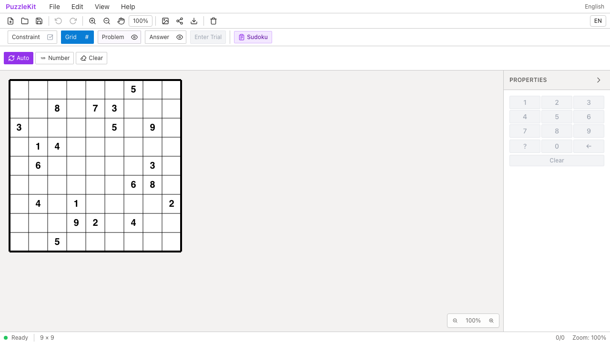
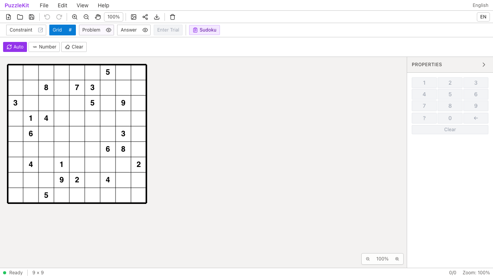
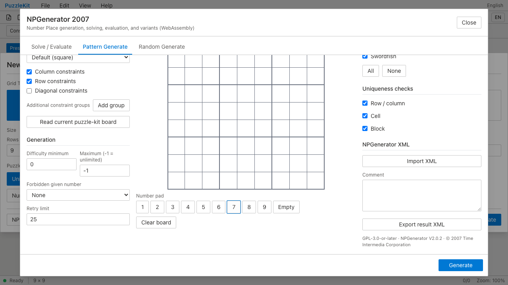

# NPGen結果変換・Seedテスト整理のQA

盤面変換とSudokuPad出力の重複fixtureを統合した。default矩形のroomMap/line確認は既存の問題・解答出力へ集約し、同じ入力データを別fileで維持する負担を減らした。SudokuPadの固定ブランド文字列チェックを削除した。

Seedテストは8回の乱数生成と一意性・範囲の確認をやめ、外部entropyだけ固定して、2語の順序・符号付き64bit・decimal文字列への変換を検査する。mock自身の呼出しや戻り値は検査していない。

3ファイル11件→2ファイル10件、65行削減。SudokuPadの3件は移動・維持している。詳細なC077/C079/C080の判断は非追跡 `.work` に保存する。本番コードとE2Eに変更はない。

| 検査 | 結果 |
|---|---|
| source map / app型 / E2E型 / app build | PASS |
| 最終対象10件 / 明示TypeScript検査 | PASS |
| Unit | 953件 / 71ファイル PASS |
| 開発版E2E | 255 PASS / 1既存skip |
| 本番版Chromium E2E | 70 PASS / 1既存skip |
| Before / After Chromium | 各NPGen 5件 PASS |
| #70〜#82＋本変更のローカル統合 | 662件 / 68ファイル PASS |
| Seedの誤実装検出 | 語順逆転・unsigned出力・Number経由の精度落ち、3/3を拒否 |

Seedの変異検証では実装を一時的に変更し、assertion failureを確認してから復元した。通常テスト・型検査を再実行して成功している。library buildは#78統合時に成功し、以降はテスト変更のみ。全PR統合ブランチでE2Eは再実行していない。

9x9の3x3ブロックと6x6の3x2ブロックは、UIに適用する寸法が異なるため期待値を残した。不規則領域、標準盤判定の否定、問題・任意解答、SudokuPadの対角線・region・非対応条件も維持した。

Before `c6e0779` / After `2377e63`。Wasmでの固定Seed生成・盤面適用、rot2生成、GUI入力、XML生成失敗からの復帰、複数XML制約群の5操作をChromiumで確認した。

| 操作 | Before | After |
|---|---|---|
| Seed 1の生成結果を適用 |  |  |
| GUI入力後 |  |  |
| 生成・適用動画 | [Before](evidence-test-npgen-contracts-20260915/generated-puzzle-before.webm) | [After](evidence-test-npgen-contracts-20260915/generated-puzzle-after.webm) |
| GUI入力動画 | [Before](evidence-test-npgen-contracts-20260915/gui-input-before.webm) | [After](evidence-test-npgen-contracts-20260915/gui-input-after.webm) |

[動画gallery](evidence-test-npgen-contracts-20260915/index.html) / [revision・SHA256](evidence-test-npgen-contracts-20260915/evidence.json)。全4動画のdecode、Chromium再生・シーク、全4画像を確認した。GUI画像は入力後のスクロール位置で、操作の途中は動画を参照できる。動画は別実行でフレーム同期していない。

Before source manifest552ファイルが基点と一致し、After551ファイルとの差分は対象3テストのみ。

```bash
npm run qa:check
npm run build
npm run qa:production
npm run qa:capture -- before e2e/npgen.spec.ts --project=chromium
# After revisionでは before を after にする
```

ローカル開発版は `QA_EXTERNAL_BASE_URL=http://127.0.0.1:4186` と、入れ子worktree・証跡をwatch対象外にした専用Vite設定を使用した。本番版は標準previewを使う。
