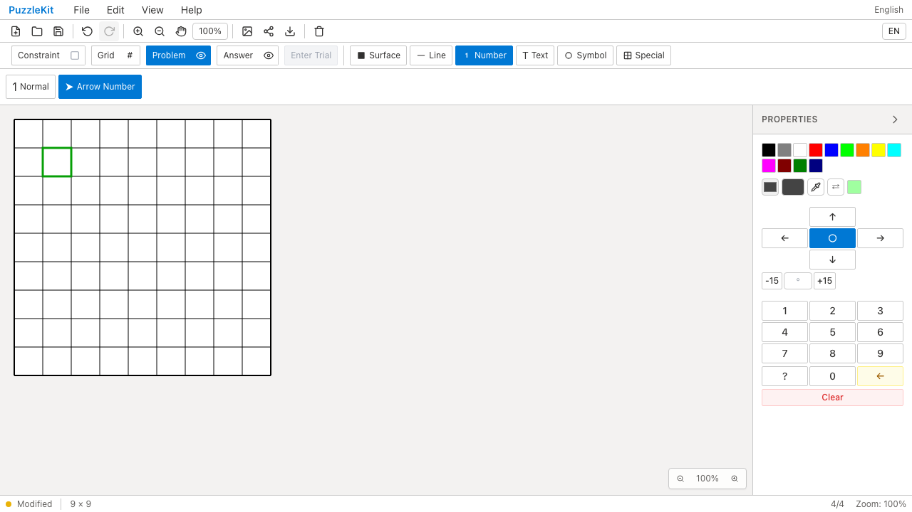

# 数値候補・方向数字のテスト整理QA

数値候補のfilter・重複除去・整列を上位の文字列変換テストへ集約した。候補entryの取得とパネル表示値は同じ混合fixtureを使い、それぞれの契約を確認する。方向数字の検索は他セル・corner・通常数字を除外し、direction 0とangle-onlyを検出する。

旧形式より現行数字が優先されるという検査を、実際のlegacy移行→手掛かり抽出へ統合した。同じfixtureで数値・文字・不明記号の変換を確認する。公開変換APIに通常数字を渡すとnullになる契約、および公開の旧形式検索APIの検査は残した。

対象21件から16件、テストコード110行を削減した。本番コード・E2Eは変更していない。詳細なC072/C073の監査は非追跡 `.work` に保存する。

| 検査 | 結果 |
|---|---|
| source map / app型 / E2E型 / app build | PASS |
| 最終変更テスト16件 / 明示TypeScript検査 | PASS |
| Unit | 949件 / 72ファイル PASS |
| 開発版E2E | 255 PASS / 1既存skip |
| 本番版Chromium E2E | 70 PASS / 1既存skip |
| Before / After Chromium | 各6件 PASS |
| #70〜#81＋本変更のローカル統合 | 663件 / 69ファイル PASS |

全Unitは`89fd5a5`で実行し、公開変換APIのassertionを保持した最終`b3e402b`では対象16件・型検査と統合の全663件を確認した。追加はテストのみで、app buildを含む本番ソースは同一。library buildは#78統合時に成功し、以降はテスト変更のみ。全PR統合ブランチでE2Eは再実行していない。

Before `c6e0779` / After `b3e402b`。方向数字・通常記号・方向記号の入力/置換/削除とUndo/Redo、自動保存reload、Surface/Numberカーソル保存の6操作をChromiumで実行した。

| 削除Redo後の最終画面 | Before | After |
|---|---|---|
| 方向数字 |  |  |
| 方向記号 |  |  |
| 数値入力・Undo/Redo動画 | [Before](evidence-test-number-contracts-20260915/directional-number-before.webm) | [After](evidence-test-number-contracts-20260915/directional-number-after.webm) |
| 記号入力・Undo/Redo動画 | [Before](evidence-test-number-contracts-20260915/directional-marker-before.webm) | [After](evidence-test-number-contracts-20260915/directional-marker-after.webm) |

最終画像はBackspace削除のRedo後なので空盤面を示す。途中の入力・置換・Undo/Redoは動画で確認できる。

[動画gallery](evidence-test-number-contracts-20260915/index.html) / [revision・SHA256](evidence-test-number-contracts-20260915/evidence.json)。全4動画のdecode、Chromium再生・シーク、全4画像を確認した。動画は別実行のためフレーム同期していない。

Beforeは同一基点の履歴・保存設定QA録画と共用した。source manifest552ファイルが基点c6e0779と一致し、最終Afterとの差分はnumberEntries.test.tsだけである。

```bash
npm run qa:check
npm run build
npm run qa:production
npm run qa:capture -- before e2e/number-history.spec.ts e2e/persistence.spec.ts e2e/cursor-style.spec.ts --project=chromium
# After revisionでは before を after にする
```

ローカル開発版は `QA_EXTERNAL_BASE_URL=http://127.0.0.1:4186` と、入れ子worktree・証跡をwatch対象外にした専用Vite設定を使用した。本番版は標準previewを使う。
