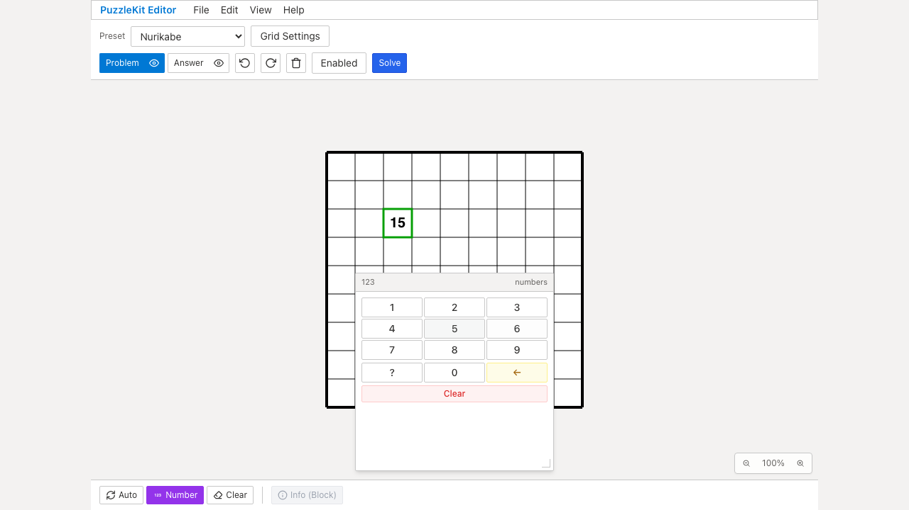
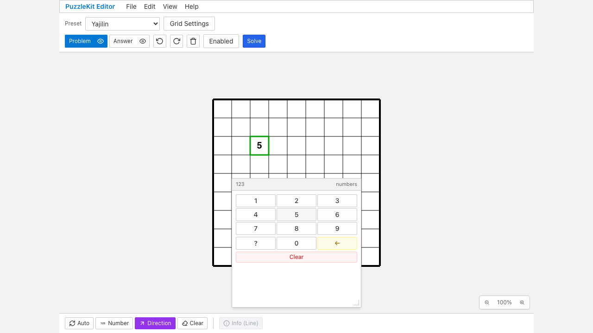

# 数字パネルの位置・履歴テスト整理（2026-09-15）

中央・隅・辺ごとにパネルを描画して同じUndo/Redoを繰り返す3件を、1回の描画で各位置を編集する1件へ統合しました。異なる隅・辺の数字を同一セルに共存させ、対象以外の数字、ID、書式が維持されることをまとめて確認します。最後の編集について別レイヤーからのUndo/Redoを残しました。

ファイル全体は12件→10件、テストコードは14行増加です。fixtureの追加で位置選択の検出力を改善し、パネル描画と共通履歴検証の繰り返しを3回から1回にしています。大幅なCI時間短縮を主張する変更ではありません。方向数字の読込、no-op履歴、Backspace/Clear、Paintの書式、外側の履歴グループ、編集保護は残しています。

明示型検査で見つかったTesting Libraryの不要な `exact` オプションと、引数を受け取らない `startHistoryGroup` への引数も削除しました。アプリ実装とE2Eは変更していません。

## 検証

- 対象Unit: Before12件、After10件成功。変更テストの明示TypeScript検査成功。
- 全Unit952件／72ファイル、app/E2E型検査、source map、app build成功。
- 開発版E2E255成功・1既存skip、本番Chromium70成功・1既存skip。
- #70〜#86のコード変更とのローカル統合: Unit650件／67ファイル成功。統合版の全E2E再実行は含みません。
- 隅・辺のインデックス判定をそれぞれ一時的に除去して比較。従来の位置テスト3件はどちらも成功した一方、統合後の1件はどちらも失敗し、誤選択を検出しました。実装を復元後、上記の通常検証が成功しています。

Before `c6e07799cfec71aa7d345216acca780f048c0bb2` / After `57afce03c25af90031d1d8e1b402ccb09019932e`。source manifestのBeforeは基準コミットに一致し、差分は `src/test/numberPadHistory.test.tsx` のみです。

## Chromium Before / After

Before/Afterともにデスクトップ2件・Pixel 7プロファイル2件、合計4件成功。位置別選択はUnitで、UI操作は既存のNurikabe/Yajilinシナリオで確認しています。画像はどちらも変更した数字を1回Undoした直後の `after-undo` 添付です。

| 操作 | Before | After |
|---|---|---|
| Nurikabeで15へ戻す |  |  |
| 数字の置換・Undo/Redo・削除 | [Before動画](evidence-test-number-pad-contracts-20260915/normal-undo-before.webm) | [After動画](evidence-test-number-pad-contracts-20260915/normal-undo-after.webm) |
| Yajilinで5へ戻す |  |  |
| 方向数字の置換・Undo/Redo・削除 | [Before動画](evidence-test-number-pad-contracts-20260915/directional-undo-before.webm) | [After動画](evidence-test-number-pad-contracts-20260915/directional-undo-after.webm) |

公開メディアはデスクトップの2操作を選定。[revision・SHA256](evidence-test-number-pad-contracts-20260915/evidence.json) / [動画ギャラリー](evidence-test-number-pad-contracts-20260915/index.html)。4画像の目視、4動画の全フレームdecode、Chromium再生・シークを確認しました。テスト整理によって既存UI操作が維持されることを示す証跡です。

## 再現

各revisionのサーバーで以下を実行します。今回のローカルViteは並行worktree用にcacheを分離し、`.work` と `docs/qa` の監視を除外しています。

```sh
npm run dev -- --config vite.qa.config.ts --host 127.0.0.1 --port 4186 --strictPort
# 別ターミナル。Afterは before を after に変更
QA_INCLUDE_PRODUCTION_TESTS=1 QA_EXTERNAL_BASE_URL=http://127.0.0.1:4186 npm run qa:capture -- before e2e/number-pad-history.spec.ts --project=chromium --project=mobile-chrome
```

詳細監査は非追跡 `.work` に保存しています。
