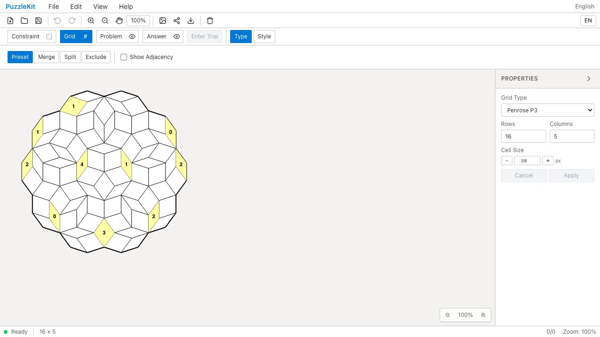

# 現役Penpa APIのテスト整理 QA

監査候補C027・C138を対応しました。`penpaCompat.test.ts` の分散した非空文字列チェックを、URL-safeな出力・セル位置・色・数字を確認する1つの往復ケースへ統合しました。puzz.link生成は種類と非正方形の寸法を1つの固定URLで確認します。

`penpaImportUrl.test.ts` は、固定の外部URLに対して本番と同じ並べ替えや座標移動を再計算していた部分を削除しました。対象の `cell-7-2`、色 `#ffffa3`、中心座標を固定し、実際に取り込んだtopologyとGridConfigから再生成したtopologyを確認します。単体テストは対象2ファイル22件→18件、163行削減です。

実アプリのMasterでツールバーから既存のPenrose solve URLを取り込み、10セルの塗りと対象セルの色・SVG中心座標をPlaywright + Chromiumで検証しました。基準URLは `src/test/penpaImportUrl.test.ts` の最初のfixtureです。

| | Before | After |
|---|---|---|
| revision（変更なしの作業ツリー） | `c6e07799cfec71aa7d345216acca780f048c0bb2` | `6771da08171493acb8f6c597ac633461a97c9cc7` |
| 同じURLの取り込み・描画確認 | 成功 | 成功 |
| 画面 |  |  |
| 動画 | [Before](evidence-test-penpa-20260915/penrose-import-before.webm) | [After](evidence-test-penpa-20260915/penrose-import-after.webm) |

source manifestの差分は対象2テストのみで、アプリ・E2Eは同一です。録画2本の全デコードとChromiumでの再生・シークを確認済み。runtime errorは0件。[固定の期待値・revision・SHA256](evidence-test-penpa-20260915/evidence.json) / [比較用HTML](evidence-test-penpa-20260915/index.html)。

検証: Unit950件／72ファイル、開発版E2E255成功・1既存スキップ、本番版Chromium70成功・1既存スキップ。source map、アプリ／E2E／変更2テストの型検査、アプリbuildが成功しました。

旧 `penpaConverter.ts` の専用テスト整理は、実装がアプリ・公開ライブラリから参照されていないことを追加調査で確認したため、旧実装の撤去として別PRに分離しています。詳細監査とUIレビューは非追跡 `.work` に保存しています。
