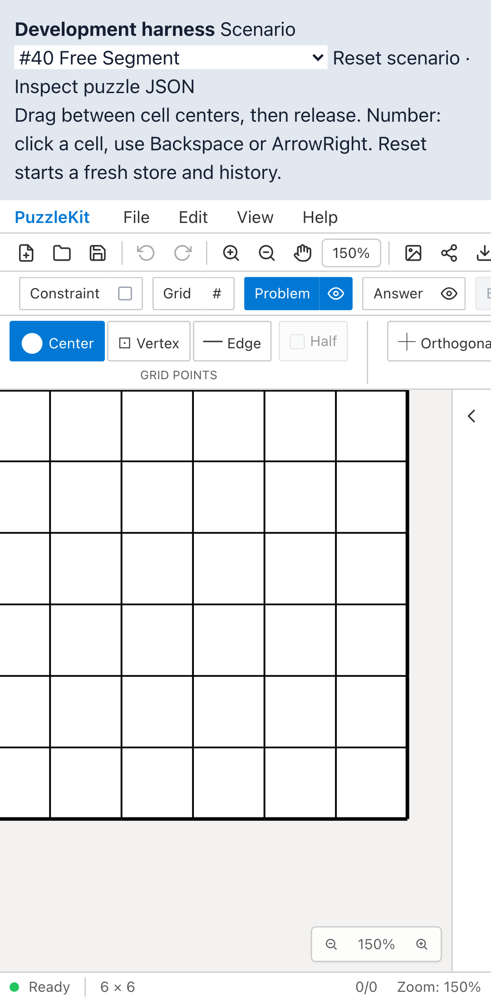
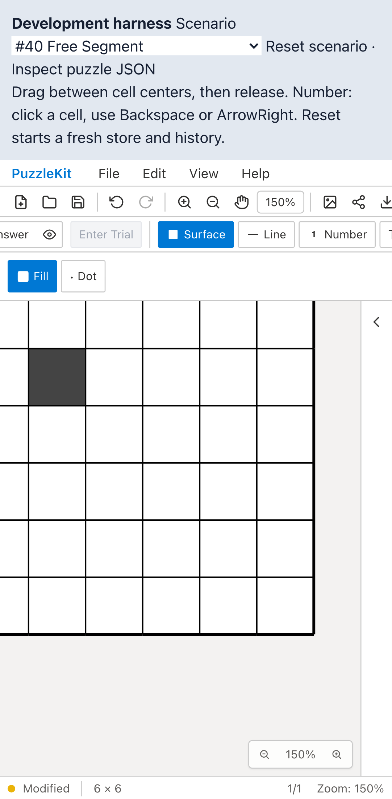

# ピンチ上下限テスト整理のQA

`pinchAnchorRegression.test.tsx` の上下限4ケースを、上限・下限それぞれで「境界に到達 → 指を離す → 境界で新しいピンチを開始してパンする」という2シナリオに統合しました。対象全体は10件から8件、hookマウントも10回から8回です。差分は31行追加・36行削除で、実行時間の短縮量は評価していません。

上限5・下限0.1の両方で、制限後の倍率と中点の座標を確認します。バッチ更新、SVGオフセットとexport余白、指の組み替え、pan/zoomの一括通知、累積微小移動のタップ抑止は残しています。アプリ実装とE2Eの変更はありません。

## 検証

| 項目 | 結果 |
|---|---|
| 対象Unit | Before 10件 / After 8件成功 |
| 全Unit | 952件・72ファイル成功 |
| 変更ファイルの明示TypeScript検査 | 成功 |
| app/E2E型検査・source map検査・app build | 成功 |
| 開発E2E | 255成功・1既存skip |
| 本番Chromium E2E | 70成功・1既存skip |
| 先行PR #70〜#89とのローカル統合Unit | 627件・67ファイル成功 |
| Before/After Chromium QA | 各6件成功、再試行なし |

統合ブランチの全E2Eは再実行していません。

一時的に「制限前の倍率で座標計算する」「倍率が変わらない場合にパンも中止する」の2種類の不具合を入れ、どちらも上下限の2テストで検出しました。実装を復元後、対象8件も成功しています。

## Before / After

Before: `c6e07799cfec71aa7d345216acca780f048c0bb2`、After: `cf54aa19a5a076028a23b7f06c370d21d4455f47`。撮影時の作業ツリーはいずれもcleanで、552ファイルのソースハッシュ比較では対象テストだけが変更されています。

Playwright + ChromiumのPixel 7プロファイルで、静止・移動・事前ズームの中点追従、最初の色塗りのUndo/Redo、パンモードでの編集抑止、微小移動の6件を実行しました。公開動画はそのうち2件です。上下限の検出力は上記Unitで検証しており、この動画は通常倍率での既存操作の維持を示します。

4画像を目視し、中点移動後の盤面とRedo後の色塗りが維持されることを確認しました。4動画の全フレームdecodeとChromiumでの再生・シークも確認済みです。

| 操作 | Before | After |
|---|---|---|
| 移動中点への追従 |  |  |
| 移動動画 | [Before](evidence-test-pinch-contracts-20260915/moving-before.webm) | [After](evidence-test-pinch-contracts-20260915/moving-after.webm) |
| 色塗りRedo後 |  |  |
| 色塗りUndo/Redo動画 | [Before](evidence-test-pinch-contracts-20260915/surface-undo-before.webm) | [After](evidence-test-pinch-contracts-20260915/surface-undo-after.webm) |

[撮影revision・コマンド・SHA256](evidence-test-pinch-contracts-20260915/evidence.json)。詳細監査は非追跡 `.work` に保管します。

開発サーバーを起動した上で、各revisionで `before` / `after` を指定します。

```sh
QA_EXTERNAL_BASE_URL=http://127.0.0.1:4186 npm run qa:capture -- after \
  e2e/pinch-anchor.chromium-touch.spec.ts --project=mobile-chrome
```
