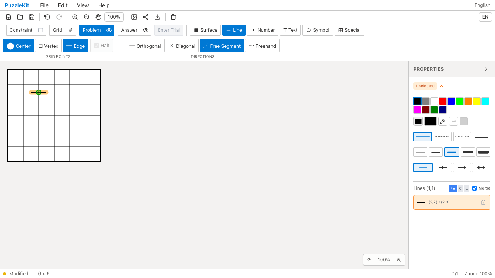
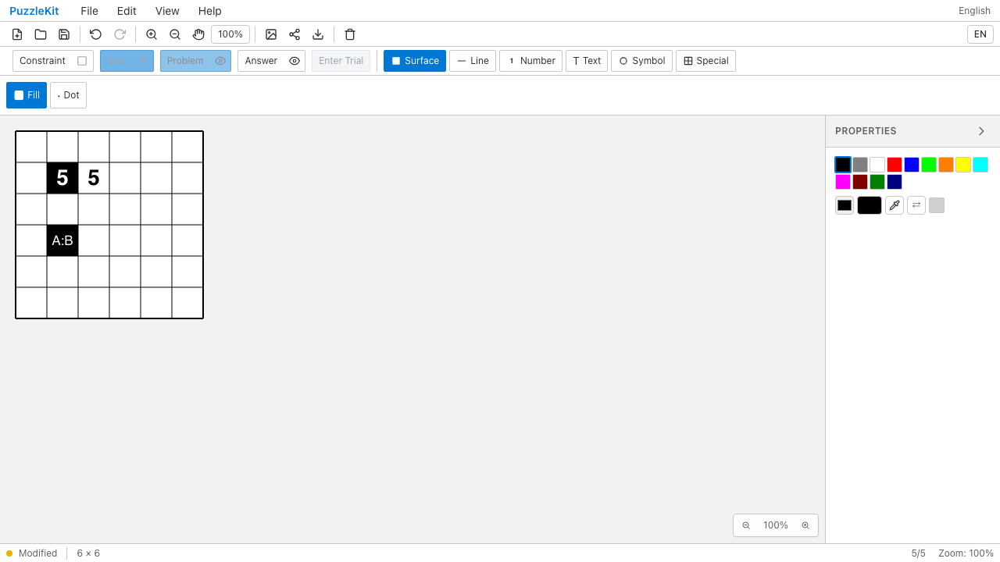
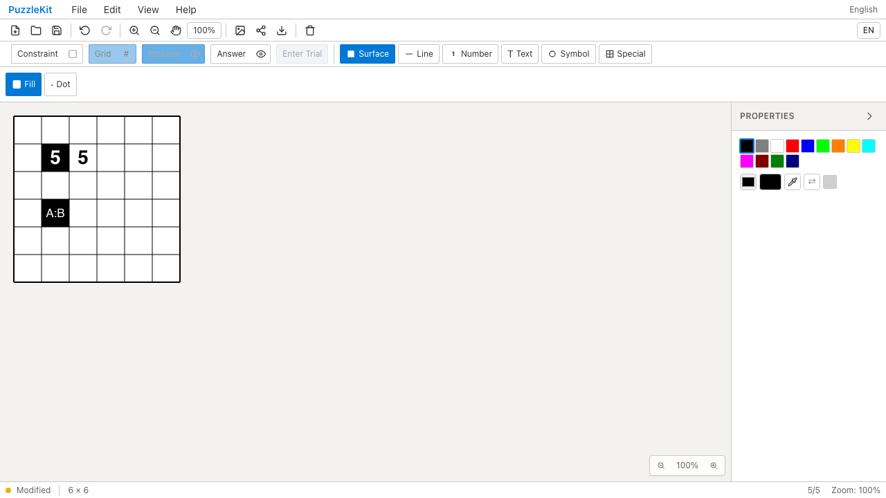
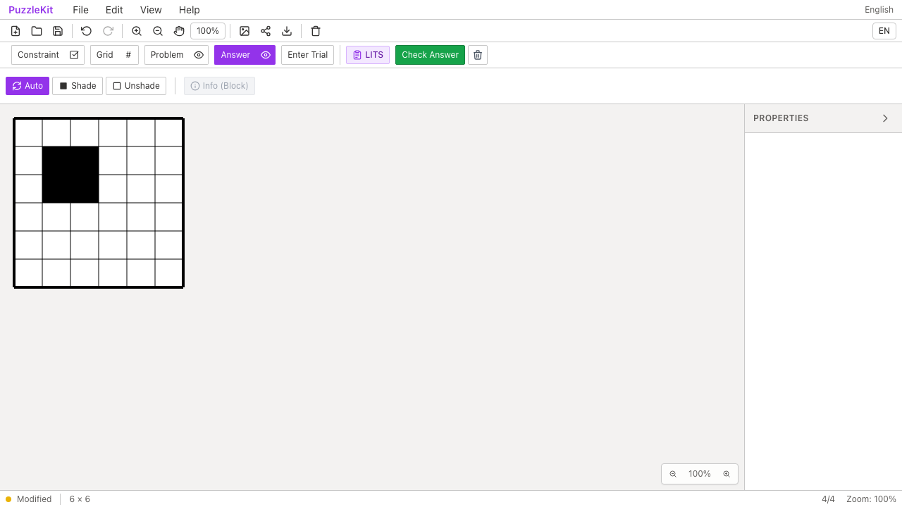
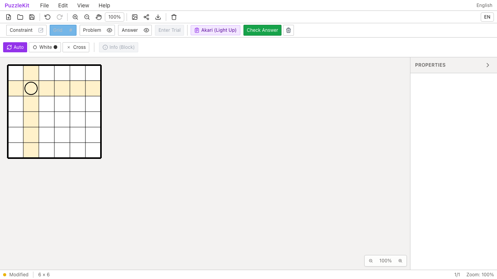

# ルール・表示E2Eの重複プロファイル整理

`issue-priority.spec.ts` のhalf/contrast/LITS/Akariの4ケースに `@desktop` を付け、ChromiumとWebKitで確認する。4ケース×4プロファイルの16枠から、2エンジンの8枠へ整理した。テスト本文・入力・assertionは変更していない。設定・タグ・説明文の差分は9行追加/7行削除で、行数やケース数そのものの削減は目的ではない。

半線ケースは `page.mouse`、残りはストアのfixture配置とDOM表示・Check Answerのclickを使い、タップやピンチは実行していない。入力routerも `pointerType === 'mouse'` をマウス経路へ送っている。モバイル設定で同じ操作を反復する費用に対し、端末固有の不具合を拾う価値が小さいと判断した。

狭いviewport、端末設定、device scaleに依存する当該4ケースの直接保証は減る。マウス入力とDOM更新のエンジン差は2エンジンで確認し、他の実touch・Properties等の狭幅UIケースは維持する。4ケース自体を削除すると、線の統合と描画の接続、背景に応じた文字色、LITS判定からUIへの反映、Akariの表示と保存データの分離を見逃すため、これらは残す。

`@production` と `@desktop` を併用した場合も本番mobile Chromeでは実行しない。私用の収集専用fixtureで無タグ/各タグ/両タグの組合せを `--list` し、通常開発・productionを含む撮影指定・本番設定の収集集合を確認した。これはブラウザー操作の追加テストではなく、実際のPlaywright設定の選別検証である。

全project/title集合の差分は4ケース×mobile Chrome/WebKitの8枠のみ。開発252→244、本番71枠不変、新しいskipなし。対象8件はChromium/WebKitで成功。全Unit954件/72file、app/E2E型検査・source map・build成功。全開発E2E243件、本番Chromium E2E70件成功（各1既存skip）。

依存はPR #102、baseは `feature/qa-artifact-retention`。先行PR全体とのローカル統合でも開発202→194、本番65枠不変で同じ8枠だけが減ることを確認。文字ケース統合と入力プロファイル整理の先行変更を保持して、3fileの競合を解消し型検査した。統合の全Unit/E2Eは今回は再実行していない。

Before `aa89a6802d1be460e39640737a1a188a77fd7f06` / After `525a0856886eede7266baeb447ca494558210857`、撮影時clean。Beforeのmanifest557ファイルは基点と一致し、変更sourceは1specと2configのみ。同じ指定でdesktop/mobile Chromiumを収集し、Before8件/After4件成功。Afterはモバイルの重複が除外される。下記は両phaseに残るdesktop4ケースの記録。

| 証跡 | Before | After |
|---|---|---|
| 半線の重複防止 |  |  |
| 半線の重複防止の動画 | [Before](evidence-test-rule-matrix-20260915/half-line-before.webm) | [After](evidence-test-rule-matrix-20260915/half-line-after.webm) |
| 文字コントラスト |  |  |
| 文字コントラストの動画 | [Before](evidence-test-rule-matrix-20260915/contrast-before.webm) | [After](evidence-test-rule-matrix-20260915/contrast-after.webm) |
| LITSの不正形状 |  |  |
| LITSの不正形状の動画 | [Before](evidence-test-rule-matrix-20260915/lits-invalid-before.webm) | [After](evidence-test-rule-matrix-20260915/lits-invalid-after.webm) |
| Akariの光線表示 |  |  |
| Akariの光線表示の動画 | [Before](evidence-test-rule-matrix-20260915/akari-highlight-before.webm) | [After](evidence-test-rule-matrix-20260915/akari-highlight-after.webm) |

8画像で線・文字色・LITS形状・Akari光線の表示を確認し、8動画を全decode・Chromium再生/シークで確認した。別実行なので動画の操作時刻は同期していない。LITSの判定操作は動画とテスト結果で確認し、最終画像にはダイアログを閉じた盤面が写る。[gallery](evidence-test-rule-matrix-20260915/index.html) / [revision・SHA256](evidence-test-rule-matrix-20260915/evidence.json)。詳細監査・UI Reviewは非追跡 `.work` に保存。

```bash
npm run qa:check
npm run build
npm run qa:production
# 各revisionでbefore/afterを指定
npm run qa:capture -- before e2e/issue-priority.spec.ts --grep 'half:|contrast:|lits:|highlights:' --project=chromium --project=mobile-chrome
```

ローカル開発/撮影は専用Vite4186へ `QA_EXTERNAL_BASE_URL` で接続し、`.work`/`docs/qa` watch除外と専用cacheを設定。本番は標準preview4176。
