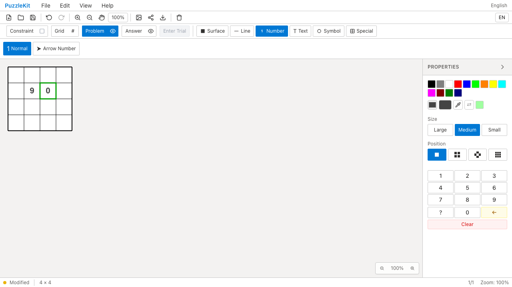
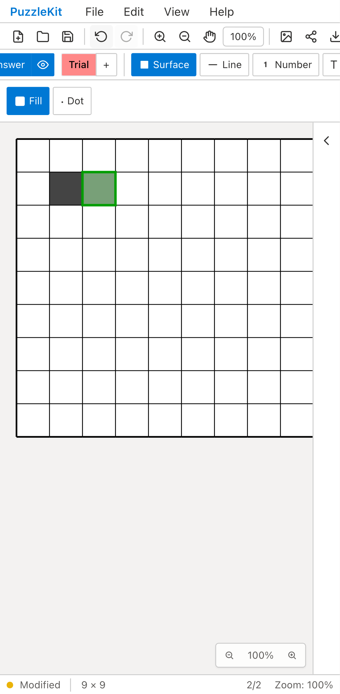

# パズル切り替えテスト整理のQA

`puzzleSession.test.ts` を11件から7件に統合しました。UI読込の未バージョン化ファイル・設定保持を成功シナリオにまとめ、各読込経路の不正state・不正IDは同じセッションで順に確認します。URL読込は失敗後の再試行成功までを1シナリオにしました。

新規作成・UI読込・store読込は、履歴のクリアを別々に呼ぶため3経路を残しています。共通の一時状態のリセット項目はUI経路で確認し、3経路すべてで仮置き・選択・描画状態・Undo/Redoを確認します。新規作成には独自のcanvasリセットもあるため、その保証を共通部分の代表ケースだけに移していません。

読込失敗時のstore参照一致とIDカウンター値の一致を削除。盤面・設定・選択・仮置き段階の値、および実際のRedo/Undoと仮置き解除で保持を確認します。成功時のID連番比較は、読込後の数字追加で既存数字が消えない検証に置き換えました。差分は87行追加・85行削除です。シナリオ数は減りますが、コード削減や速度短縮は主張しません。

## 検証

| 項目 | 結果 |
|---|---|
| 対象Unit | Before 11件 / After 7件成功 |
| 全Unit | 950件・72ファイル成功 |
| 変更ファイルの明示TypeScript検査 | 成功 |
| app/E2E型検査・source map検査・app build | 成功 |
| 開発E2E | 255成功・1既存skip |
| 本番Chromium E2E | 70成功・1既存skip |
| 先行PR #70〜#90とのローカル統合Unit | 623件・67ファイル成功 |
| Before/After Chromium QA | 各6件成功、再試行なし |

統合ブランチの全E2Eは再実行していません。アプリ実装・E2Eには変更がありません。

一時的に不具合を入れて検出力も確認しました。

- ID同期を外すと、UI/store両経路の数字上書きを検出（2件失敗）。
- UI読込の履歴クリアを外すと、UI成功シナリオが失敗。
- store読込失敗時に仮置き保存内容だけを消すと、不正入力シナリオが失敗。

一時変更はすべて復元し、対象7件も成功しています。

## Before / After

Before: `c6e07799cfec71aa7d345216acca780f048c0bb2`、After: `603bb7be2f19c2828b17e73dd99f48acc89e15b0`。撮影時の作業ツリーはclean。552ファイルのソースハッシュ比較では対象テストだけが変更されています。

Playwright + Chromiumで、デスクトップとPixel 7プロファイルそれぞれ新規作成・File Open成功・失敗の3件を実行しました。以下は成功のデスクトップと失敗のモバイルの証跡です。画像は各操作とUndo/Redo後の最終状態です。

4画像を目視し、読込数字と追加数字、失敗時の色塗りと仮置き状態の保持を確認しました。4動画の全フレームdecodeとChromiumでの再生・シークも確認しています。

| 操作 | Before | After |
|---|---|---|
| File Open成功・Redo後 |  |  |
| 成功・Undo/Redo動画 | [Before](evidence-test-session-contracts-20260915/file-open-before.webm) | [After](evidence-test-session-contracts-20260915/file-open-after.webm) |
| File Open失敗・Redo後 |  |  |
| 失敗・Undo/Redo動画 | [Before](evidence-test-session-contracts-20260915/invalid-open-before.webm) | [After](evidence-test-session-contracts-20260915/invalid-open-after.webm) |

[撮影revision・コマンド・SHA256](evidence-test-session-contracts-20260915/evidence.json)。詳細監査は非追跡 `.work` に保管します。

開発サーバーを起動し、各revisionで `before` / `after` を指定します。

```sh
QA_INCLUDE_PRODUCTION_TESTS=1 QA_EXTERNAL_BASE_URL=http://127.0.0.1:4186 \
  npm run qa:capture -- after e2e/puzzle-session.spec.ts \
  --project=chromium --project=mobile-chrome
```
