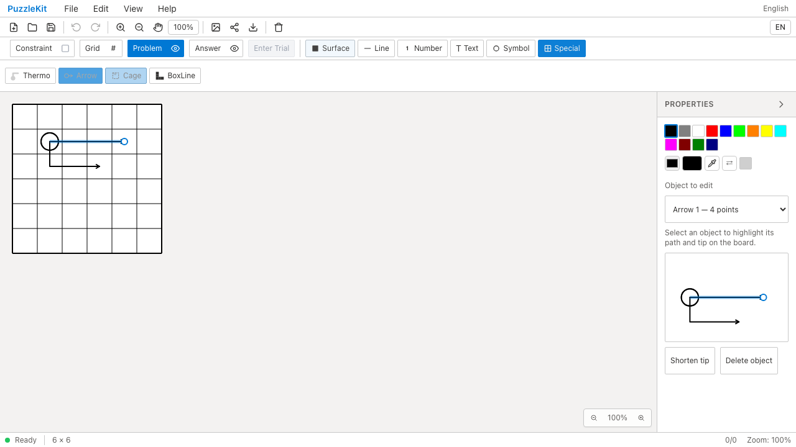
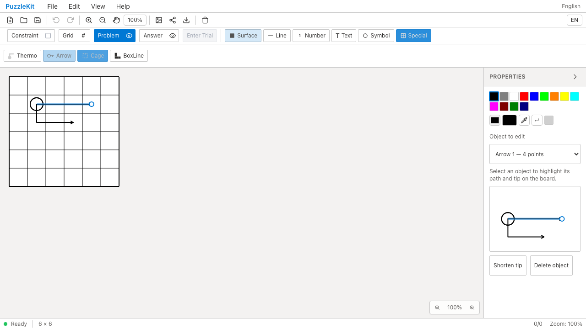
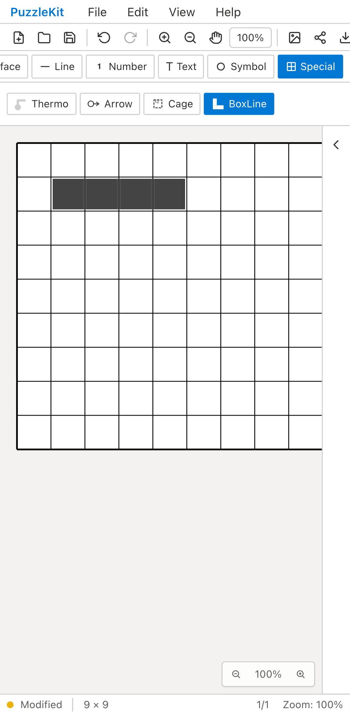

# 特殊図形・タッチテスト整理のQA（2026-09-15）

共通のキャンセル・複数指による中断・パン・ペン入力をArrowの代表ケースへ集約しました。Player保護と盤面外リリースはハンドラーごとに独立した判定があるため、Arrow（Thermoと共有）・Cage・BoxLineで残しています。2本指・3本指の削除もツール別の配線を持つため、4ツールそれぞれで両方を検証し、fixtureのみ共有しました。

先端短縮は内部の履歴entry数を検査する代わりに、1回Undoで元に戻り、最小2点での再操作が履歴を汚さないことを確認します。保存・読込、ID・色・追加データの維持も残しています。

2ファイル60件→41件（先端9→8、タッチ51→33）。グループ分けによりコードは18行増えますが、共通処理のセットアップと操作の反復を減らしています。CI時間の大幅短縮を主張する変更ではありません。アプリ実装とE2Eは変更していません。

## 検証

- 対象41件と明示TypeScript検査成功。イベントfixtureのSVG型を明示し、引数不要の履歴API呼出しも修正。
- 全Unit935件／72ファイル、app/E2E型検査、source map、app build成功。
- 開発版E2E255成功・1既存skip。本番Chromium70成功・1既存skip。
- #70〜#87のコード変更とのローカル統合: Unit631件／67ファイル成功。統合版の全E2E再実行は含みません。
- 一時的な不具合3種類（キャンセルで描画確定、BoxLineで3本指の削除指定を無視、最小長で無変更の履歴を追加）をすべて検出。ソースを復元し、対象41件も再度成功しています。

Before `c6e07799cfec71aa7d345216acca780f048c0bb2` / After `e0b4601e56f37bb4bf5c463ca3562d9a1a45e6ed`。source manifestのBeforeは基準コミットに一致し、差分は対象2テストのみです。

## Chromium Before / After

Before/Afterともにデスクトップ2件・Pixel 7プロファイル9件、計11件成功。先端短縮と再読込、4ツールのタッチ描画、キャンセル・複数指・パンからの復帰を実行しました。以下はArrowの選択プレビュー（デスクトップ）とBoxLineのタッチ確定（Pixel 7）です。

| 操作 | Before | After |
|---|---|---|
| 先端編集の対象を選択 |  |  |
| 短縮・Undo/Redo・再読込 | [Before動画](evidence-test-special-contracts-20260915/selected-tip-before.webm) | [After動画](evidence-test-special-contracts-20260915/selected-tip-after.webm) |
| BoxLineのタッチ描画 |  |  |
| 確定・Undo/Redo | [Before動画](evidence-test-special-contracts-20260915/touch-boxline-before.webm) | [After動画](evidence-test-special-contracts-20260915/touch-boxline-after.webm) |

画像は `selected-object` / `after-release` 添付から取得しています。[revision・SHA256](evidence-test-special-contracts-20260915/evidence.json) / [動画ギャラリー](evidence-test-special-contracts-20260915/index.html)。4画像の目視、4動画の全フレームdecodeとChromium再生・シークを確認しました。テスト整理前後で既存のUI操作が維持されることを示す証跡です。

## 再現

各revisionのサーバーで以下を実行します。今回のローカルViteは並行worktree用にcacheを分離し、`.work` と `docs/qa` の監視を除外しています。

```sh
npm run dev -- --config vite.qa.config.ts --host 127.0.0.1 --port 4186 --strictPort
# 別ターミナル。Afterは before を after に変更
QA_INCLUDE_PRODUCTION_TESTS=1 QA_EXTERNAL_BASE_URL=http://127.0.0.1:4186 npm run qa:capture -- before e2e/special-tip.spec.ts e2e/special-touch.chromium-touch.spec.ts --project=chromium --project=mobile-chrome
```

詳細監査は非追跡 `.work` に保存しています。
