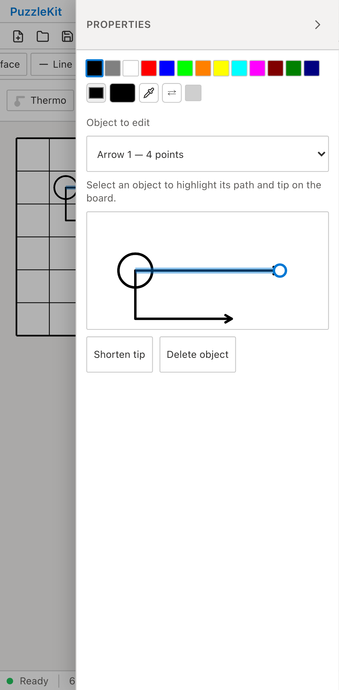
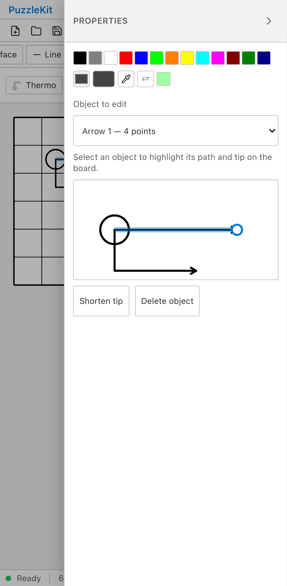

# 重なり矢印E2Eのfixture整理

CIで `page.evaluate: Resulting promise was garbage collected` が発生した初期化を、公開File Openでの固定JSON読込に置き換えた。ブラウザー内の動的import・直接store操作をこのspecから撤去し、結果はSVG・object選択欄・公開Save JSONで確認する。File Open/Save操作は既存セッションE2Eと共有した。アプリとUnitは変更していない。

旧CIエラーの根本原因は未確定。失敗時はHTTP 200、fixture描画済み、アプリ例外なしだった。旧SHAで20回、新しい初期化もdesktop/mobile Chromium各10回の計20回成功している。失敗率改善を実証したとは扱わず、失敗した動的import経路を撤去した変更として評価する。

共通編集panelの重なり選択・下限2点・削除UndoをArrow代表へ集約し、2tool×4profile=8枠から4枠へ整理。Thermoの作成・短縮・UndoRedo・SVG出力・再読込は既存の製品mobile Chromium E2Eを維持。両typeの短縮・属性復元は既存Unitにあり、panel下限はArrow代表で確認する。Thermo固有のWebKit・重なり・下限問題を直接拾う範囲は狭まる。

短縮後、Undo直後、削除Undo後の保存JSONでID・属性・点列・非選択objectを確認。SVGはUndoで挿入順が変わるため、内部順序に依存せず形状の集合を比較する。固定fixtureの追加等でコードは純増87行。行数削減や速度改善の数値は主張しない。

全project/title集合の差分はThermo長フロー4枠の削除のみ。開発256→252枠、本番71枠不変、追加skipなし。先行PRの統合でも意図した4枠だけ減ることを確認。今回は統合Unit/全E2Eは再実行していない。

全Unit954件/72file、app/E2E型検査、source map、app build成功。開発E2E251件成功・1既存skip、本番Chromium E2E70件成功・1既存skip。共通File操作とArrowの対象8シナリオ成功、新Arrow20回の反復も成功。

Before `c6e07799cfec71aa7d345216acca780f048c0bb2` / After `1278d6043917d15a8585bc31590502e1a619b055`。両方clean。special-tip全ケースをdesktop/mobile Chromiumで実行し、Before4件/After2件成功。Before source552ファイルは基点SHAと一致し、変更sourceは2spec・File操作helper・JSON fixtureのみ。

| 証跡 | Before | After |
|---|---|---|
| 重なり矢印の選択（mobile） |  |  |
| 選択・短縮・Undo・読込の動画 | [Before](evidence-test-special-fixture-20260915/arrow-overlap-before.webm) | [After](evidence-test-special-fixture-20260915/arrow-overlap-after.webm) |

Beforeは内部seed、AfterはFile Openを使うため準備の操作列は異なる。同じ矢印を選択したpreviewを画像で比較し、2動画を全decode・Chromium再生/シークで確認した。[gallery](evidence-test-special-fixture-20260915/index.html) / [revision・SHA256](evidence-test-special-fixture-20260915/evidence.json)。詳細監査・UI Reviewは非追跡 `.work` に保存。

```bash
npm run qa:check
npm run build
npm run qa:production
# 各revisionでphaseをbefore/afterに変更
npm run qa:capture -- before e2e/special-tip.spec.ts --project=chromium --project=mobile-chrome
# 反復確認
npx playwright test e2e/special-tip.spec.ts --project=chromium --project=mobile-chrome --repeat-each=10
```

ローカル開発/撮影/反復は専用Vite4186へ `QA_EXTERNAL_BASE_URL` で接続し、`.work`/`docs/qa` watch除外と専用cacheを設定。本番は標準preview4176。
