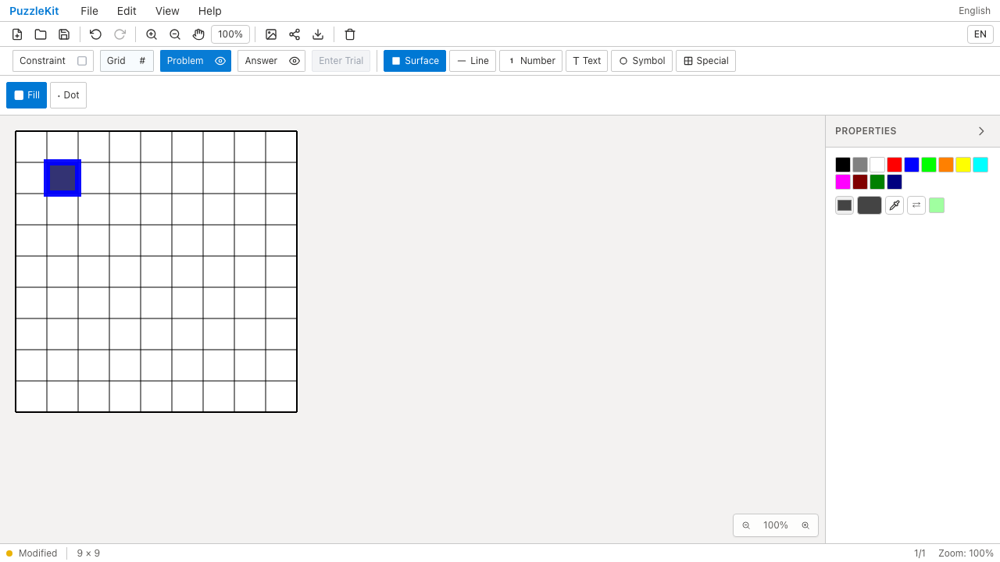
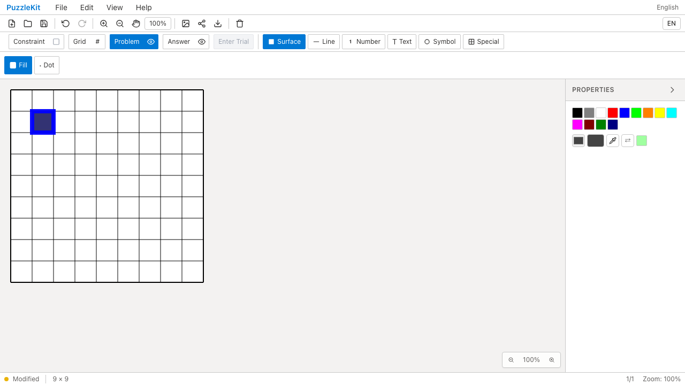
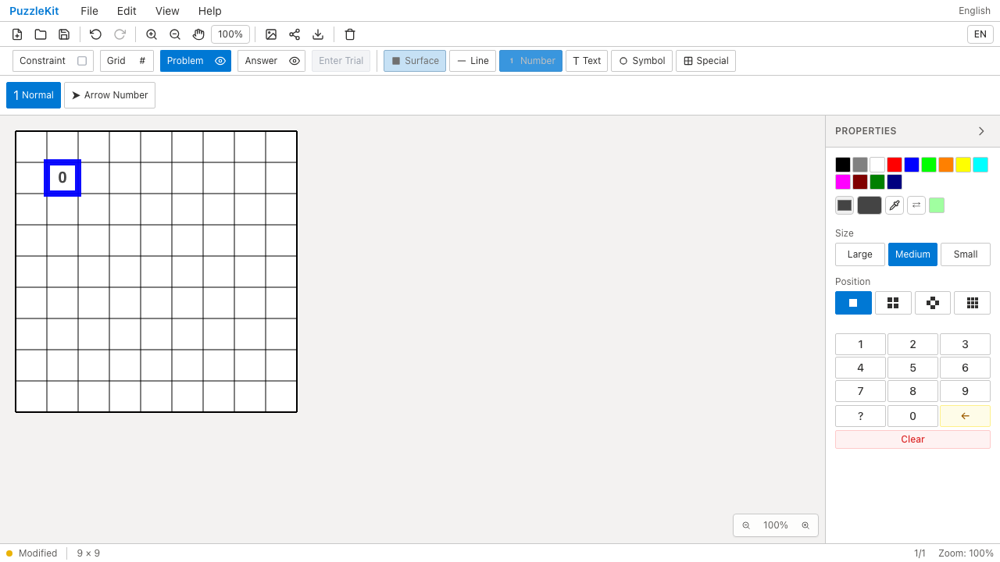

# 保存設定テスト整理のQA

カーソル設定の専用テストを保存設定の代表例へ統合した。最近使ったパズルは3回の保存で、重複除去・順序・内容・更新日時を一度に検査する。localStorageのモック自体の利用可能判定や、設定初期値の重複確認を削除した。

対象17件から7件、テストコード165行を削減した。カスタムカーソルの色/幅、currentToolの非永続化、部分設定更新時の既存値保持、履歴一覧消去、言語保存、設定消去後のdefault復元を維持する。詳細なC070〜C071の監査は非追跡 `.work` に保存する。

| 検査 | 結果 |
|---|---|
| source map / app型 / E2E型 / app build | PASS |
| 変更テストの明示TypeScript検査 | PASS |
| Unit | 944件 / 71ファイル PASS |
| 開発版E2E | 255 PASS / 1既存skip |
| 本番版Chromium E2E | 70 PASS / 1既存skip |
| Before / After Chromium | 各6件 PASS |
| 未マージPRのローカル統合 | #70〜#79＋履歴整理＋本変更で668件 / 69ファイル PASS |

本番コード・E2Eは変更していない。library buildは#78を含む統合で成功し、以降の統合はテスト変更のみ。全PR統合ブランチでE2Eは再実行していない。

Before `c6e0779` / After `9efc47d`。Surface/Numberの選択枠を青・幅8に設定し、reload後も維持されることを実UIで確認した。ほかに数値Undo/Redo、自動保存reloadを含むChromium6操作が各revisionで成功した。

| 操作 | Before | After |
|---|---|---|
| Surfaceのreload後 |  |  |
| Numberのreload後 |  |  |
| Surface動画 | [Before](evidence-test-storage-contracts-20260915/surface-cursor-before.webm) | [After](evidence-test-storage-contracts-20260915/surface-cursor-after.webm) |
| Number動画 | [Before](evidence-test-storage-contracts-20260915/number-cursor-before.webm) | [After](evidence-test-storage-contracts-20260915/number-cursor-after.webm) |

[動画gallery](evidence-test-storage-contracts-20260915/index.html) / [revision・SHA256](evidence-test-storage-contracts-20260915/evidence.json)。全4動画のdecode、Chromium再生・シーク、全4画像を確認した。動画は別実行のためフレーム同期していない。

Beforeは同じ基点の履歴整理用録画と共用した。source manifest552ファイルが基点c6e0779と一致し、Afterとの差分は対象2テストだけである。

```bash
npm run qa:check
npm run build
npm run qa:production
npm run qa:capture -- before e2e/number-history.spec.ts e2e/persistence.spec.ts e2e/cursor-style.spec.ts --project=chromium
# After revisionでは before を after にする
```

ローカル開発版ではBeforeに `QA_EXTERNAL_BASE_URL=http://127.0.0.1:4186`、Afterに `http://127.0.0.1:4188` と、入れ子worktree・証跡をwatch対象外にした専用Vite設定を使用した。本番版は標準previewを使う。
