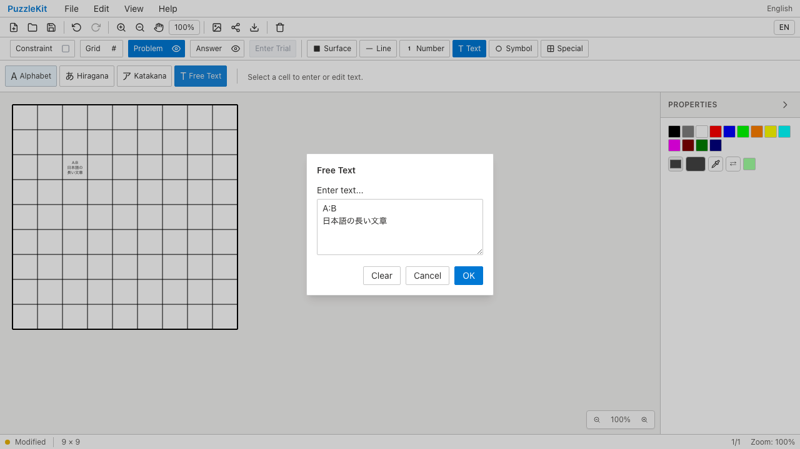
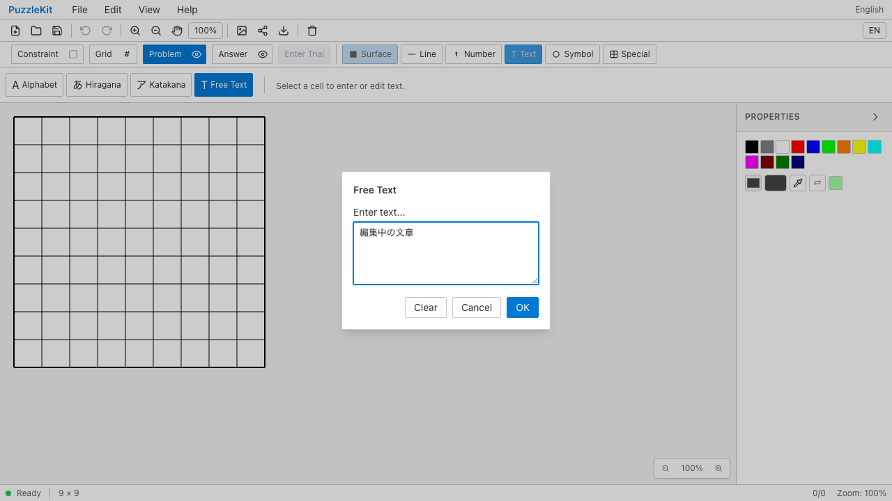

# 文字入力テスト整理のQA（2026-09-15）

文字列5例の直接解析テストと、3種類のツールで繰り返していた編集・Undo検査を統合しました。コロン・改行・日本語・絵文字・前後空白を含む既存テキストをAlphabetから開き、変更なしの確定、書式とIDを保った編集、別レイヤーからのUndo/Redo、削除のUndoを一連の操作で確認します。同一セルに共存する非テキスト記号も維持します。

12件を3件に整理し、21行削減しました。折返し・絵文字の分割防止と、JSON読込後のレイヤー情報・編集履歴は異なる処理なので独立した検証を残しています。更新時のaddSymbol戻り値IDも、既存のJSON読込後編集テストで維持しています。アプリ実装・E2Eは変更していません。

## 検証

- 対象Unit: Before 12件、After 3件。変更テストの明示TypeScript検査成功。
- 全Unit: 945件／72ファイル成功。app/E2E型検査とsource map検査成功。
- 開発版E2E: 255成功・1既存skip。
- 本番Chromium: 70成功・1既存skip。app build成功。87ファイルのハッシュが本番QAで使用した成果物と一致。
- #70〜#85のコード変更とのローカル統合: Unit652件／67ファイル成功。最終の戻り値assert追加後も統合側の対象3件成功。統合版の全E2E再実行は含みません。
- 空白をtrimする、既存テキストを選択ツールの文字種へ変換する、編集時にIDを取り替える、の3つをローカル統合で一時的に導入し、すべて統合テストが検出しました。実装を復元して対象3件が再度成功しています。

Before `c6e07799cfec71aa7d345216acca780f048c0bb2` / After `d4d016cdd94769011ef723846c7218191f66f5ce`。追跡ソースのBeforeハッシュは基準コミットに一致し、source manifestの差分は `src/test/textSymbols.test.tsx` のみです。After撮影時の未追跡ファイルは準備中の公開QA資料です。全開発・本番E2Eは `dc09567`、全Unit・明示型検査とAfter撮影は `d4d016c` で実行しています。両コミットの差分は公開APIの戻り値を検査するassert 1行のみです。

## Chromium Before / After

Before/Afterともに、デスクトップ2成功・1skip、Pixel 7プロファイル3成功（合計5成功・1skip）。skipはタッチを持たないデスクトップにおけるタッチ専用シナリオです。OSの実IME操作は含まず、compositionイベント契約を検証しています。

| 操作 | Before | After |
|---|---|---|
| Alphabetから既存の複数行テキストを再表示 |  |  |
| 編集・Undo/Redo・再読込・SVG出力 | [Before動画](evidence-test-text-contracts-20260915/text-edit-before.webm) | [After動画](evidence-test-text-contracts-20260915/text-edit-after.webm) |
| composition中のEscapeでドラフトを維持 |  |  |
| Escapeと明示キャンセル | [Before動画](evidence-test-text-contracts-20260915/composition-draft-before.webm) | [After動画](evidence-test-text-contracts-20260915/composition-draft-after.webm) |

公開メディアはデスクトップの2操作を選定。画像はそれぞれ `cross-tool-dialog` / `composition-draft` 添付から取得しています。[revision・SHA256](evidence-test-text-contracts-20260915/evidence.json) / [動画ギャラリー](evidence-test-text-contracts-20260915/index.html)。4画像を目視確認し、4動画の全フレームdecodeとChromium再生・シークを検証しました。UI変更のないテスト整理なので、既存動作の維持を示す証跡です。

## 再現

各revisionのサーバーを用意し、次を実行します。今回のローカルViteは並行worktree向けにcacheを分離し、`.work` と `docs/qa` の監視を除外しています。

```sh
npm run dev -- --config vite.qa.config.ts --host 127.0.0.1 --port 4186 --strictPort
# 別ターミナル。Afterは before を after に変更
QA_INCLUDE_PRODUCTION_TESTS=1 QA_EXTERNAL_BASE_URL=http://127.0.0.1:4186 npm run qa:capture -- before e2e/text-editing.spec.ts --project=chromium --project=mobile-chrome
```

詳細監査は非追跡 `.work` に保存しています。
