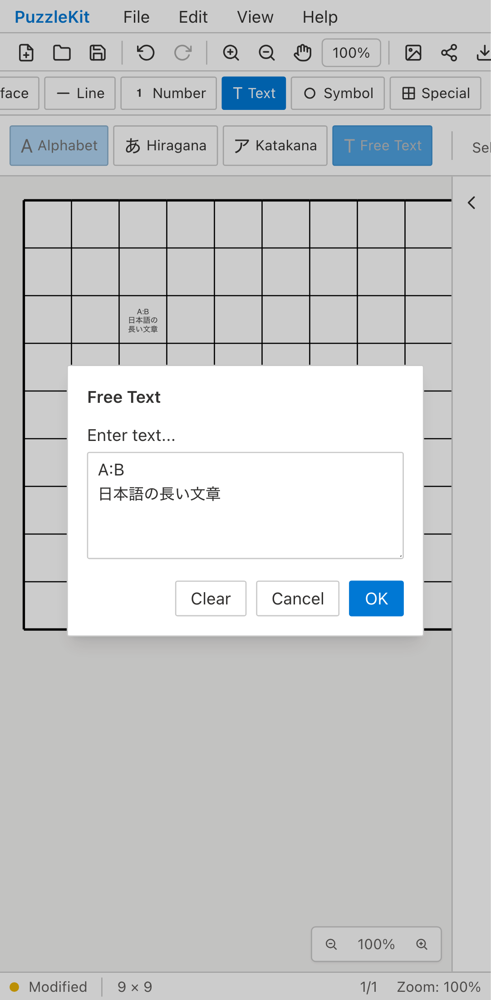
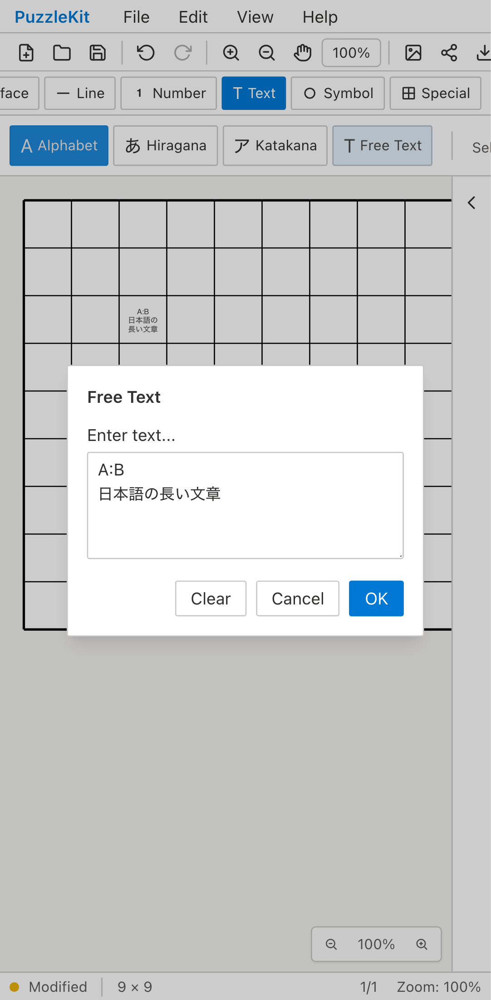

# 文字入力E2Eの統合

文字の保存・再表示・再編集を繰り返す3ケースを、既存の本番UI長文フローへ統合した。アプリ・Unit・ブラウザープロファイル設定は変更していない。3spec合計12→9ケース、35行追加・73行削除（38行削減）。

削除前の独自検査は次のように残した。

| 元のケース | 統合先で残す検査 |
|---|---|
| `text: colons, long strings and newlines survive display and reopening` | コロン・改行・日本語に長い英字列とemojiを追加。SVG文字内容、幅/高さ40未満、再編集時の全文を確認 |
| `Free text is reachable from the toolbar and editable after reload` | 再読込後、Free Textボタンから同じ文字を開き、別の文字へ変更してUndoで元へ戻す |
| `edit: text replacement, clear and undo preserve a single entry` | 置換Undo/Redoに加え、Clear→OKで削除し、Undoで1要素だけ復元する |

統合先のAlphabet再編集・再読込・SVG出力を維持。IME composition Escapeと実touchの独立ケースは変更していない。削除したFree Text用の分岐が不要になったため、残ったLITS初期化を従来の `init(true)` と同じ固定処理へ整理した。

個別ケースの起動や内部storeのseed経路は独立検査しなくなる。特定の短い入力値だけに起きる不具合の直接保証も減る。共有の入力・保存経路で代表させ、長い文字列・emoji・改行・異なる編集入口・Clearの違いを残す。一つの長いフローへ集めるため、前半の失敗時は後半が実行されなくなる。この診断上の負担と、繰り返す起動・保存・再読込のコストを比較した統合である。

全project/title集合を照合し、開発256→244枠の差は削除3ケース×4プロファイルのみ。本番71枠は不変、新しいskipなし。先行PRとのローカル統合でも開発214→202枠、本番65枠不変で、同じ12枠のみ減ることを確認した。統合ブランチの全Unit/E2Eは今回は再実行していない。

全Unit954件/72file、app/E2E型検査・source map成功。開発E2E243件成功・1既存skip。統合した文字フローとLITSフローを全4プロファイルで検証し、8件成功。app build成功後、本番Chromium E2E70件成功・1既存skip。

Before `c6e07799cfec71aa7d345216acca780f048c0bb2` / After `34ce3892399d9f6babf86c83c178a503c4703a09`、撮影時clean。Before source552ファイルは基点SHAと一致し、変更sourceは上記3specのみ。対象文字4フローをdesktop/mobile Chromiumで撮影し、Before8件/After2件成功。下記は両phaseにある本番文字フローのmobile記録。

| 証跡 | Before | After |
|---|---|---|
| Alphabetから文字を再編集 |  |  |
| 操作動画 | [Before](evidence-test-text-flows-20260915/text-editing-before.webm) | [After](evidence-test-text-flows-20260915/text-editing-after.webm) |

2画像のダイアログ内の文字と盤面表示を確認した。ツールボタンの強調表示には撮影時の差があり、pixel単位の同一性は主張しない。After動画は長い追記・Free Text再編集・Clear Undoを含むので操作列と長さが異なる。2動画は全decodeとChromium再生/シークを確認済み。[gallery](evidence-test-text-flows-20260915/index.html) / [revisionとSHA256](evidence-test-text-flows-20260915/evidence.json)。詳細監査・UI Reviewは非追跡 `.work` に保存。

```bash
npm run qa:check
npm run build
npm run qa:production
# 各revisionでbefore/afterを指定
npm run qa:capture -- before e2e/issue-priority.spec.ts e2e/room-text-access.spec.ts e2e/text-editing.spec.ts --grep 'text: colons|edit: text replacement|Free text is reachable|text-ui: long text' --project=chromium --project=mobile-chrome
```

ローカル開発/撮影は専用Vite4186へ `QA_EXTERNAL_BASE_URL` で接続し、`.work`/`docs/qa` watch除外と専用cacheを設定。本番は標準preview4176。
