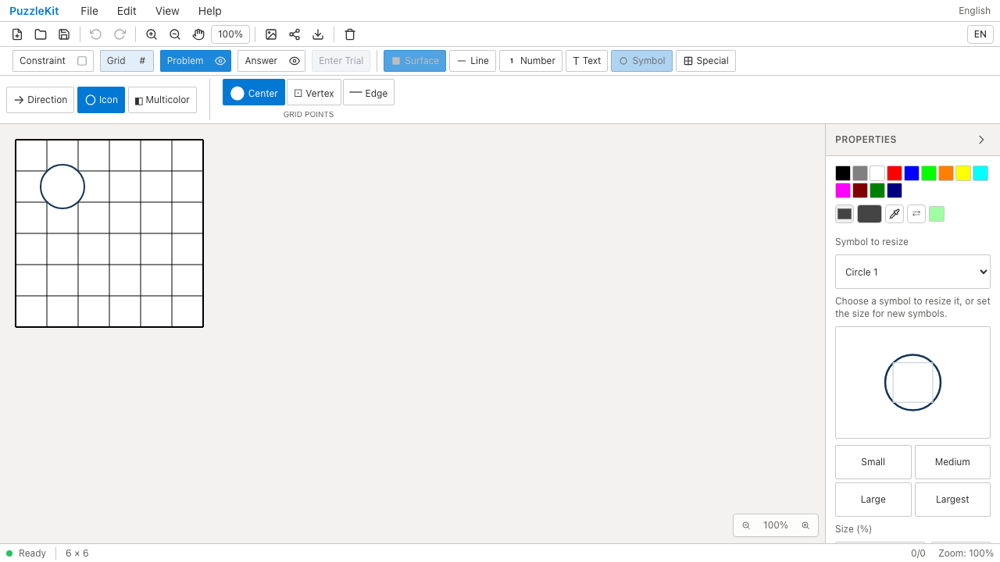
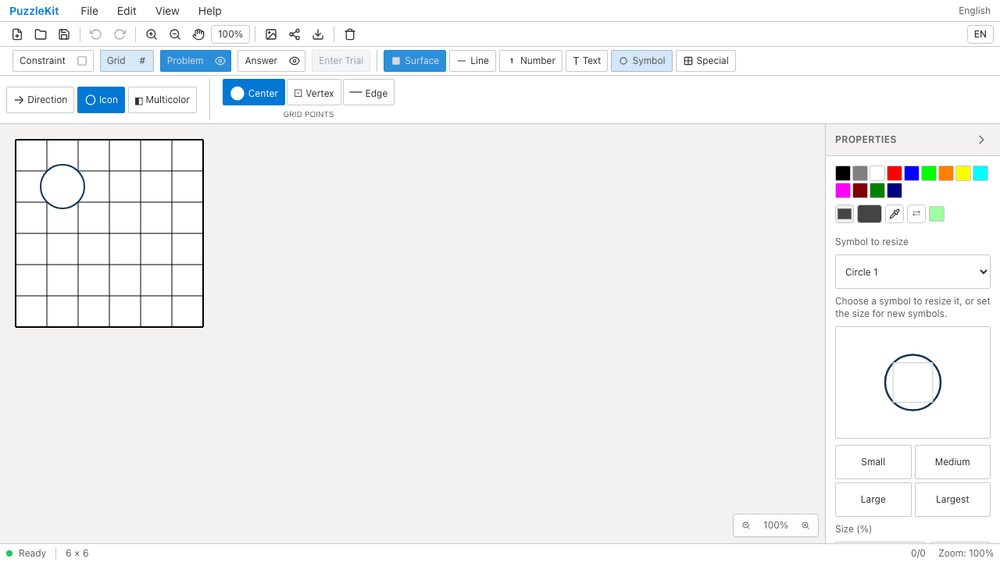
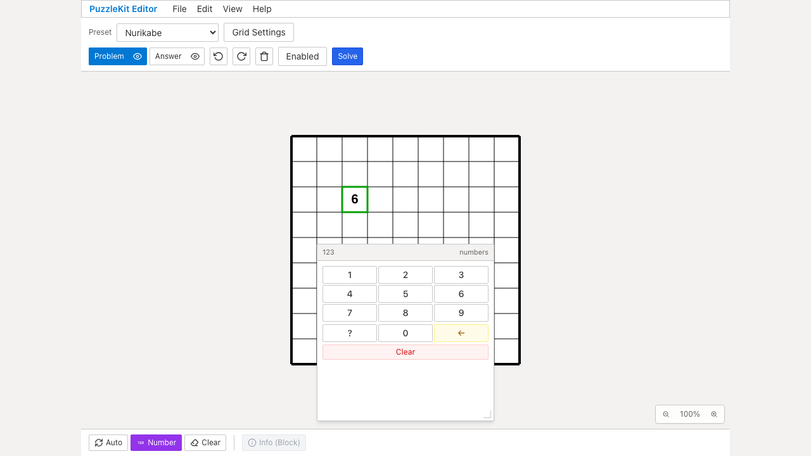

# 描画・入力テスト整理のQA

Penpaの定数・辞書の転記、翻訳ラベルの文字列コピー、重複した描画テストを整理した。変更はテストとQA証跡のみ。

- Penpaの外部互換に関わる数値enum、パレット変換、不正入力のfallbackは維持。
- 翻訳は日英のキー一致と必須ラベルの非空検査に統合。任意の補足文には空文字を許容する。
- 多色セルは独立したProvider/storeで、非矩形セルの単色・複色描画と問題／解答レイヤーの表示切替を一度のマウントで確認。
- NPGeneratorのフォーカス・Tab停止位置をキーボード編集フローへ統合。移動後のキーはフォーカス先に送る。
- 記号サイズは境界・旧presetを純粋関数で確認し、旧presetとcustomサイズの描画・SVG出力を一度のマウントに統合。履歴・保存・編集保護の確認は維持。
- 数字の編集保護4ケースから、操作しないReactコンポーネントの描画を除去。

今回の監査候補10項目の判断記録と全体の進捗台帳は、非追跡の `.work` に保存している。

## 検証

| 検査 | 結果 |
|---|---|
| source map / app型検査 / E2E型検査 / doctor / build | PASS |
| Unit | 72ファイル・954件PASS（変更前73ファイル・1,002件） |
| QA runner | 3件PASS |
| 開発版E2E | 255 PASS / 1既存skip |
| 製品版Chromium E2E | 70 PASS / 1既存skip |
| Before / After Chromium | 各9件PASS、runtime errorなし |

Unitの実測は17.03秒。前回記録15.84秒と実行条件が異なるため、速度改善は主張しない。効果はテストコード426行の純減と、重複した描画・ストア生成の削減。ケース数・カバレッジの維持自体を目的としていない。

## Before / After

Before: `31a15cd347e7c240cb5b4cc9857d2e0f8e39fb41`。After: `7465608`。同一の9ケースをChromiumで実行した。以下はそのうち2操作の証跡で、アプリの挙動変更はない。

| 操作 | Before | After |
|---|---|---|
| 記号サイズ変更・Undo/Redo・再読込 |  |  |
| 数字の置換・Undo/Redo |  |  |

| 動画 | Before | After |
|---|---|---|
| 記号サイズ | [再生](evidence-test-ui-contracts-20260915/symbol-resize-before.webm) | [再生](evidence-test-ui-contracts-20260915/symbol-resize-after.webm) |
| 数字Undo | [再生](evidence-test-ui-contracts-20260915/number-undo-before.webm) | [再生](evidence-test-ui-contracts-20260915/number-undo-after.webm) |

[ローカル再生用gallery](evidence-test-ui-contracts-20260915/index.html) / [revision・結果・SHA256](evidence-test-ui-contracts-20260915/evidence.json)。4動画の全decode、Chromiumでの再生・シーク、4枚のスクリーンショットを確認した。全9ケースの動画・trace・ログは各ローカルQA runに保存。CIは従来どおり全E2Eの証跡をartifactに30日保存する。

## 再現

```bash
npm run qa:check
npm run build
npm run qa:production
# Before/Afterそれぞれのrevisionで実行する
npm run qa:capture -- before e2e/topology-issues.spec.ts e2e/number-pad-history.spec.ts e2e/symbol-sizing.spec.ts --project=chromium
npm run qa:capture -- after e2e/topology-issues.spec.ts e2e/number-pad-history.spec.ts e2e/symbol-sizing.spec.ts --project=chromium
```

今回のローカルQAでは標準ポート4174を別プロジェクトが使用していたため、puzzle-kitのVite QAサーバーを4184で起動し、開発版コマンドに `QA_EXTERNAL_BASE_URL=http://127.0.0.1:4184` を指定した。製品版は標準のpreviewサーバーで確認する。
