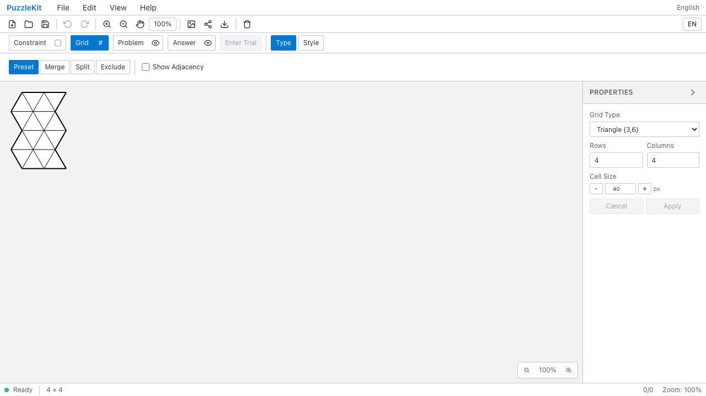
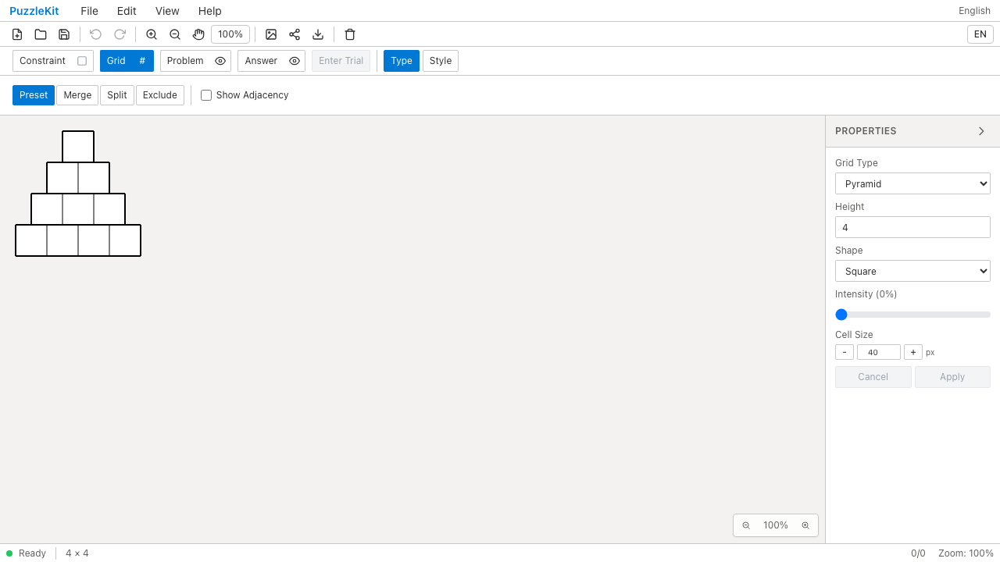

# 頂点APIテスト統合のQA

PR #70の格子テスト整理を基点に、三角形・ピラミッドの頂点検査6件をAPI別2件へ統合した（18行追加・58行削除）。実装は変更していない。別実装である両公開APIを直接呼び、中心(10,20)、辺長12、上向き/下向きの順序付き頂点座標を固定値で検証する。

指定サイズを半分にする不具合は従来のピラミッド5件では通過したが、新しいピラミッド検査で失敗した。中心Xを無視する三角形の不具合も独立に検出。復元後2件成功。速度改善やテスト件数の維持を目的にはしていない。

対象19件/3ファイル、明示的なテストTypeScript検査、全Unit789件/73ファイル、app/E2E型検査、source map検査、app build成功。開発E2E255件成功・1既存skip、本番Chromium E2E70件成功・1既存skip。先行PRを合わせたローカル統合Unit587件/68ファイル成功。統合全E2Eは再実行していない。

Before `f7b49a8e6164f0341cbcb0036bef13d45054e36c` / After `e2c208df4eed197b469ada4d47aa88d42629f6e7`。撮影時clean、Beforeの552 source filesは基点SHAと一致。Afterで変化したsourceは対象テスト3ファイルのみ。

Chromiumのdesktop/Pixel 7で、新規Triangle/Pyramid盤面を作成する同一シナリオを各phase4件実行し成功した。公開API自体の検証はUnitで行い、動画はcanvasでのAPI使用を証明するものではない。Pyramid表示は既存のSquare shape設定。公開4画像を目視し、4動画を全decode・Chromium再生/シークで確認した。

| 画面 | Before | After |
|---|---|---|
| Triangle |  |  |
| Pyramid |  |  |
| Triangle動画 | [Before](evidence-test-vertex-contracts-20260915/triangle-before.webm) | [After](evidence-test-vertex-contracts-20260915/triangle-after.webm) |
| Pyramid動画 | [Before](evidence-test-vertex-contracts-20260915/pyramid-before.webm) | [After](evidence-test-vertex-contracts-20260915/pyramid-after.webm) |

[再生用gallery](evidence-test-vertex-contracts-20260915/index.html) / [revision・SHA256](evidence-test-vertex-contracts-20260915/evidence.json)。詳細監査・UI観察は非追跡 `.work` に保存。

再現には公開した [capture spec](evidence-test-vertex-contracts-20260915/capture.spec.txt) と [config](evidence-test-vertex-contracts-20260915/capture.config.txt) を、各revisionの `.work/vertex-capture.spec.ts` と `.work/playwright.vertex.config.ts` にコピーする。別checkoutで実行する場合も同じファイルを使う。

```bash
npm run test:unit
npm run qa:check
npm run build
npm run qa:production
npm run dev -- --config vite.qa.config.ts --host 127.0.0.1 --port 4186 --strictPort
# 別terminal。各revisionでphaseをbefore/afterに変更
QA_EXTERNAL_BASE_URL=http://127.0.0.1:4186 npm run qa:capture -- before --config .work/playwright.vertex.config.ts
```

ローカル撮影サーバーは `.work` と `docs/qa` のwatch除外・専用Vite cacheを設定した。これは先行PR #73の環境分離と同じ目的で、実装を変更する設定ではない。
