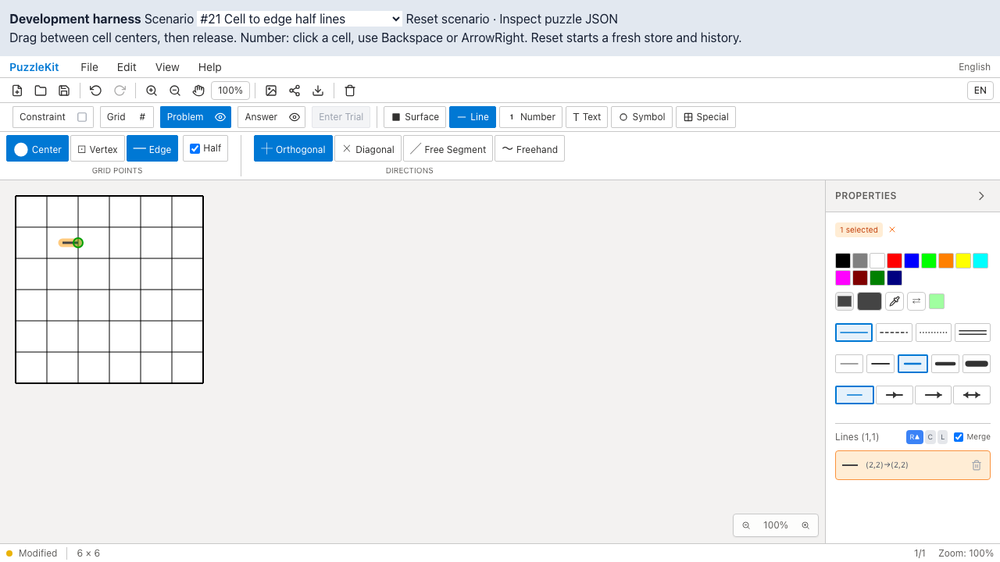

# 未使用格子ヘルパー削除のQA

`src/utils/gridPointUtils.ts` は専用Unitテスト以外から参照されず、アプリ・4つのライブラリエントリから到達しない。実装346行と専用テスト86行（9件）を撤去した。同名の公開関数は `src/utils/gridUtils.ts` にあり、削除対象ではない。

PR #70の後続変更。詳細な参照調査・削除判断は非追跡 `.work` に保存している。

## 検証

| 検査 | 結果 |
|---|---|
| source map / app型検査 / E2E型検査 | PASS |
| Unit | 71ファイル・784件PASS（変更前793件） |
| 開発版E2E | 255 PASS / 1既存skip |
| 本番版Chromium E2E | 70 PASS / 1既存skip |
| Before / After Chromium | 各5件PASS |
| アプリbuild | PASS。全87ファイルのSHA256が削除前後で一致 |
| ライブラリbuild | PR #70〜#75と本変更をローカル統合してPASS |

単独ブランチのライブラリ型検査には既存エラーがあるため、その修正PR #72を含むローカル統合で確認した。リモートではマージしていない。

## Before / After

Before `f7b49a8` / After `eab3e76`。同一の `e2e/topology-issues.spec.ts` をChromiumで実行した。未使用モジュールの削除前後で、同じ操作が通ることを確認した。

| 操作 | Before | After |
|---|---|---|
| 六角形セルの除外・復帰 |  |  |
| 半線の描画・Undo/Redo |  |  |

| 動画 | Before | After |
|---|---|---|
| 六角形セル | [再生](evidence-unused-grid-points-20260915/hex-exclusion-before.webm) | [再生](evidence-unused-grid-points-20260915/hex-exclusion-after.webm) |
| 半線 | [再生](evidence-unused-grid-points-20260915/half-lines-before.webm) | [再生](evidence-unused-grid-points-20260915/half-lines-after.webm) |

[再生用gallery](evidence-unused-grid-points-20260915/index.html) / [revision・結果・SHA256](evidence-unused-grid-points-20260915/evidence.json)。全decode、Chromiumでの再生・シーク、スクリーンショットを確認した。全5ケースの動画・trace・ログはローカルQA runに保存し、CIも全E2Eの証跡を30日保存する。

## 再現

```bash
npm run qa:check
npm run build
npm run qa:production
# それぞれのrevisionで実行
npm run qa:capture -- before e2e/topology-issues.spec.ts --project=chromium
npm run qa:capture -- after e2e/topology-issues.spec.ts --project=chromium
```

ローカルの開発版検証は専用Viteサーバー4186を起動し、`QA_EXTERNAL_BASE_URL=http://127.0.0.1:4186` を指定した。証跡・入れ子worktreeをwatchから除外する専用設定を使った。本番版は標準previewサーバーを使う。
