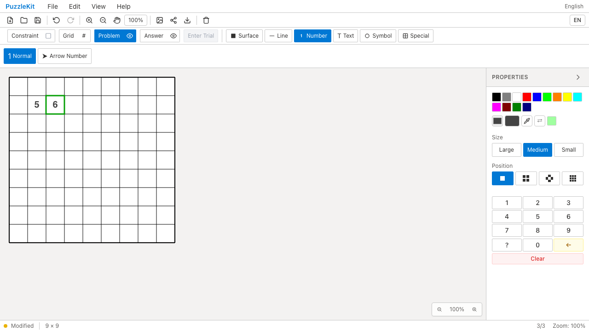
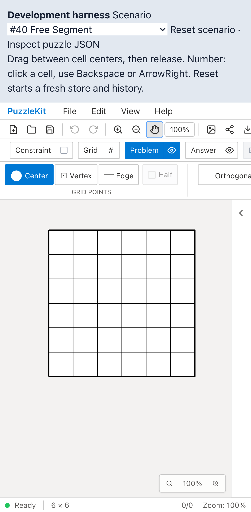
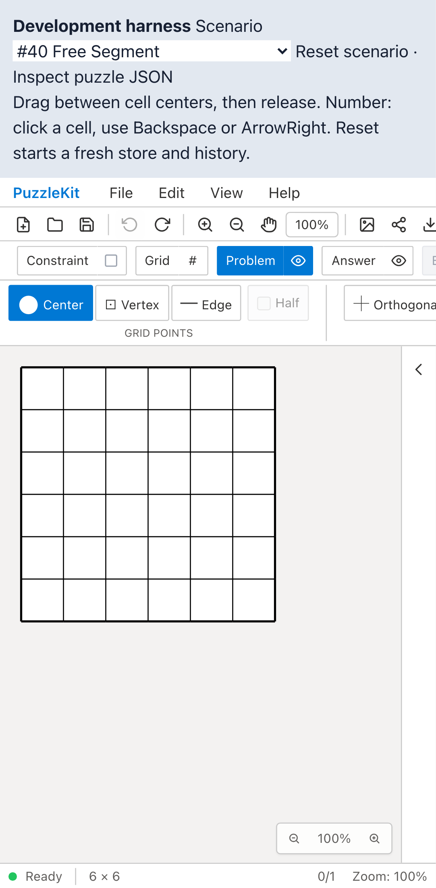

# 未使用入力ヘルパー撤去のQA

本番から参照されない6関数と専用の定数表を、対応するUnitテスト13件とともに撤去した。

- `interactionStateMachine.ts`: `toolSupportsDrag`、`toolNeedsCompletion`、`TOOL_CATEGORY_CONFIG`。
- `keyboardUtils.ts`: `isArrowKey`、`isDigit`、`isSingleChar`、`isDeleteKey`。

現役のCanvas interaction・number keyboardは別の処理を使う。公開ライブラリの4エントリからも、この6関数をexportしていない。モジュール全体は利用されているため、未使用部分だけを撤去した。詳細な利用経路調査は非追跡 `.work` に保存している。

## 検証

| 検査 | 結果 |
|---|---|
| source map / app型検査 / E2E型検査 | PASS |
| 変更2テストのTypeScript検査 | PASS |
| Unit | 72ファイル・941件PASS（変更前954件） |
| 開発版E2E | 255 PASS / 1既存skip |
| 本番版Chromium E2E | 70 PASS / 1既存skip |
| Before / After Chromium | 各デスクトップ5件＋タッチ2件PASS |
| app build | PASS。生成物87ファイルのSHA256が変更前後で一致 |
| ローカル統合 | PR #70〜#77＋本変更でUnit719件／70ファイル、library build成功 |

ライブラリの既存型エラー修正はPR #72にあるため、それを含むローカル統合で確認した。リモートではマージしていない。

## Before / After

Before `c6e0779` / After `05c8217`。実際の数値入力・方向移動・Backspace削除・線の描画とUndo/Redoに加え、Chromiumのタッチ入力でパン・キャンセル後の再描画を確認した。

| 操作 | Before | After |
|---|---|---|
| 数値入力・ArrowRight |  |  |
| タッチパン |  |  |
| キャンセル後の再描画・Undo |  |  |

| 動画 | Before | After |
|---|---|---|
| 数値入力・ArrowRight | [再生](evidence-unused-input-helpers-20260915/number-navigation-before.webm) | [再生](evidence-unused-input-helpers-20260915/number-navigation-after.webm) |
| タッチパン | [再生](evidence-unused-input-helpers-20260915/touch-pan-before.webm) | [再生](evidence-unused-input-helpers-20260915/touch-pan-after.webm) |
| キャンセル後の再描画 | [再生](evidence-unused-input-helpers-20260915/touch-cancel-before.webm) | [再生](evidence-unused-input-helpers-20260915/touch-cancel-after.webm) |

[再生gallery](evidence-unused-input-helpers-20260915/index.html) / [revision・SHA256](evidence-unused-input-helpers-20260915/evidence.json)。全6動画のdecodeとChromiumでの再生・シーク、各スクリーンショットを確認した。CIの全E2E動画・trace・ログは30日保存する。

## 再現

```bash
npm run qa:check
npm run build
npm run qa:production
# 各revisionでbefore / afterを指定
npm run qa:capture -- before e2e/editor-issues.spec.ts --project=chromium
npm run qa:capture -- before e2e/gestures.chromium-touch.spec.ts --project=mobile-chrome --grep 'touch pan mode|cancelled touch'
```

ローカル開発版では `QA_EXTERNAL_BASE_URL=http://127.0.0.1:4186` を指定し、証跡・入れ子worktreeをwatch対象外にする専用Vite設定を使った。本番版は標準previewサーバーを使う。
