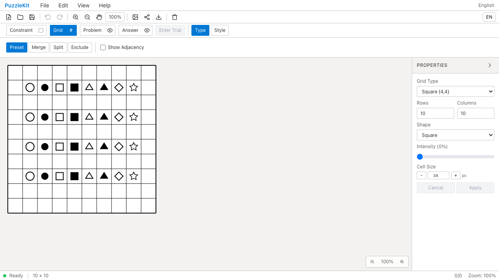
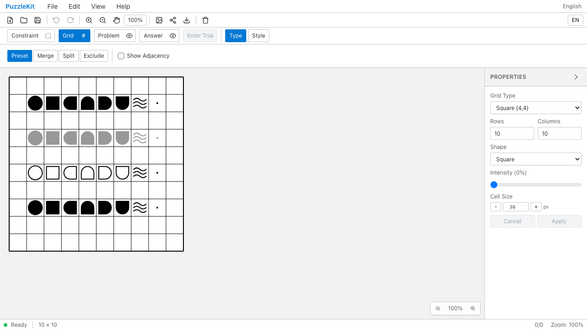

# 船記号とPenpa読み込み QA

Penpaの船記号を読み込むと丸・四角・三角などへ変わり、灰色や白抜きも失われていました。カテゴリとvariantの組で変換するよう修正し、単艦・中間・4方向の船端・水面・点をパレットとSVG描画に追加しました。

関連: #7。今回の範囲は標準船セットです。円弧・四分円は残件なのでIssueは閉じません。Penpaの独自色や回転済み盤面、他カテゴリの変換、Penpaへの書き出しの完全互換を保証する変更ではありません。

参照はPenpa+ 3.2.4本体で作成・保存した[固定URL](../../e2e/fixtures/penpa-battleships.url.txt)と[参照画像](evidence-battleships-20260916/penpa-reference.png)です。水面はフォントに依存しないSVG波線で表現します。形状の参照コードとMIT表記は[fixtureの説明](../../e2e/fixtures/penpa-battleships.md)と[ライセンス](../licenses/penpa-edit.txt)に記載しています。

| | Before | After |
|---|---|---|
| アプリrevision | `ceee29088d9bdf1e9acdf5a9020d139aee9b65fa` | `ffa161b6303810531d0fdd0ce70cd5d15cfcbd9b` |
| PC画面 |  |  |
| PC動画 | [Before](evidence-battleships-20260916/before-chromium.webm) | [After](evidence-battleships-20260916/after-chromium.webm) |
| モバイル画面 | [Before](evidence-battleships-20260916/before-mobile-chrome.png) | [After](evidence-battleships-20260916/after-mobile-chrome.png) |
| モバイル動画 | [Before](evidence-battleships-20260916/before-mobile-chrome.webm) | [After](evidence-battleships-20260916/after-mobile-chrome.webm) |
| 同一シナリオの結果 | 2件とも船の中間が `circle-filled` となり失敗 | PC/モバイルの2件とも成功 |

Playwright + Chromiumで製品ビルドを操作。Beforeのworktreeには最終版のテストとfixtureのみを追加し、アプリはbaselineのままです。両実行のテストSHA256は一致しています。Beforeは誤変換の検出時点で終了し、Afterは続けて以下を確認しています。

- PNGの実ピクセルで船端の4方向と灰色・白抜きを確認。SVGにも問題24個・解答8個の船記号が出力される。
- パレット検索と船端の配置、130%サイズ・15度回転、Undo/Redo、File Save/Openによる状態保持。
- [PCパレット](evidence-battleships-20260916/chromium-fleet-palette.png) / [モバイルパレット](evidence-battleships-20260916/mobile-chrome-fleet-palette.png) / [編集後](evidence-battleships-20260916/chromium-edited-fleet.png) / [出力PNG](evidence-battleships-20260916/chromium-fleet.png) / [出力SVG](evidence-battleships-20260916/chromium-fleet.svg)。

[比較HTML](evidence-battleships-20260916/index.html) / [revision・期待した失敗・実行結果・SHA256](evidence-battleships-20260916/evidence.json)。動画4本の全デコードとChromiumでの再生・シークを確認。ブラウザー例外はBefore/Afterとも0件。比較HTMLはフォルダごと取得してローカルブラウザーで開けます。GitHubでは上の画像・動画リンクから個別に確認できます。

検証結果:

| 検査 | 結果 |
|---|---|
| 全Unit | 592成功 / 69ファイル |
| 全開発版E2E | 154成功・既存skip 1件 |
| 全製品版E2E | 54成功・既存skip 1件 |
| source map、アプリ型、E2E型 | 成功 |
| アプリbuild / ライブラリbuild | 成功 |
| npm pack dry-run | PenpaのMIT表記が同梱されることを確認 |

新規の保証は外部URLの変換テスト1件と、描画/操作/出力のE2Eシナリオ1件。既存の保存・Undo等の単体テストを複製していません。開発版全検査は `28767b6` で実行し、その後の変更は配布物へのライセンス追加と空行整理のみ。製品版検査と両buildは上記After revisionで実行しました。

詳細なUIレビューと撮影手順の調整記録は非追跡 `.work` に保存し、push対象には含めていません。
