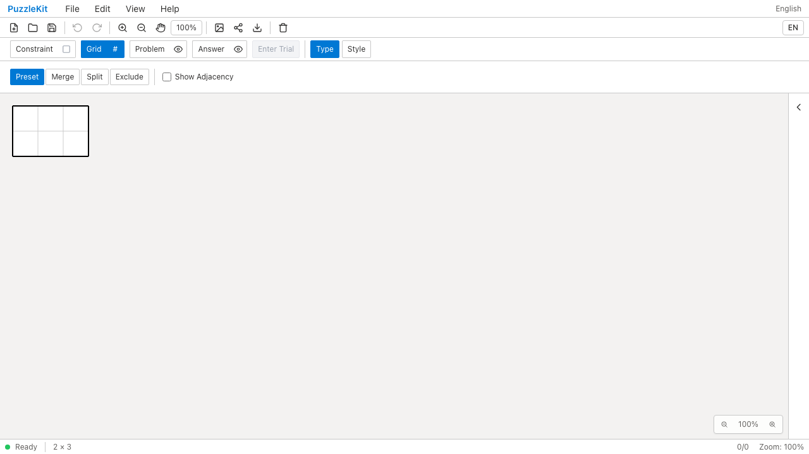
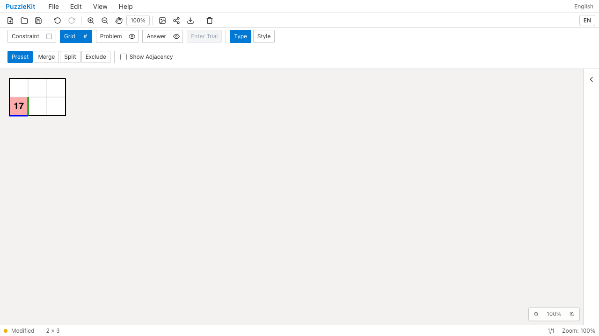
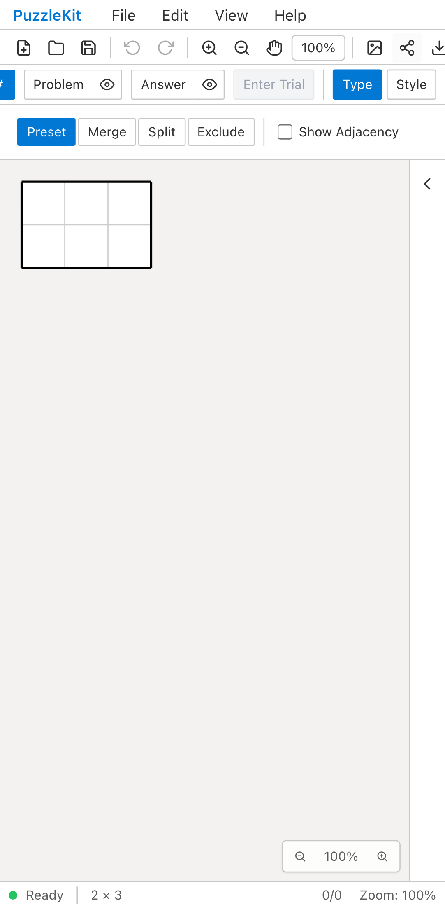
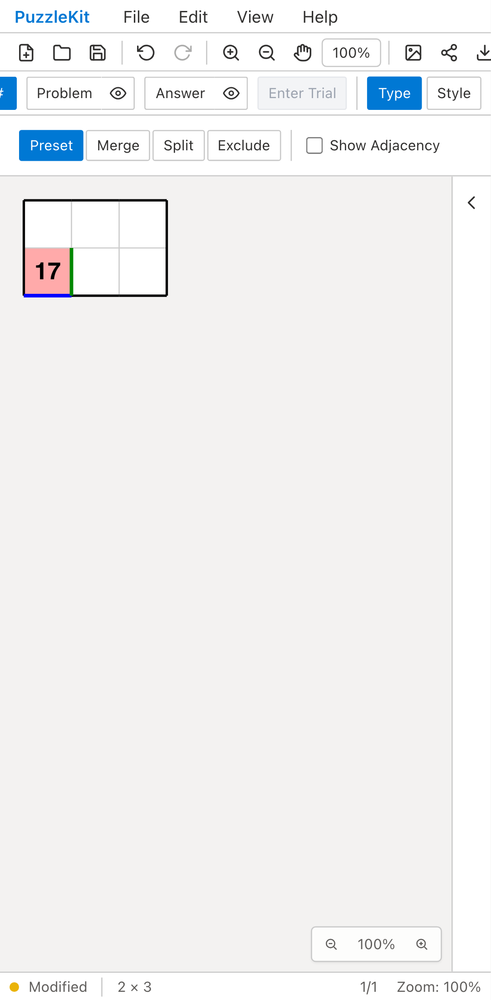

# 正方格子の行列変更: Before / After

同じ2×2の保存盤面を3列に広げる。Beforeでは盤面を再生成してIDとの対応が失われ、
数字17・桃色の塗り・青い下辺が消える。Afterでは元のIDと注記が残る。

| | Before | After |
| --- | --- | --- |
| PC |  |  |
| Mobile |  |  |

- PC動画: [Before](evidence-extent-20260916/before-chromium.webm) / [After](evidence-extent-20260916/after-chromium.webm)
- モバイル動画: [Before](evidence-extent-20260916/before-mobile-chrome.webm) / [After](evidence-extent-20260916/after-mobile-chrome.webm)
- 1列に縮小後: [PC](evidence-extent-20260916/after-chromium-trimmed.png) / [Mobile](evidence-extent-20260916/after-mobile-chrome-trimmed.png)
- [比較ギャラリー](evidence-extent-20260916/index.html) / [コミット・結果・SHA256](evidence-extent-20260916/evidence.json)

Before: `2be0bf5d7de669cdd91fe5b52388effc11e2e53d`、2026-09-16T03:21:16Z。
After: `42e4e064a52a61034ac9170fecb8c8351db2740a`、2026-09-16T03:28:01.985Z。
同一のテスト・fixture（SHA256を照合）をPlaywright + Chromiumで実行した。
PCはマウス、Pixel 7エミュレーションは実際のtouchscreen.tapで追加セルを塗る。
Beforeは両端末で青い線の消失を検出して失敗し、Afterは両端末で成功。
いずれも未処理のブラウザ例外はない。Beforeはその失敗時点までの録画。

Afterでは存続する頂点の位置とID、数字・線・塗り、Undo/Redo、ファイル再読込、
追加されたセルへの入力、1列への縮小後に共有辺が残ることを確認。
Unitでは上・左の周囲セル追加、除外中のセル、試行状態のUndo、
保存し直した後にも削除済みIDを再利用しないことを確認する。

範囲は[正方格子の行列編集](../board-extent-identity.md)を参照。
他の格子・変形プリセット・独自形状等の再生成は残る。公開の低水準リサイズAPIも、適用可能な正方格子では同じ編集器を使う。
このQAを全盤面のID移行完了の根拠にはしない。

初期E2Eではfixtureの辺方向に対する期待値と、GridからProblemタブへ戻る手順を修正した。
最終録画は修正後の同じテストを両コミットで実行している。
UI Review本文は非追跡の `.work/ui-review` にのみ保存する。

検証結果: Unit594件（72ファイル）、開発E2E162件、本番Chromium E2E62件が成功。
E2Eは各既存skip1件。型・E2E型・solver source map・アプリ/library buildも成功。
開発E2E全体の後に公開resize APIを同じ編集器へ接続したため、その変更後に
型・全Unit・両ビルド・全本番E2E・最終After録画を再確認した。
動画4本はffmpegで全フレームをデコードし、画像3枚は目視確認した。
ローカルChromiumで動画4本の再生・中間へのシークも成功した。
