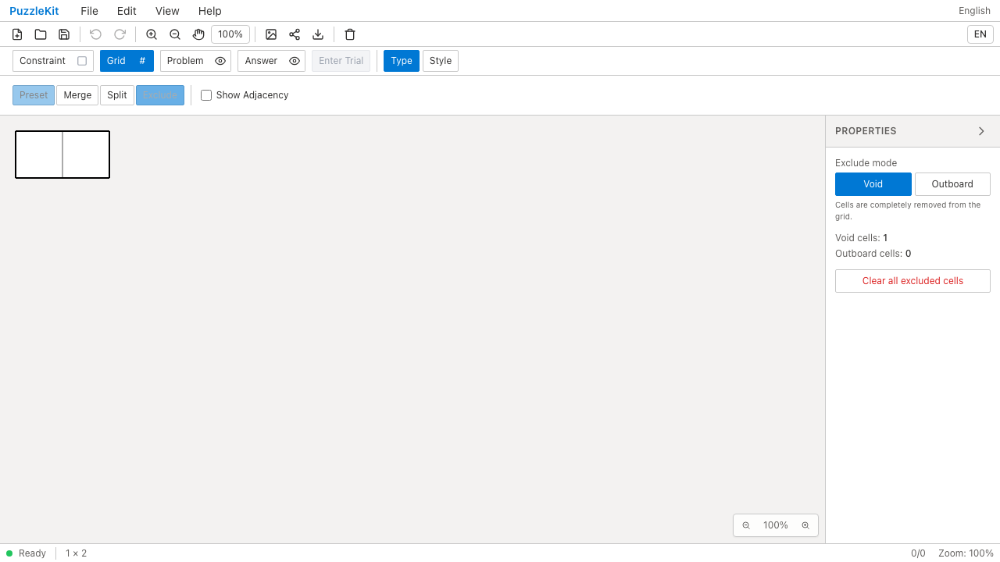
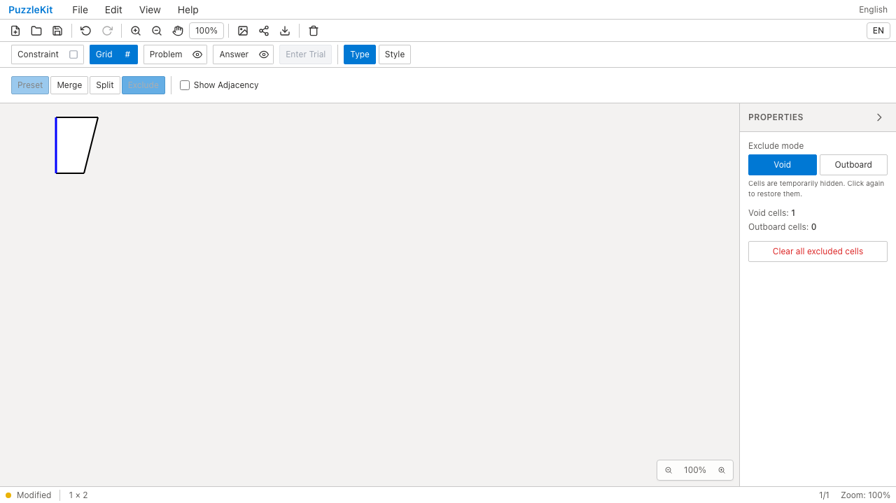
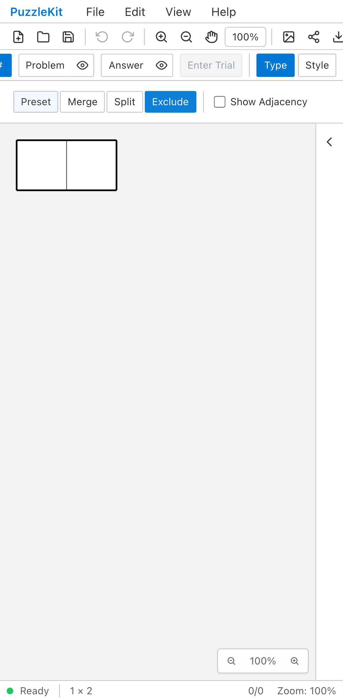
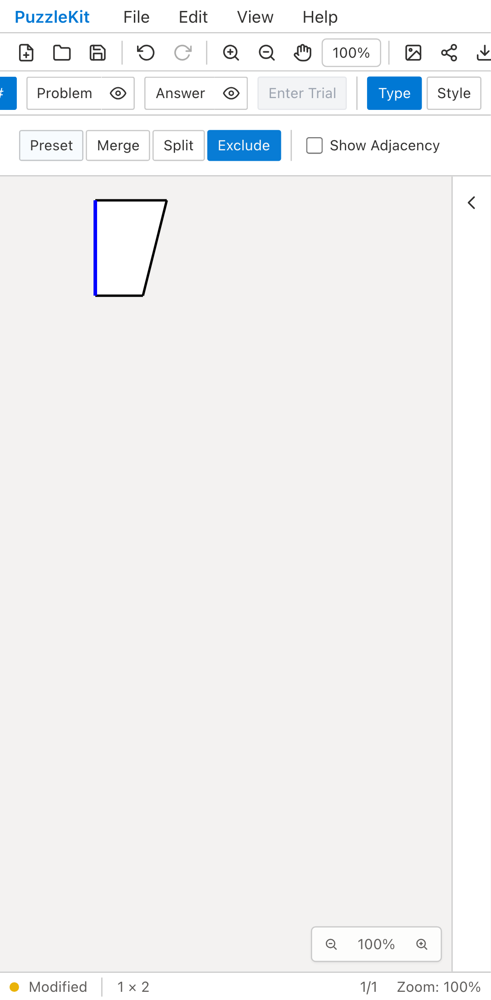

# セル除外のID保持: Before / After

合成した任意IDの台形盤面をFileメニューから読み込み、左のセルを除外した。
修正前は盤面が正方形へ生成し直され、残ったセルの形と青い共有辺が失われた。
修正後は残った辺・セルの形とIDを保持し、Undo/Redo・保存したファイルの再読込・穴のクリックによる再表示で、数字17と塗りも戻る。

- Before: `da5ad8c185bbc7d8836f8da86c431b2ff54ebd4a`。修正後と同じテストだけを追加した独立worktree。
- After: `ead216dea6b83bb96bc81168d36960a529b7aa0f`。
- 使用環境: Playwright + Chromium。PCはマウス、Pixel 7はネイティブタッチ。
- 比較対象のテストとfixtureは同じSHA256であることを検証済み。

[比較ギャラリー](evidence-exclusion-20260916/index.html) / [実行結果・コミット・SHA256](evidence-exclusion-20260916/evidence.json)

## 確認対象

UIの検証に加え、単体テストでは2×2正方形の中心頂点と線が別の場所へ移らないこと、
全セルの除外・一括解除、Outboardの隣接関係、旧形式の六角格子の部分的な再表示、
不正な除外前データの読込拒否を確認する。単純な設定値のテスト8件を実際の参照寿命を確認する3件へ統合した。

除外の仕様は[セル除外とIDの寿命](../board-cell-exclusion.md)。
リサイズ・結合・分割・プリセット変更等の再生成経路は引き続き未対応。
旧ファイルから既に失われた形状・IDの対応は推測で復元しない。
UI Review本文は非追跡の `.work/ui-review/` にのみ保存し、公開ファイルに含めていない。

## 結果

- Unit: 590件、70ファイル成功。
- 開発E2E: 158件成功、既存skip 1件。
- 本番Chromium E2E: 58件成功、既存skip 1件。
- 型検査、E2E型検査、source map確認、アプリ・ライブラリビルド成功。
- Before: 2026-09-16T02-20-04-672Z、PC・モバイルとも青い辺の消失により期待どおり失敗。
- After: 2026-09-16T02-20-32-628Z、同じテストが両方成功。実行時例外なし。
- 動画4本はffmpegで全デコードし、Chromiumで再生・シークを確認。

最初の全体QAでは、既存LITSテスト1件が初期化の動的import中に
「Resulting promise was garbage collected」で失敗した。除外操作前の失敗であり、
最終コードを固定した全体再実行では158件成功した。初回ログ・traceはローカルの
`.work/exclusion-qa/qa-check.log` と `artifacts/check/2026-09-16T02-12-21-937Z/` に保持。
初回実行中にソース調整が入っていたため、初回を最終コードの検証結果として数えていない。

| | Before | After |
| --- | --- | --- |
| PC |  |  |
| Mobile |  |  |

[PC Before動画](evidence-exclusion-20260916/before-chromium.webm) /
[PC After動画](evidence-exclusion-20260916/after-chromium.webm) /
[Mobile Before動画](evidence-exclusion-20260916/before-mobile-chrome.webm) /
[Mobile After動画](evidence-exclusion-20260916/after-mobile-chrome.webm)
