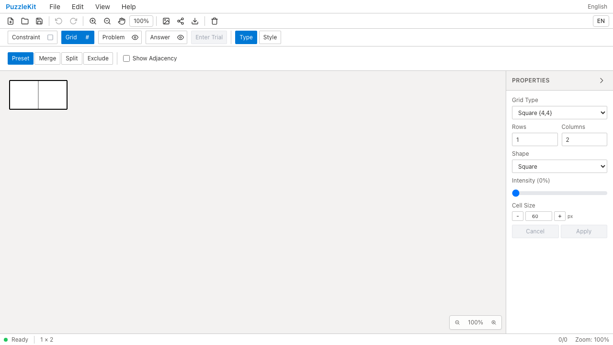
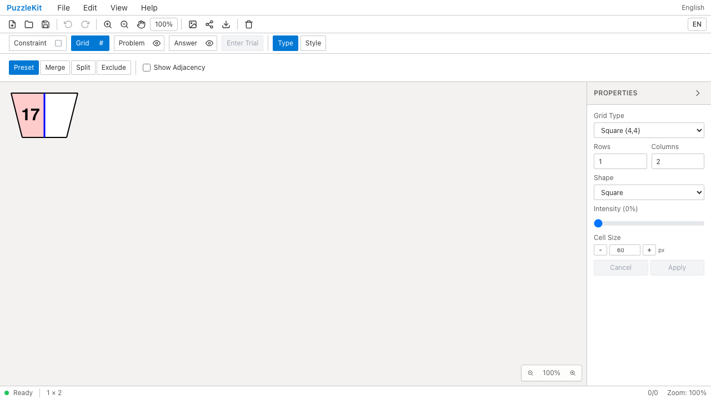
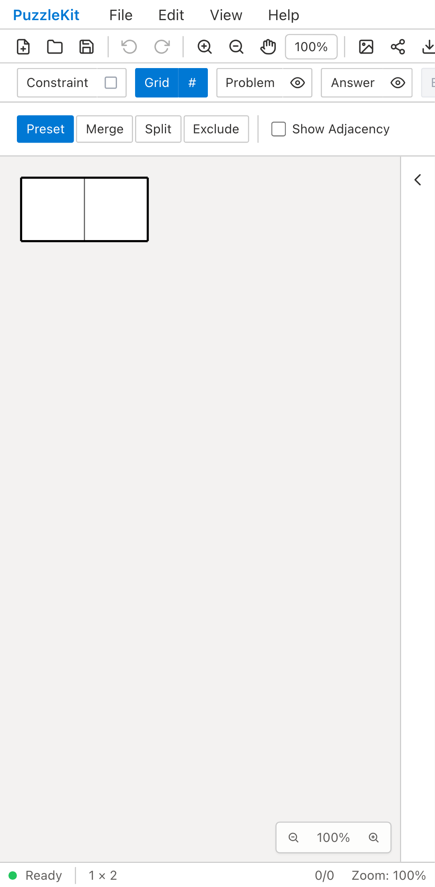
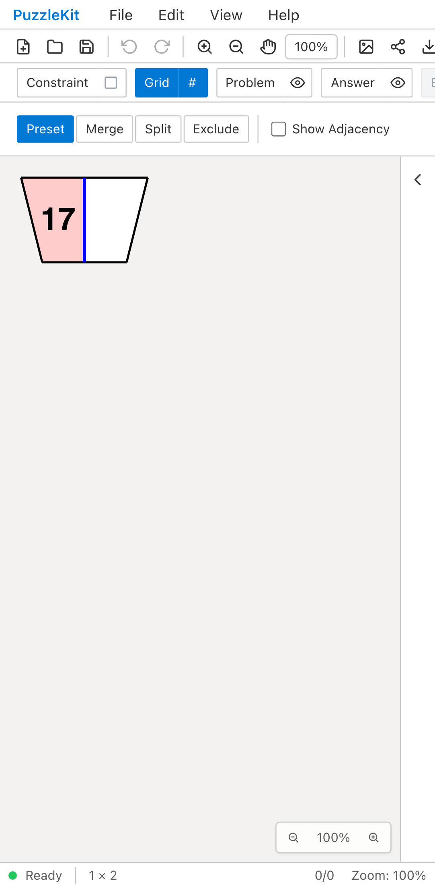

# 盤面IDのネイティブ保存・復元 QA

## 結果

同じ合成JSONを読み込んだとき、Beforeは設定から通常の2マスを作り直し、
元の台形・数字17・ピンクの塗り・青い辺が失われる。
Afterはセル・頂点・辺のID、接続、位置を保持して表示する。
保存し直して開く、右セルを塗る、Undo/Redo、自動保存後の再読込まで確認した。

| 環境 | Before | After |
| --- | --- | --- |
| PC Chromium |  |  |
| Pixel 7 Chromium |  |  |

[PC Before動画](evidence-board-ids-20260916/before-chromium.webm) /
[PC After動画](evidence-board-ids-20260916/after-chromium.webm) /
[Mobile Before動画](evidence-board-ids-20260916/before-mobile-chrome.webm) /
[Mobile After動画](evidence-board-ids-20260916/after-mobile-chrome.webm)

[PC再読込後](evidence-board-ids-20260916/after-chromium-reloaded.png) /
[Mobile再読込後](evidence-board-ids-20260916/after-mobile-chrome-reloaded.png) /
[ローカル再生用ギャラリー](evidence-board-ids-20260916/index.html) /
[revision・結果・SHA256](evidence-board-ids-20260916/evidence.json)

## 再現条件

- Before: `6829349c633aaf630ba7ed4e66a40066b809e0b5`。
- After: `67c498d2cbeb25a6f4e8eece97fe9737b64b7826`。
- 同一の `e2e/board-id-persistence.spec.ts` と `e2e/fixtures/opaque-board-ids.json`。
  両実行のハッシュ一致を確認済み。
- 録画はVite開発サーバー。PCはマウス、Pixel 7はネイティブタッチで盤面を操作した。
- Beforeは塗りの形状が見つからない期待どおりの失敗2件。Afterは2件成功。
  アプリの未捕捉例外は両方0件。BeforeとAfterは別実行であり操作時刻は同期していない。
- 公開動画4本は全フレームのデコードとChromiumでの再生・シークを確認。

## 検証範囲

- 型、E2E型、source map確認、Unit **595件 / 70ファイル** 成功。
- 開発E2E **156件成功・既存skip 1件**。ChromiumとWebKitの既存チェックを含む。
- アプリ・library build成功。本番Chromium **56件成功・既存skip 1件**。
- 合成盤面の任意IDと全トポロジを、メニュー保存・アイコン保存・自動保存・再読込で比較。
- Unitでは共有ペイロードのID `co / color / zL` の保持、旧圧縮形式の読込、
  重複ID・キー不一致・存在しない頂点参照の拒否と既存履歴の保持も確認。
- 旧線形式の重複修復テストは、旧版番号とスナップショットなしの実際の旧形式に揃えた。
  修復と再保存後の安定性の確認は維持している。
- 最後のBase64生成の分割処理変更後は、関連Unit6件、本番ビルド・E2E、
  最終After録画を実行。全開発E2Eはその小変更前の結果。

このQAは保存・復元についての証跡。
除外・リサイズ・結合・分割でのID維持を完了したという意味ではない。
それらは[移行一覧](../board-id-migration.md)に残している。
UI Review本文は無視対象の `.work` にのみ置き、公開していない。
