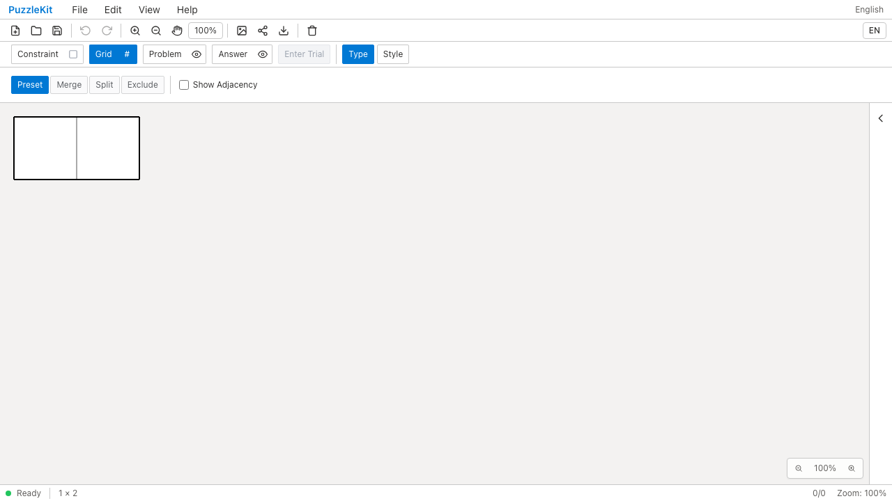
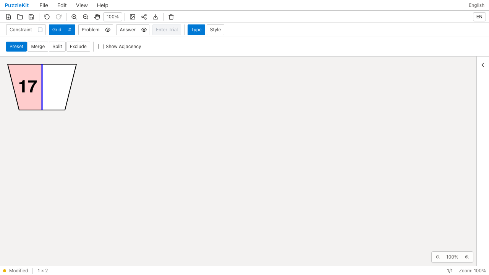
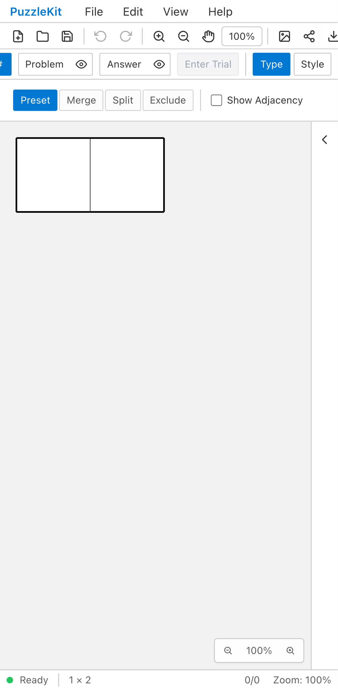
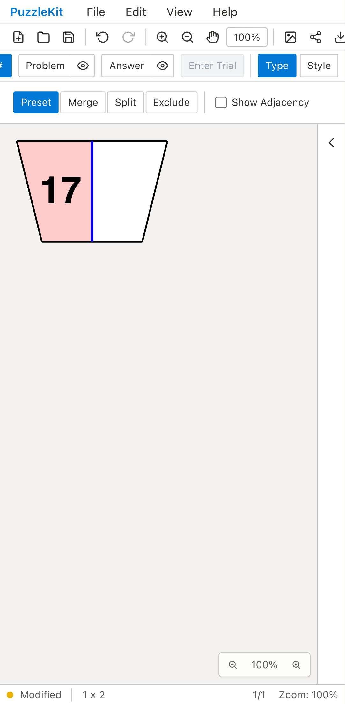

# セルサイズ変更とID保持: Before / After

任意IDを持つ2セルの台形盤面で、Grid > Type > PresetのCell Sizeを60から90に変更した。
修正前はプレビューとApply時に正方形へ生成し直され、数字17・ピンクの塗り・青い共有辺が失われた。
修正後はIDと参照を保ち、元の形状を1.5倍に拡縮する。

- Before: `a787d5868e5f35a96413e9fc9587523ab332794b`。同一E2Eだけをコピーした独立worktree。
- After: `8f9928badd6b12d26f270dd6c2828db94a6b0fd7`。
- Playwright + Chromium。PCはマウス、Pixel 7はネイティブタッチ。
- Before録画: 2026-09-16T02-54-03-726Z。両端末で形状不一致と描画消失を再現。
- After録画: 2026-09-16T02-55-16-340Z。両端末成功、実行時例外なし。
- E2EとfixtureのSHA256一致を検証済み。動画4本を全デコードし、Chromiumで再生・シーク確認済み。

[比較ギャラリー](evidence-layout-20260916/index.html) / [実行結果・コミット・SHA256](evidence-layout-20260916/evidence.json)

## 検証

操作テストは、プレビュー・Apply・既存要素の拡縮・Undo/Redo・ファイル再読込・除外中の90→60への変更・一括解除を確認する。
単体テストでは外側余白、サイズと色の同時変更、別のresizeGrid API、
プリセットの未適用状態と適用後の保存設定も確認した。IDの採番順を期待値には使わない。

Unit592件（71ファイル）、開発E2E160件、本番Chromium60件成功（E2Eは各既存skip1件）。
型検査・E2E型検査・source map・アプリ/library build成功。
開発E2Eの全体実行後、resizeGridからサイズと色を同時に変える分岐を共通化した。
その最終変更後は全Unit・型・両ビルド・全本番Chromium・最終After録画を再確認した。
初期のモバイル試行では開いたPropertiesがリボン/Fileを覆い、テスト操作がタイムアウトした。
本番の操作に合わせCloseを経由するテストへ修正し、force clickや再試行で回避していない。

[レイアウト変更の仕様](../board-layout-identity.md)を参照。
行列数変更、プリセット変更、結合・分割などの再生成経路はこの完了範囲に含めない。
UI Review本文は非追跡の `.work/ui-review/` のみに保持し、公開物には含めない。

| | Before | After |
| --- | --- | --- |
| PC |  |  |
| Mobile |  |  |

[PC Before動画](evidence-layout-20260916/before-chromium.webm) /
[PC After動画](evidence-layout-20260916/after-chromium.webm) /
[Mobile Before動画](evidence-layout-20260916/before-mobile-chrome.webm) /
[Mobile After動画](evidence-layout-20260916/after-mobile-chrome.webm)
