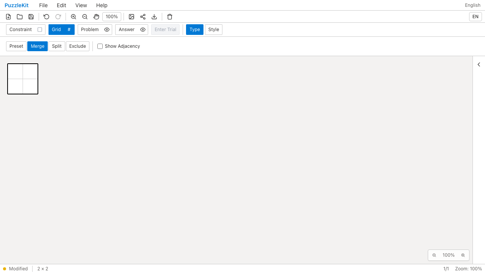
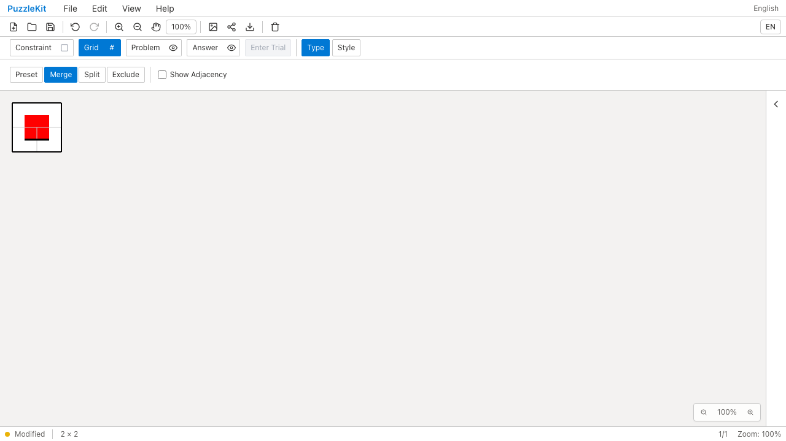
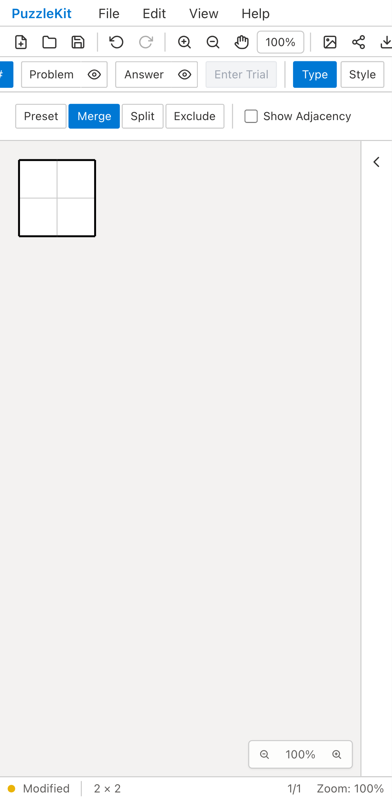
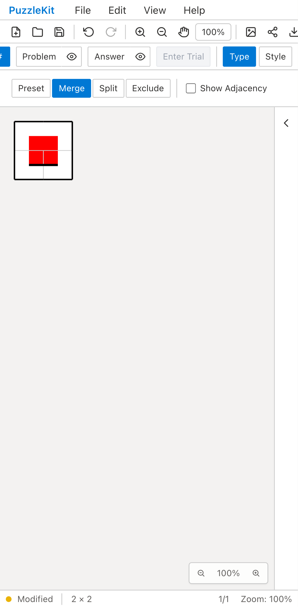

# セル結合のID保持: Before / After

任意IDの2×2盤面の上2セルを結合する。Beforeは設定から盤面を再生成して、中央頂点の赤い注記を失う。
Afterは結合元を実グラフから解決し、残る境界頂点・辺のIDを保持する。

| | Before | After |
| --- | --- | --- |
| PC |  |  |
| Mobile |  |  |

- PC動画: [Before](evidence-merge-20260916/before-chromium.webm) / [After](evidence-merge-20260916/after-chromium.webm)
- Mobile動画: [Before](evidence-merge-20260916/before-mobile-chrome.webm) / [After](evidence-merge-20260916/after-mobile-chrome.webm)
- 結合解除後: [PC](evidence-merge-20260916/after-chromium-restored.png) / [Mobile](evidence-merge-20260916/after-mobile-chrome-restored.png)
- [比較ギャラリー](evidence-merge-20260916/index.html) / [revision・結果・SHA256](evidence-merge-20260916/evidence.json)

Before: `57f6f04dfcaba8fe8a1fa4128babc19476f51fae`、2026-09-16T05:20:20.671Z。
After: `e5e858665c48f6d444ea9aba82d330f4696a2c8d`、2026-09-16T05:21:18.649Z。
同じテストとfixtureのSHA256を照合した。Playwright + ChromiumのDesktopとPixel 7エミュレーションで
マウス／CDPのタッチ入力を使用した。物理端末のQAではない。
Beforeは両環境で結合後の頂点注記欠落を検出して失敗し、Afterは両環境で成功。
両実行とも未処理のブラウザ例外なし。Beforeの録画は失敗まで。

Afterは存続する中央頂点と外周の途中の頂点、Undo/Redo、ネイティブ保存・再読込、
プロパティのDeleteによる結合解除を確認した。解除後も元セルと頂点のID・内容が戻る。
PCの比較画像とモバイル解除後画像を目視確認した。PC画像では上2セル間の辺がAfterで消え、
その位置の背景画素が白となっていることも確認し、描画更新後の画像であることを確かめた。
消滅したセルを参照するループ線は除去されるため、Afterの下側の線だけが残る。

Unitは両レイヤーの注記の整理とUndo、試行の復元、独立した結合のID維持、結合済みセルの
再結合、削除IDの非再利用、除外・Wave・セルサイズ変更・保存の組合せ、保存情報の不整合拒否を確認する。
固定ID merged-0へ依存した既存テスト1件は上記の実ストアの回帰テストへ統合した。
初期のE2E失敗は問題／解答レイヤーの指定、Gridモードへの切替順、Map配列の挿入順比較を修正した。
最終録画では同じ修正済みテストを両リビジョンで実行した。

[実装範囲と注記の扱い](../board-merge-identity.md)。結合元の形状を持たない旧ファイルの移行、
結合後の行列変更、分割・彫刻との組合せは未完了であり、PR #126はDraftを維持する。
動画4本は全フレームのデコードと、ローカルChromiumでの再生・シーク成功。UI Review本文は非追跡の`.work/ui-review`にのみ保存する。

最終差分の検証: Unit607件（76ファイル）、本番Chromium E2E72件、開発E2E172件成功（各既存skip1件）。
型・E2E型・アプリ/library build・solver source map検証成功。

後続の[旧結合ファイルの移行QA](2026-09-16-legacy-merge-identity.md)では、既知の旧生成器に一致するファイルの解除に対応した。
