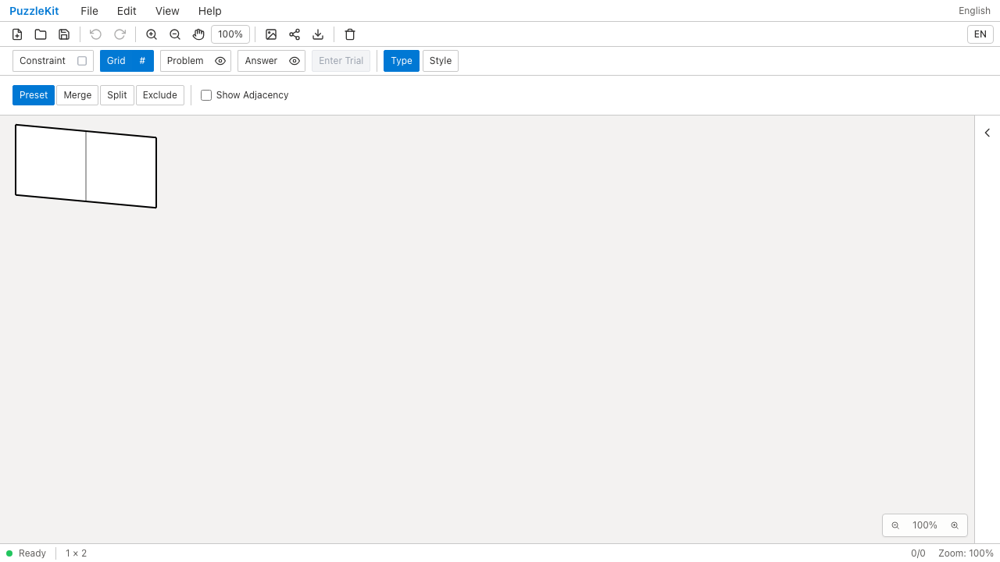
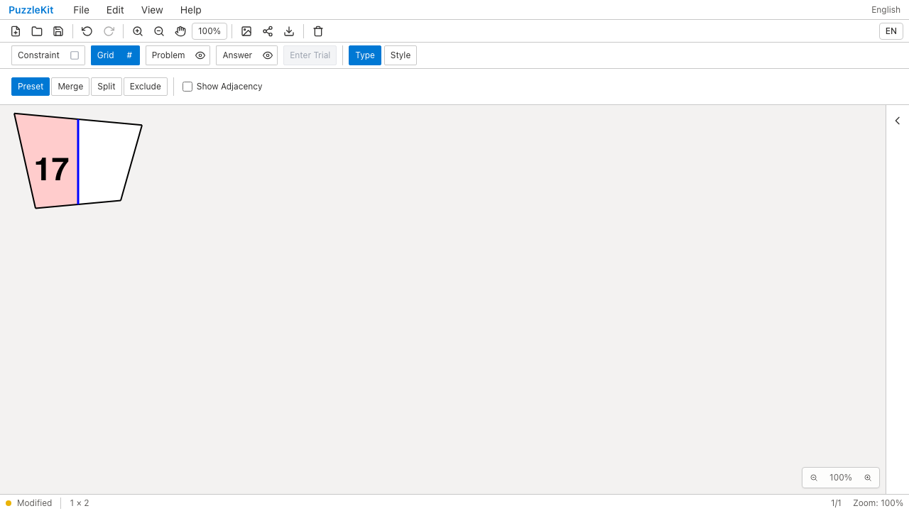
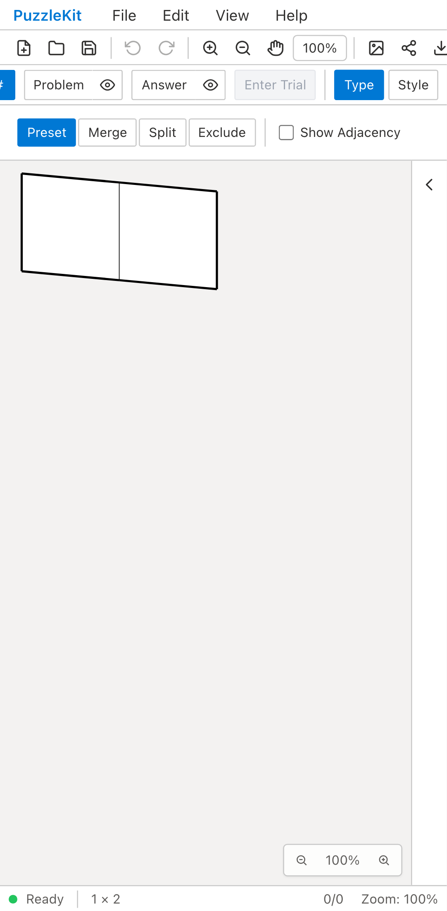
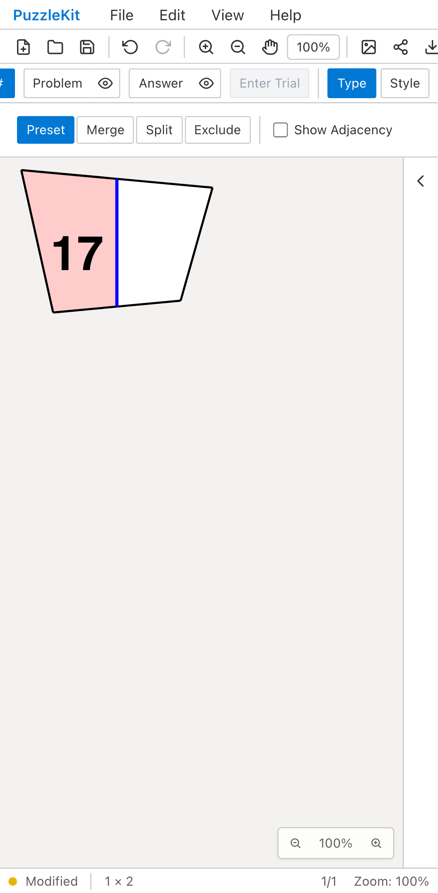

# 表示変形のID保持: Before / After

同じ任意IDの独自盤面にWaveを適用し、セルサイズを60から90へ変更する。
Beforeは格子を再生成して数字17・桃色の塗り・青い線を失う。
Afterは独自形状と注記を保持して変形し、保存後にも元の形へ戻せる。

| | Before | After |
| --- | --- | --- |
| PC |  |  |
| Mobile |  |  |

- PC動画: [Before](evidence-preset-20260916/before-chromium.webm) / [After](evidence-preset-20260916/after-chromium.webm)
- Mobile動画: [Before](evidence-preset-20260916/before-mobile-chrome.webm) / [After](evidence-preset-20260916/after-mobile-chrome.webm)
- 元の独自形状へ復帰: [PC](evidence-preset-20260916/after-chromium-restored.png) / [Mobile](evidence-preset-20260916/after-mobile-chrome-restored.png)
- [比較ギャラリー](evidence-preset-20260916/index.html) / [revision・結果・SHA256](evidence-preset-20260916/evidence.json)

Before: `ba80e825bcd43bcab1fdf351eba8273c685e342c`、2026-09-16T04:29:21.246Z。
After: `4390efbc5d701cdf00023ab5b6633e519acb0371`、2026-09-16T04:30:28.129Z。
同じテスト・fixtureのSHA256を照合。Playwright + ChromiumのDesktop/Pixel 7エミュレーションで
ブラウザの入力欄とボタンを操作した。物理端末のQAではない。
Beforeは両端末で数字17の欠落を検出して失敗し、Afterは両端末で成功。
どちらも未処理のブラウザ例外なし。Before動画はその失敗まで。

Afterでは注記・IDの保持、Undo/Redo、ネイティブ保存・再読込、Squareへ戻す際の
元座標復元、プリセットのみ変更した場合のApply/Cancelを確認。
Unitでは頂点注記と全接続、再適用時に変形が重ならないこと、別プリセット経由の復帰、
除外中のセル・セルサイズ変更との組合せ、欠損した元座標の読込拒否を確認する。
最初のUnitの期待値はfixtureの強度0のまま変形を期待していたため、明示的に0.5へ設定した。
最終の動画は上記の同一テストを両コミットで収録した。

[実装範囲](../board-preset-identity.md)。六角格子の行列編集の参照ずれは追加調査で引き続き再現する。
結合・分割・彫刻の移行も未完了であり、PR #126はDraftを維持する。
既存形式に元座標がない場合は読込時の実形状を新たな基準にし、過去の形状を推測しない。

検証: Unit602件（74ファイル）、型・E2E型・アプリ/library build成功。
最終差分で本番Chromium E2E68件・開発E2E168件成功（各既存skip1件）。
solver source map検証も成功。
動画4本は全フレームをデコードし、ローカルChromiumで再生・シーク成功。PCのBefore/Afterとモバイルの復帰後画像を目視確認。
UI Review本文は非追跡の`.work/ui-review`にのみ保存する。
