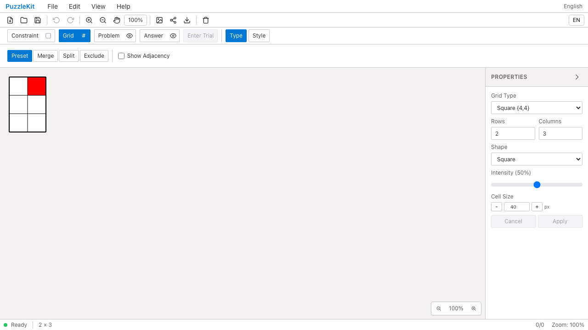

# Board rotation (#6) — QA 2026-09-16

盤面全体の回転を追加しました。Grid → Style → Propertiesから±15°、任意の角度、0°へのリセットを操作できます。角度はネイティブJSONと盤面設定に保存され、Undo/Redoに対応します。

セル・辺のIDと論理座標は維持し、盤面・数字・記号・背景画像・カーソル・描画プレビューをまとめて回転します。SVG/PNGの出力寸法と中央配置は回転後の外接矩形を使います。数字も盤面と一緒に回転します。キーボードの行列移動は従来の論理方向です。Penpa/puzz.link形式との回転角の相互変換は含みません。

## Evidence

[Before/After gallery](evidence-rotation-20260916/index.html) / [revision・結果・SHA256](evidence-rotation-20260916/evidence.json)

| | Before | After |
|---|---|---|
| PC |  |  |
| Mobile |  |  |
| PC動画 | [Before](evidence-rotation-20260916/before-chromium.webm) | [After](evidence-rotation-20260916/after-chromium.webm) |
| Mobile動画 | [Before](evidence-rotation-20260916/before-mobile-chrome.webm) | [After](evidence-rotation-20260916/after-mobile-chrome.webm) |

[角度操作](evidence-rotation-20260916/mobile-chrome-rotation-controls.png) / [六角形盤面](evidence-rotation-20260916/chromium-hex-rotation.png) / [Paint追加確認の動画](evidence-rotation-20260916/after-paint.webm)

比較には同一の合成JSONと同一のPlaywrightテストを使います。基準コミットは `2396c889a3c1b5ee06c79e7dfeaa1cdb3231636e`。回転のアプリ実装は `2f1ba9e`。正確なテスト・fixtureのハッシュと撮影時刻はevidence.jsonに記録しています。動画はVite開発サーバー上のChromiumで撮影し、製品ビルドは別途本番E2Eで確認しています。

## Checks

- 2行3列・40pxセル・20px余白・90°のJSONを読み込み。Beforeは回転を無視し、PNGが160×120、赤セルは左上。Afterは120×160、赤セルは右上。画像の実ピクセルで検証。
- ±15°、角度入力とEnter/Apply、0°へのリセット、Undo/Redo。保存済みファイルの角度を検証。
- 回転後に見える左下セルを操作し、保存データが元の `cell-1-2` を指すことを検証。保存・再読込後も内容を保持。
- 六角形盤面を15°回転し、見えるセルを操作して正しいセルのsurfaceが更新されることを検証。
- Paintでは保存された90°の盤面設定を読み込み、合成画像を追加。画像の角と調整ハンドルの一致、画面上のドラッグ量、盤面移動時に画像位置・大きさを維持することを検証。
- Unitは実ストアで、回転がグラフID・要素を変えず、後から変えた背景色をUndoが巻き戻さず、JSONから復元できることを検証。

PCはマウス、モバイルの盤面操作はChromiumのタッチ入力です。Paintの画像調整はPCで確認。録画5本は全フレームをデコードして検査します。独立実行のためBeforeとAfterの操作時刻は同期していません。

## Reproduction

```sh
npm run qa:check
npm run build
npm run build:lib
npm run qa:production
npm run qa:capture -- after e2e/board-rotation.spec.ts --project chromium --project mobile-chrome
```

Beforeでは `--grep '#6 board rotation:'` で比較対象を選択し、回転がないことによるPNG寸法・色位置の失敗2件を確認します。画面・動画・traceの元データは各worktreeの無視対象 `artifacts/qa/` に保存します。

## Results

- Unit: 593件 / 70ファイル成功。
- 開発E2E: 157件成功、既存skip 1件。ChromiumとWebKitを含む標準 `qa:check` 成功。
- 本番Chromium E2E: 57件成功、既存skip 1件。
- 型検査、E2E型検査、source map検査、アプリbuild、library build成功。
- 比較Before: 期待したPNG寸法・色位置の失敗2件。After: Chromium PC/モバイルと追加WebKitの計5件成功。
- アプリ例外なし。録画5本の全デコードとChromium再生・シーク成功。

Paintテストは再配置前後の座標を別々に読むタイミング依存を検出したため、同一フレームで画像とハンドルを測定するよう修正しました。その後、対象テストと標準QAを再実行して成功しています。画像の書き出しによる画面証跡の上書きもファイル名を分けて解消し、Before/Afterを再撮影しました。アプリ実装は `2f1ba9e` から変更していません。
